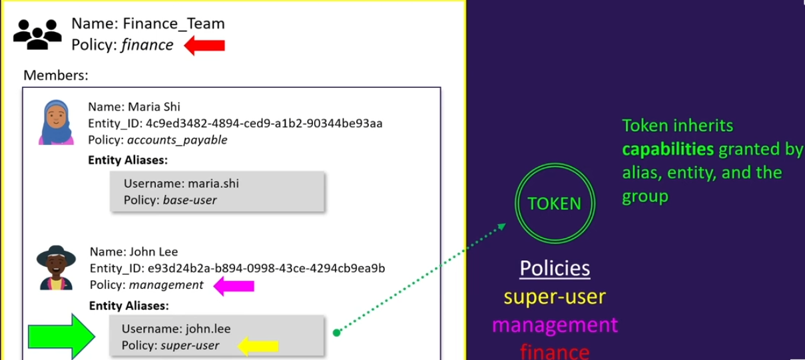
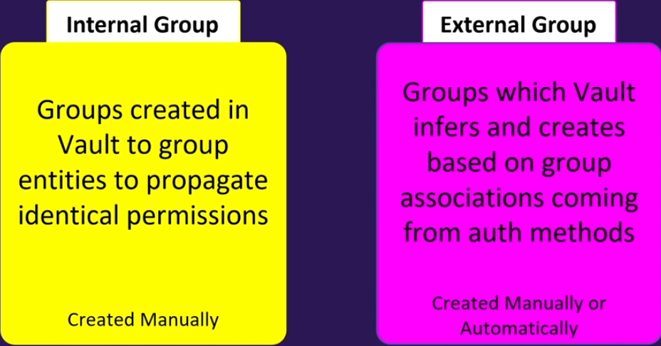

## Entity
用来跟踪所有用户,机器登录vault的一种方式，是通过identity  secret  engine完成的，负责管理vault识别的所有内部实体
每个实体都被分配一个唯一的值，每个实体由0个或者多个alias（**认证方法加上一些标识**）组成。当你第一次登录vault时，会创建一个实体，并附加alisa
你可以手动创建实体，然后附加多个别名。
policy可以附加到实体上。
Entity 可以拥有元数据（metadata），这些元数据可以用来存储关于这个 Entity 的额外信息，例如用户的姓名、邮箱、所属部门等。甚至再编写策略的时候使用这些元数据。

假设Smith有Userpass ,LDAP的登录方式，每种方法都有不同的**entity_id**，并附加不同的策略

```
UserPass: jsmith  
Entity_ID: b81de864-75fa-5619-1fca-ddd72bbe5b29  

###元数据
department: accounting  
sub-team: accounts-payable  
```

```
LDAP: jsmith@example.com  
Entity_ID: e93d24b2a-b894-0998-43ce-4294cb9ea9b  

##元数据
department: finance  
team: management  
```

但是我们可以将用户的所有不同实体合并为一个实体，不管与哪种方式登录，都与这个实体绑定

**如下的图示结构：**


你可以看到用户有一个单独的实体ID，并有一个新的policy,现在作为实体的一部分，被分配了别名，每个alias都有一个不同的实体ID

**流程：**

Smith用户使用LDAP并用jsmith@example.com  进行登录，首先使用LADP凭据进行验证，vault会验证这些凭据是否与LDAP匹配，认证通过之后，vault会返回一个Token,但是这个token将于它的别名`LDAP: jsmith@example.com`关联的策略关联 ，同时也会与management  策略关联

### 直接关联的策略

直接附加到 Vault 实体上的策略，适用于该实体的所有登录方式。

适用于需要跨多种认证方式访问 Vault 资源的情况（例如 LDAP、GitHub、OIDC 认证的同一个人）。

### 实体别名关联的策略

通过 特定身份验证方法 进行登录时，Vault 会根据该方法的 **身份别名（Entity Alias）** 赋予对应的策略。

适用于不同认证源的权限管理，比如：

- Maria 通过 **LDAP 登录** 时拥有 `base-user` 策略。
- John 通过 **GitHub 登录** 时拥有 `super-user` 策略。

## Identity Group

一个组可以包含多个实体作为其成员，在下图中除了拥有自己的策略，还将获得与该组相关的策略



如果约翰使用john.lee进行登录，将拥有三个策略的权限

### 类型



+ 内部组

  用于将实体进行分组，你需要手动创建，

+ 外部组

  手动创建外部组，并且你将把一个组映射到你OIDC提供者中的组名

## 实验

### AppRple

你需要创建不同的role,将不同的用例（获取静态secret，动态凭据，修改配置）映射到Vault后端的特定策略上

```shell
C:\>vault auth enable approle  
Success! Enabled approle auth method at: approle/  

C:\>vault write auth/approle/role/bryan policies=bryan token_ttl=20m  
Success! Data written to: auth/approle/role/bryan  

C:\>vault list auth/approle/role  
Keys  
----  
bryan  

##现在我们需要获取角色的ID
C:\>vault read auth/approle/role/bryan/role-id  
Key      Value  
---      -----  
role_id  2d7d168a-806b-52d0-40b6-597841cf8d42  

##接下来生成一个secret-id
C:\>vault write -force auth/approle/role/bryan/secret-id  
Key                      Value  
---                      -----  
secret_id               fe323f09-72db-1a83-1846-a150b669686c  
secret_id_accessor      2e69247f-568a-70dc-c2a5-45a262eefc87  
secret_id_ttl           0s  
##接下来登录
C:\>vault write auth/approle/login role_id=2d7d168a-806b-52d0-40b6-597841cf8d42 secret_id=fe323f09-72db-1a83-1846-a150b669686c  
Key                     Value  
---                     -----  
token                   s.zOutHiDfKlehjDfMuEDKzIV     ##用于后续所有的请求
token_accessor          Itew3hMdkKQ65AVNL38XzzB8  
token_duration          20m  
token_renewable         true  
token_policies          ["bryan" "default"]  
identity_policies      []  
policies                ["bryan" "default"]  
token_meta_role_name   bryan  
```

### userpass

```shell
C:\>vault auth list  
Path        Type   Accessor              Description  
----        ----   ---------             -----------   
token/      token  auth_token_0ba527c3   token based credentials  

C:\>vault auth enable userpass  
Success! Enabled userpass auth method at: userpass/  

C:\>vault write auth/userpass/users/frank password=vault policies=bryan  
Success! Data written to: auth/userpass/users/frank  

C:\>vault write auth/userpass/users/jamie password=cloud policies=bryan  
Success! Data written to: auth/userpass/users/jamie  

C:\>vault list auth/userpass/users  
Keys  
----  
frank  
jamie  

C:\>vault read auth/userpass/users/jamie  
Key               Value  
---               -----  
policies          [bryan]  
token_bound_cidrs []  
token_explicit_max_ttl 0s  
token_max_ttl    0s  
token_no_default_policy false  
token_num_uses   0  
token_period     0s  
token_policies   [bryan]  
token_ttl       0s  
token_type      default  
C:\>vault login -method=userpass username=jamie  
```

