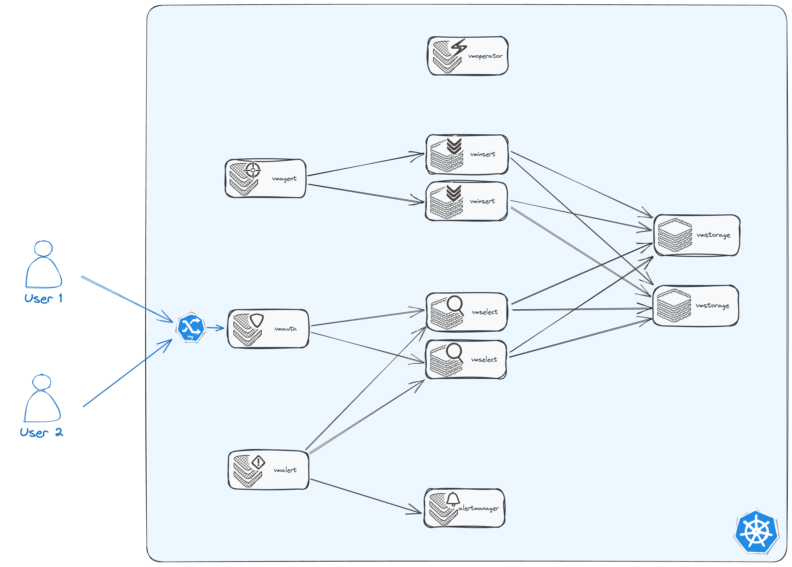

## 组件介绍

### VMCluster

请参考[官方文档](https://docs.victoriametrics.com/operator/resources/vmcluster/)

VMCluster 的目的是提供高可用性和容错的 VictoriaMetrics 数据库集群。VMCluster CRD定义了这种集群版本的 VictoriaMetrics 数据库。

对于每个VMCluster资源，Operator 会创建以下 Kubernetes 资源：

- **VMStorage**：作为 StatefulSet 部署，负责存储数据。
- **VMSelect**：    作为 StatefulSet 部署，负责处理查询请求。
- **VMInsert**：    作为 Deployment 部署，负责处理数据插入请求。

**VMStorage** 和 **VMSelect** 会创建 headless service，而 **VMInsert** 会创建 clusterIP 类型的 service。

这些资源的创建和协调过程遵循严格的顺序：

1. 首先同步 **VMStorage**，Operator 会等待所有 **VMStorage** Pod 都处于 Ready 状态。
2. 然后以相同的方式同步 **VMSelect**。
3. 最后同步 **VMInsert**。

所有 StatefulSet 都使用 `OnDelete` 更新策略创建。这允许通过逐个删除 Pod 并等待其变为 Ready 状态来手动管理 Operator 的滚动更新过程。

滚动更新过程可以通过 Operator 的环境变量进行配置。

最重要的环境变量是 `VM_PODWAITREADYTIMEOUT=80s`，它控制 Operator 等待 Pod 进入 Ready 状态的时间。

#### High availability

VictoriaMetrics 集群版本提供了一整套高可用性功能，包括指标复制、节点故障转移和水平扩展。

首先，我们建议您熟悉“VictoriaMetrics Cluster”本身提供的高可用性工具：

- [High availability](https://docs.victoriametrics.com/Cluster-VictoriaMetrics.html#high-availability),
- [Cluster availability](https://docs.victoriametrics.com/Cluster-VictoriaMetrics.html#cluster-availability),
- [Replication and data safety](https://docs.victoriametrics.com/Cluster-VictoriaMetrics.html#replication-and-data-safety).

`VMCluster` 支持上述连接中列出的所有参数和功能：

- `replicationFactor` - the number of replicas for each metric.
- for every component of cluster (`vmstorage` / `vmselect` / `vminsert`):
  - `replicaCount` - the number of replicas for components of cluster.
  - `affinity` - the affinity (the pod’s scheduling constraints) for components pods. See more details in [kubernetes docs](https://kubernetes.io/docs/concepts/scheduling-eviction/assign-pod-node/#affinity-and-anti-affinity).
  - `topologySpreadConstraints` - 控制 Pod 如何在集群中跨故障域（如区域、可用区、节点和其他用户定义的拓扑域）进行分布。 更多细节请参考  [kubernetes docs](https://kubernetes.io/docs/concepts/workloads/pods/pod-topology-spread-constraints/).

In addition, operator:

- uses k8s services or vmauth for load balancing between `vminsert` and `vmselect` components,
- uses health checks for to determine the readiness of components for work after restart,
- allows to horizontally scale all cluster components just by changing `replicaCount` field.

### VMAgent

VMAgent 就像一个数据搬运工，它可以从你的 Kubernetes 集群中收集各种指标数据，然后存储到 VictoriaMetrics 数据库中。

**权限配置**: VMAgent 需要访问 Kubernetes API 才能工作，所以你需要给它配置相应的权限。你可以使用提供的示例文件[`examples/vmagent_rbac.yaml`](https://github.com/VictoriaMetrics/operator/blob/master/config/examples/vmagent_rbac.yaml) 来创建 RBAC 规则，或者使用 Operator 自动创建的默认 RBAC 账号。

**Deployment**：Opretor会根据vmagent资源创建正确的deployment

VMAgent 的配置信息存储在一个 Secret 对象中，这个 Secret 的名称以 `<VMAgent-name>` 为前缀。Operator 会根据你选择的 VMServiceScrape 对象自动生成 VMAgent 的配置信息，并更新到 Secret 中。

**服务发现**: VMServiceScrape 对象定义了 VMAgent 需要收集指标数据的目标服务。你可以使用标签选择器来指定哪些服务需要被 VMAgent 监控。

**自动更新**: 当你修改了 VMServiceScrape 或 VMAgent CRD 后，Operator 会自动更新 VMAgent 的配置信息，确保 VMAgent 能够正确地收集指标数据。

**自定义配置**: 如果你没有指定任何 VMServiceScrape 对象，那么 Operator 就不会自动管理 VMAgent 的配置信息。在这种情况下，你需要手动创建和管理 Secret 对象，并在其中设置 VMAgent 的配置信息。

#### Scraping

`VMAgent` supports scraping targets with:

- [VMServiceScrape](https://docs.victoriametrics.com/operator/resources/vmservicescrape/),
- [VMPodScrape](https://docs.victoriametrics.com/operator/resources/vmpodscrape/),
- [VMNodeScrape](https://docs.victoriametrics.com/operator/resources/vmnodescrape/),
- [VMStaticScrape](https://docs.victoriametrics.com/operator/resources/vmstaticscrape/),
- [VMProbe](https://docs.victoriametrics.com/operator/resources/vmprobe/).
- [VMScrapeConfig](https://docs.victoriametrics.com/operator/resources/vmscrapeconfig/)

这些对象告诉 VMAgent 从哪些目标以及如何收集指标并生成部分 VMAgent 抓取配置。更多的细节请[参考](https://docs.victoriametrics.com/operator/resources/vmagent/)

#### High availability

##### 副本和重复数据的删除

请[参考](https://docs.victoriametrics.com/operator/resources/vmagent/)

##### StatefulMode

默认情况下，VMAgent 使用 `/tmp` 目录作为缓存路径，而 `/tmp` 目录是 Kubernetes 中的临时存储，Pod 重启后数据就会丢失。

为了避免数据丢失，可以使用 StatefulMode，将缓存数据存储到 Kubernetes 的持久化存储中。

VMAgent 可以将数据先缓存到本地磁盘，然后再发送到远程存储，这样即使网络中断，数据也不会丢失。

```yaml
apiVersion: operator.victoriametrics.com/v1beta1
kind: VMAgent
metadata:
  name: vmagent-ha-example
spec:
  selectAllByDefault: true
  vmAgentExternalLabelName: vmagent_ha
  remoteWrite:
    - url: "http://vminsert-demo.vm.svc:8480/api/v1/write"
  scrapeInterval: 30s
  replicaCount: 2
  # StatefulMode:
  statefulMode: true
  statefulStorage:
    volumeClaimTemplate:
      spec:
        resources:
            requests:
              storage: 3Gi

```

##### 重新打标签

请[参考](https://docs.victoriametrics.com/operator/resources/vmagent/)

### VMAuth

VMAuth 提供了一种机制，可以让你安全地将应用程序暴露给外部世界或 Kubernetes 集群内的其他应用程序。

假设我们有一个 VictoriaMetrics 集群，想要限制特定用户对特定命名空间的指标数据的访问权限。

**场景:**

- 我们有两个命名空间：`production` 和 `development`。
- 我们有三个用户：`admin`、`developer` 和 `viewer`。
- 我们希望：
  - `admin` 用户可以访问所有命名空间的所有指标数据。
  - `developer` 用户只能访问 `development` 命名空间的指标数据。
  - `viewer` 用户只能访问 `production` 命名空间的指标数据。

**VMAuth 配置:**

我们可以使用 VMAuth 的 `userNamespaceSelector` 和 `userSelector` 来实现以上访问控制。

## 安装



### 1.Setup operator

```
helm  -n vm   install vmoperator vm/victoria-metrics-operator -f   ./values.yaml 
```

### 2.组件部署

让我们使用 vmagent、vmauth、vmalert、vmalertmanager 和 vmcluster 创建一个完整的监控集群

VictoriaMetrics 集群所需的五个组件：

- **vmagent:** VictoriaMetrics Agent，负责收集监控指标并发送到 VictoriaMetrics Server。

- **vmauth:** VictoriaMetrics Authentication，负责身份认证和授权。

- **vmalert:** VictoriaMetrics Alert，负责根据预设规则触发告警。

- **vmalertmanager:** VictoriaMetrics Alertmanager，负责管理告警，例如抑制重复告警、发送告警通知等。

- vmcluster:

  VictoriaMetrics Cluster，用于部署 VictoriaMetrics 的集群版本，包括 vmstorage、vmselect 和 vminsert 三个组件：

  - **vmstorage:** VictoriaMetrics Storage，负责存储监控数据。
  - **vmselect:** VictoriaMetrics Select，负责查询监控数据。
  - **vminsert:** VictoriaMetrics Insert，负责接收和写入监控数据。

#### vmcluster

```yaml
# vmcluster.yaml
apiVersion: operator.victoriametrics.com/v1beta1
kind: VMCluster
metadata:
  name: demo
spec:
  retentionPeriod: "1"
  replicationFactor: 2
  vmstorage:
    replicaCount: 2
    storageDataPath: "/vm-data"
    storage:
      volumeClaimTemplate:
        spec:
          resources:
            requests:
              storage: "10Gi"
    resources:
      limits:
        cpu: "1"
        memory: "1Gi"
  vmselect:
    replicaCount: 2
    cacheMountPath: "/select-cache"
    storage:
      volumeClaimTemplate:
        spec:
          resources:
            requests:
              storage: "1Gi"
    resources:
      limits:
        cpu: "1"
        memory: "1Gi"
      requests:
        cpu: "0.5"
        memory: "500Mi"
  vminsert:
    replicaCount: 2
    resources:
      limits:
        cpu: "1"
        memory: "1Gi"
      requests:
        cpu: "0.5"
        memory: "500Mi"
```

#### VMAgent

```
apiVersion: operator.victoriametrics.com/v1beta1
kind: VMAgent
metadata:
  name: vmagent-ha-example
  namespace: vm
spec:
  selectAllByDefault: true
  vmAgentExternalLabelName: vmagent_ha
  remoteWrite:
    - url: "http://vminsert-demo.vm.svc:8480/api/v1/write"
  scrapeInterval: 30s
  replicaCount: 2
  # StatefulMode:
  statefulMode: true
  statefulStorage:
    volumeClaimTemplate:
      spec:
        resources:
            requests:
              storage: 3Gi

```

