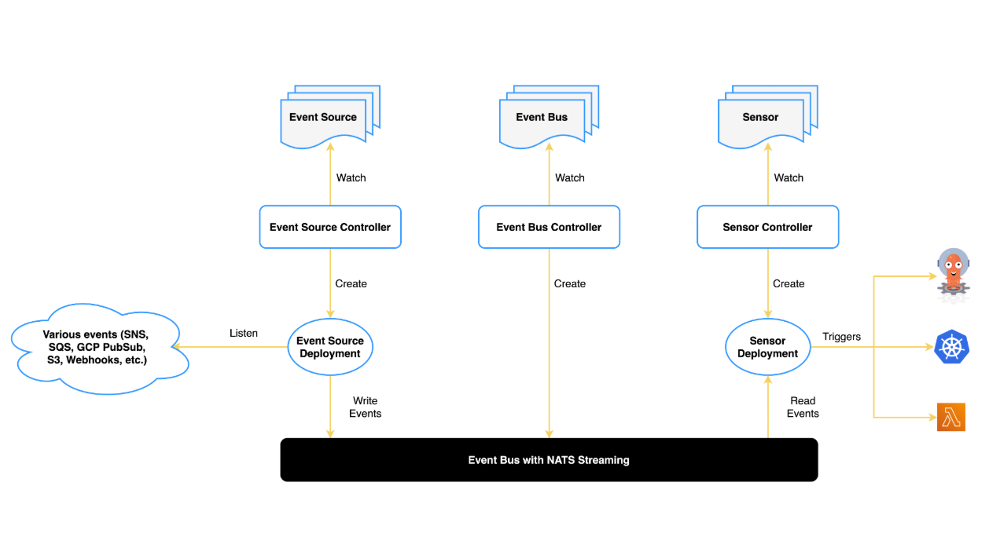

## Architecture



### Event Source

监听器和翻译器

**监听：**它连接到其中一个外部事件生成系统（如 AWS SQS 队列、webhook 端点、GCP PubSub 主题等）。对它进行配置，使其了解如何接收来自该特定系统的事件。

**翻译：**一旦接收到事件，它就会将该事件（可能是系统专用格式）转换为一种名为 "CloudEvent "的标准格式。这样，Argo Events 系统的其他部分就能理解该事件。

发送（派发）：最后，它将翻译后的 CloudEvent 发送到eventbus。然后，其他组件（如传感器）可以监听这些标准化事件的 `eventbus` 。

### Sensor

传感器定义了一组事件依赖项（输入）和触发器（输出）。它监听事件总线上的事件，并充当事件依赖关系管理器来解析和执行触发器。

#### Event dependency

dependency是传感器等待发生的事件。

### EventBus

事件总线通过连接事件源和传感器充当 Argo-Events 的传输层。

事件源发布事件，而传感器则订阅事件以执行触发器。

EventBus 属于命名空间；要使 EventSource 和 Sensor 正常工作，命名空间中必须有一个 EventBus 对象。

### Trigger

触发器（Trigger）是当事件依赖项得到解决后，由传感器（Sensor）执行的资源/工作负载。

## 说明

安装 [Argo Events](https://argoproj.github.io/argo-events/installation/)

在安装了events之后，我们将为 Webhook 设置传感器sensor和event-source。请参考[Here](https://argoproj.github.io/argo-events/tutorials/01-introduction/),目标是根据 HTTP Post 请求触发 Argo workflow。记得设置RBAC权限

然后通过ingress 公开事件源 pod

## Parameterization

### Webhook Event Payload

Webhook 事件源通过 HTTP 请求接收事件并将其转换为 CloudEvents。Webhook 传感器通过事件总线从事件源接收的事件结构如下、

```
{
    "context": {
      "type": "type_of_event_source",
      "specversion": "cloud_events_version",
      "source": "name_of_the_event_source",
      "id": "unique_event_id",
      "time": "event_time",
      "datacontenttype": "type_of_data",
      "subject": "name_of_the_configuration_within_event_source"
    },
    "data": {
      "header": {},
      "body": {},
    }
}
```

1. `Context` ：这是 CloudEvent 上下文，无论 HTTP 请求的类型如何，它都由事件源填充。
2. `Data` ：数据包含以下字段。
   + `Header` ：事件`data`中的`header`包含分派到事件源的 HTTP 请求中的标头。事件源从请求中提取标头并将其放入事件`data` `header`中。
   + `Body` ：这是 HTTP 请求的请求负载。

