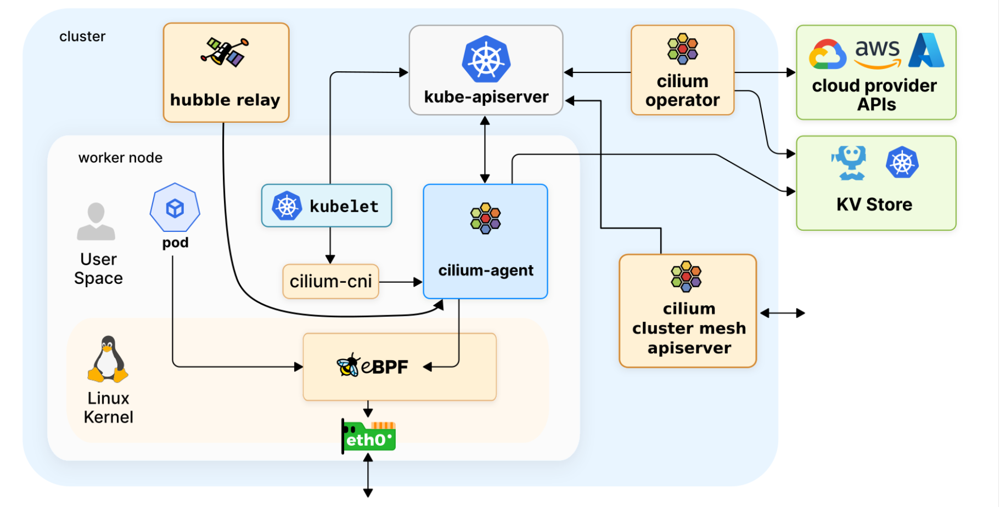
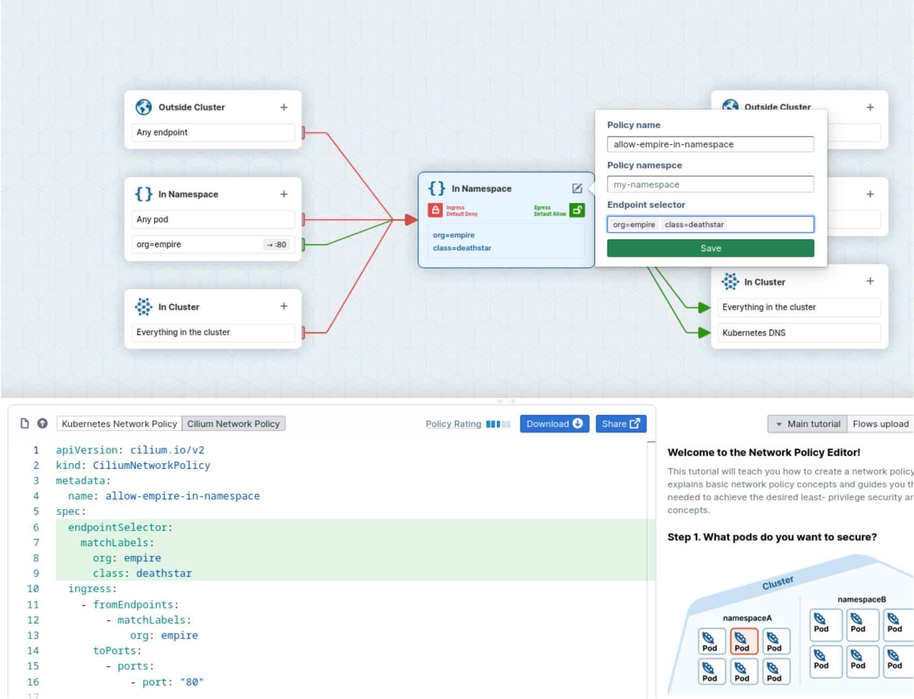
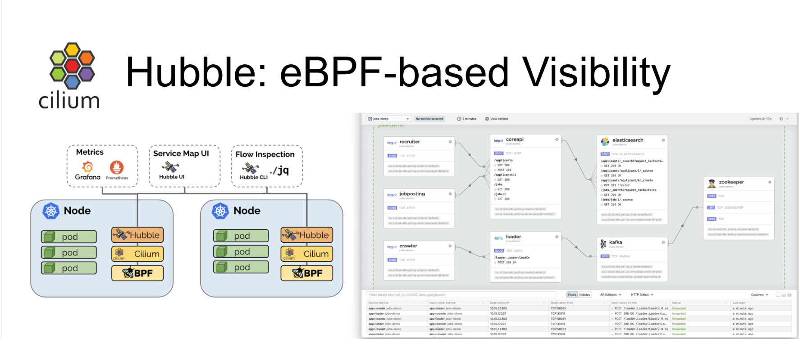
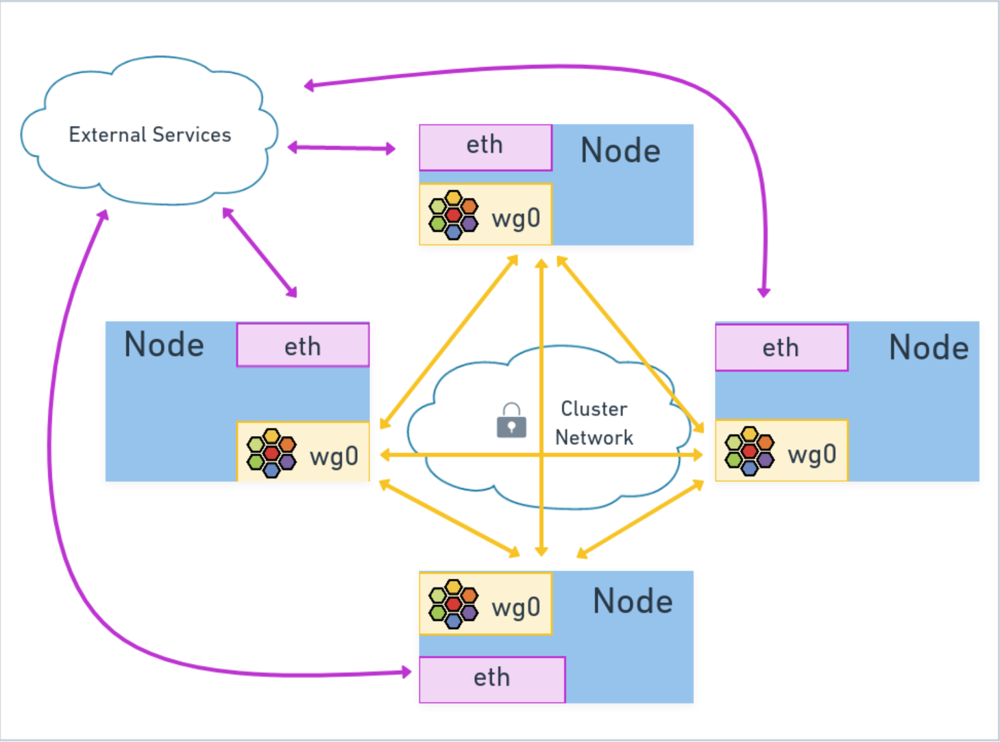

# Cilium概述

在高度动态和复杂的微服务世界中，主要从 IP 地址和端口角度考虑网络可能会导致沮丧。使用传统的网络工具实现效率可能非常低，仅提供粗粒度的可见性和过滤，限制了您排除故障和保护容器网络的能力。 [Cilium 的创建就是为了解决这些挑战](https://cilium.io/blog/2018/04/24/cilium-security-for-age-of-microservices/)。

从一开始，Cilium 就专为大规模、高度动态的容器化环境而设计。它本身理解容器和 Kubernetes 身份，并解析 HTTP、gRPC 和 Kafka 等 API 协议，提供比传统防火墙更简单、更强大的可见性和安全性。

Cilium 使用[eBPF](https://ebpf.io/)作为底层引擎，创建了一个经过精确优化的网络堆栈，用于在 Kubernetes 等平台上运行微服务。 eBPF 使 Cilium 强大的安全可见性和控制逻辑能够动态插入 Linux 内核中。 eBPF 使 Linux 内核变得可编程，以便像 Cilium 这样的应用程序可以挂接到 Linux 内核子系统中，从而将用户空间应用程序上下文引入内核操作。

由于 eBPF 在 Linux 内核内部运行，因此可以应用和更新 Cilium 安全策略，而无需对应用程序代码或容器配置进行任何更改。 eBPF 程序连接到 Linux 网络数据路径，并可用于在数据包进入网络套接字时根据网络策略规则执行丢弃数据包等操作。

eBPF 能够以前所未有的粒度和效率对系统和应用程序进行可见性和控制。它以完全透明的方式完成此操作，无需应用程序以任何方式进行更改。 Cilium 通过分层高效的身份概念来利用 eBPF 的强大功能；将 Kubernetes 上下文信息（例如元数据标签）引入 eBPF 支持的网络逻辑。

那么既然我们知道了 Cilium 是什么、它要解决什么问题以及 eBPF 如何赋能它，那么我们就来谈谈 Cilium 能做什么。

## 常见功能

### Networking

Cilium 提供网络连接，允许 Pod 和其他组件（Kubernetes 集群内部或外部）进行通信。 Cilium 实现了一个简单的扁平第 3 层网络，能够跨越连接所有应用程序容器的多个集群。

默认情况下，Cilium 支持**overlay**网络模型，其中虚拟网络跨越所有主机。覆盖网络中的流量被封装以在不同主机之间传输。默认选择此模式，因为它具有最低的基础架构和集成要求，并且仅需要主机之间的 IP 连接。

Cilium 还提供**native routing**网络模型的选项，使用每个主机上的常规路由表将流量路由到 pod（或外部）IP 地址。此模式适用于高级用户，需要对底层网络基础设施有一定的了解。它可以与本机 IPv6 网络以及云网络路由器或预先存在的路由守护程序结合使用。

### 身份感知和网络策略

网络策略定义允许哪些工作负载相互通信，通过防止意外流量来保护您的部署。 Cilium 可以强制执行本机 Kubernetes NetworkPolicies 和增强的 CiliumNetworkPolicy 资源类型。

为了避免这种情况，Cilium 根据 Kubernetes 标签等相关元数据为应用程序容器组分配身份。然后，该身份与应用程序容器发出的所有网络数据包相关联，从而允许 eBPF 程序有效地验证接收节点的身份，而无需使用任何 Linux 防火墙规则。例如，当扩展部署并在集群中的某个位置创建新的 Pod 时，新的 Pod 与现有的 Pod 共享相同的标识。与网络策略执行相对应的 eBPF 程序规则不必再次更新，因为它们已经知道 Pod 的身份！

传统防火墙在第 3 层和第 4 层运行，而 Cilium 还能确保 REST/HTTP、gRPC 和 Kafka 等现代第 7 层应用协议的安全（除了在第 3 层和第 4 层执行外）。它能够根据应用协议请求条件执行网络策略，如

- Allow all HTTP requests with method **GET** and path **/public/.\***. Deny all other requests.
- Require the HTTP header **X-Token: [0-9]+** to be present in all REST calls.

### Transparent Encryption

现在，许多监管框架（如 PCI 或 HIPAA）都要求对服务之间的飞行数据进行加密。Cilium 支持使用 IPSec 或 WireGuard 进行简单配置的透明加密，启用后无需重新配置任何工作负载即可确保节点之间的流量安全

### Multi-cluster Networking

Cilium 的 Cluster Mesh 功能可让工作负载轻松与不同 Kubernetes 集群中托管的服务进行通信。您可以在不同区域的群集中运行服务，并使用 Cilium Cluster Mesh 将它们连接起来，从而实现服务的高可用性

### Load Balancing

Cilium 为应用程序容器和外部服务之间的流量实现分布式负载平衡。Cilium 可以[完全替代](https://cilium.io/blog/2020/06/22/cilium-18/#kubeproxy-removal) kube-proxy 等组件，也可以用作[独立的负载平衡器](https://cilium.io/blog/2022/04/12/cilium-standalone-L4LB-XDP/)。eBPF 使用高效的**hash tables **实现负载平衡，几乎可以无限扩展

### 增强的网络可观察性

虽然我们已经学会喜欢**tcpdump**和**ping**这样的工具，它们总是在我们心中占有特殊的位置，但它们无法胜任解决动态 Kubernetes 集群环境中的网络问题的任务。 Cilium 致力于提供可观察性工具，让您快速识别和修复集群网络问题。

为此，Cilium 包含一个名为 Hubble 的专用网络可观测组件。 Hubble 利用 Cilium 的身份概念，以可操作的方式轻松过滤流量，并提供：

- Visibility into network traffic at Layer 3/4 (IP address and port) and Layer 7 (API Protocol).
- Event monitoring with metadata: When a packet is dropped, the tool doesn’t just report the source and destination IP of the packet, it also provides the full label information of both the sender and receiver among a lot of other information.
- Configurable Prometheus metrics exports.
- A graphical UI to visualize the network traffic flowing through your clusters.

### Prometheus Metrics 

Cilium 和 Hubble 通过 Prometheus 导出有关网络性能和延迟的metrics，因此您可以将 Cilium metrics集成到现有的仪表板中。

### Service Mesh

你已经看到，Cilium 支持服务间的负载平衡、应用层可见性以及各种与安全相关的功能，这些都是 Kubernetes 服务网格的特点。Cilium 还支持 Kubernetes 的 Ingress 和 Gateway API，可提供全套[服务网格](https://isovalent.com/blog/post/cilium-service-mesh/)功能，不需要在每个 pod 中注入 sidecar 容器的开销。

# Cilium安装

具体的安装部分请参考官方文档

安装 Cilium 时，会安装多个操作组件（一些是可选的）



**Cilium Components** 

+ Cilium Operator

  Cilium Operator负责管理集群中的职责，逻辑上应该为整个集群处理一次，而不是为集群中的每个节点处理一次。不直接参与数据包的转发或网络策略的决策.如果Operator暂时无法使用，集群通常会继续运行

+ Cilium Agent

  ```shell
  root@k3s:~/k3s# kubectl  -n kube-system  get ds
  NAME           DESIRED   CURRENT   READY   UP-TO-DATE   AVAILABLE   NODE SELECTOR            AGE
  cilium         1         1         1       1            1           kubernetes.io/os=linux   36m
  cilium-envoy   1         1         1       1            1           kubernetes.io/os=linux   36m
  
  ```

  Cilium Agent作为守护程序集运行，以便 Kubernetes 集群中的每个节点上都有一个 Cilium Agent pod 运行。该Agent完成与 Cilium 相关的大部分工作：

  + 与 Kubernetes API 服务器交互以同步集群状态。
  + 与 Linux 内核交互 - 加载 eBPF 程序并更新 eBPF 映射。
  + 通过文件系统套接字与 Cilium CNI 插件可执行文件交互，以获得新安排的工作负载的通知。
  + 根据要求的网络策略，按需创建 DNS 和 Envoy Agent。
  + 启用 Hubble 时创建 Hubble gRPC 服务。

+ Cilium Client 

  Cilium Agent守护程序集中的每个 pod 都附带一个 Cilium Client可执行文件，可用于检查 Cilium Agent的状态以及安装在该节点上的 eBPF 映射资源。Client从 daemonset pod 内部与 Cilium Agent的 REST API 进行通信。

  **注意：**这与您在工作站上安装的 Cilium CLI 工具可执行文件不同。 Cilium Client可执行文件包含在每个 Cilium Agent pod 中，并且可以用作诊断工具，以在需要时帮助排除 Cilium Agent操作故障。作为正常操作的一部分，您很少会与 Cilium Client进行交互，但我们将在一些实验室中使用它来帮助我们在使用某些 Cilium 功能时了解 Cilium 网络状态的内部结构。

+ Cilium CNI Plugin

  The Cilium agent daemonset also installs the Cilium [CNI](https://kubernetes.io/docs/concepts/extend-kubernetes/compute-storage-net/network-plugins/) plugin executable into the Kubernetes host filesystem and reconfigures the node’s CNI to make use of the plugin. The CNI plugin executable is separate from the Cilium agent, and is installed as part of the agent daemonset initialization. When required, the Cilium CNI plugin will communicate with the running Cilium agent using a host filesystem socket.

+ Hubble Relay

  When Hubble is enabled as part of a Cilium-managed cluster, the Cilium agents running on each node are restarted to enable the Hubble gRPC service to provide node-local observability. For cluster-wide observability, a Hubble Relay deployment is added to the cluster along with two additional services; the Hubble Observer service and the Hubble Peer service.

  The Hubble Relay deployment provides cluster-wide observability by acting as an intermediary between the cluster-wide Hubble Observer service and the Hubble gRPC services that each Cilium agent provides. The Hubble Peer service makes it possible for Hubble Relay to detect when new Hubble-enabled Cilium agents become active in the cluster. As a user, you will typically be interacting with the Hubble Observer service, using either the Hubble CLI tool or the Hubble UI, to gain insights into the network flows across your cluster that Hubble provides.

+ Cluster Mesh API Server

  Cluster Mesh API 服务器是一个可选部署，仅在启用 Cilium Cluster Mesh 功能时才会安装。 Cilium Cluster Mesh 允许 Kubernetes 服务在多个集群之间共享。

  Cilium Cluster Mesh 在每个集群中部署一个 etcd 键值存储，以保存有关 Cilium 身份的信息。它还为每个 etcd 存储公开了一个代理服务。在同一集群网格的任何成员中运行的 Cilium 代理可以使用此服务来跨网格全局读取有关 Cilium 身份状态的信息。这使得创建和访问跨越集群网格的全局服务成为可能。一旦 Cilium Cluster Mesh API 服务可用，在属于 Cluster Mesh 成员的任何 Kubernetes 集群中运行的 Cilium 代理就能够安全地从每个集群的 etcd 代理中读取数据，从而获得整个网格中全局 Cilium 身份状态的信息。这使得创建跨越集群网格的全局服务成为可能

## Cilium Endpoints

Cilium 通过为应用程序容器分配 IP 地址来使应用程序容器在网络上可用。所有共享公共 IP 地址的应用程序容器都被分组到 Cilium 所称的端点中。端点是 Cilium 用于有效管理容器连接的内部表示，并将根据需要为其管理的所有容器创建端点。事实证明，Kubernetes Pod 直接映射到 Cilium 端点，因为 Kubernetes Pod 被定义为一组在一组公共 Linux 内核命名空间中运行并共享 IP 地址的容器。在 Cilium 管理的集群中，Cilium 将为集群中运行的每个 Kubernetes Pod 创建一个 Endpoint。

## Cilium Identity

使 Cilium 高效工作的一个关键概念是 Cilium 的[Identity](https://docs.cilium.io/en/v1.13/gettingstarted/terminology/#identity)概念。所有 Cilium[端点](https://docs.cilium.io/en/v1.13/gettingstarted/terminology/#endpoints)都分配有基于标签的身份。

Cilium使用源自用户和系统定义的标签和元数据来表明工作负载的身份，将安全性与网络寻址解耦。创建Pod的时候，同时会创建一个端点。这个端点有IPv4或者IPV6的地址，同时还有身份标识（源自Pod标签）如果标签发生变化，Cilium 会相应地更新端点的身份。该身份用于强制端点之间的基本连接。 Pod 现在只需从键值存储解析其身份，这比更新集群中每个节点的安全规则要简单得多。

首先，Cilium 实现标准 Kubernetes 网络策略规范。您的 Kubernetes 网络策略可以与 Cilium 一起使用，无需任何额外更改。然而，Cilium 还更进一步，通过 Cilium 网络策略扩展了标准 Kubernetes 网络策略规范，提供了更大的灵活性、粒度和高级功能。借助 Cilium 网络策略，我们可以在 OSI 模型的第 3、4 和 7 层实施细粒度规则，从而满足比标准 Kubernetes 网络策略更广泛、更相关的用例。

请多详细解释请[参考](https://isovalent.com/blog/post/intro-to-cilium-network-policies/)

# 网络策略

接下来我们将了解

+ Cilium 支持哪些网络策略类型。
+ 讨论标准 Kubernetes NetworkPolicy 资源的第 3 层和第 4 层功能。
+ 了解 CiliumNetworkPolicy 资源如何扩展 NetworkPolicy 以包含第 7 层。
+ 使用 Networkpolicy.io 可视化策略编辑器编写第 3 层和第 4 层 CiliumNetworkPolicy。
+ 编写第 7 层 CiliumNetworkPolicy 以限制对服务公开的特定 HTTP API 端点的访问。

## 网络策略的类型

网络策略允许用户定义 Kubernetes 集群中允许哪些流量。传统防火墙配置为根据源或目标 IP 地址和端口允许或拒绝流量，而 Cilium 使用 Kubernetes 身份信息（例如标签选择器、命名空间名称，甚至完全限定域名）来定义允许和禁止哪些流量的规则。这允许网络策略在像 Kubernetes 这样的动态环境中工作，在创建和销毁这些 pod 时，IP 地址会不断地被使用和重用于不同的 pod。

在 Kubernetes 上运行 Cilium 时，您可以使用 Kubernetes 资源定义网络策略。 Cilium 代理将监视 Kubernetes API 服务器以获取网络策略的更新，并加载必要的 eBPF 程序和映射，以确保实现所需的网络策略。支持 Cilium 的 Kubernetes 提供三种网络策略格式：

+ 标准 Kubernetes [NetworkPolicy](https://docs.cilium.io/en/latest/network/kubernetes/policy/#networkpolicy)资源，支持第 3 层和第 4 层策略。
+ 支持第 3、4 和 7 层（应用程序层）策略的[CiliumNetworkPolicy](https://docs.cilium.io/en/latest/network/kubernetes/policy/#ciliumnetworkpolicy)资源。
+ [CiliumClusterwideNetworkPolicy](https://docs.cilium.io/en/latest/network/kubernetes/policy/#ciliumclusterwidenetworkpolicy)资源，用于指定应用于整个集群而不是指定命名空间的策略。

Cilium 支持同时使用所有这些策略类型。但是，在使用多种策略类型时应谨慎，因为理解多种策略类型中允许的完整流量集可能会令人困惑。如果不密切关注，可能会导致意外的政策行为.networkpolicy.io 上的可视化工具可以帮助您了解不同策略定义的影响。

## NetworkPolicy Resources

NetworkPolicy 资源是[标准 Kubernetes 资源](https://kubernetes.io/docs/concepts/services-networking/network-policies/)，可让您在 IP 地址或端口级别（开放系统互连 (OSI) 模型第 3 层或第 4 层）控制流量。 NetworkPolicy 功能包括：

+ 使用标签匹配的 L3/L4 入口和出口策略；
+ 针对集群外部端点使用 IP/CIDR 的 L3 IP/CIDR 入口和出口策略；
+ L4 TCP 和 ICMP 端口入口和出口策略。

CiliumNetworkPolicy 是标准 NetworkPolicy 的扩展。 CiliumNetworkPolicy 通过以下几个附加功能扩展了标准 Kubernetes NetworkPolicy 资源 L3/L4 功能：

+ L7 HTTP 协议策略规则，限制 Ingress 和 Egress 到特定的 HTTP 路径
+ 支持其他 L7 协议，例如[DNS](https://docs.cilium.io/en/latest/security/policy/language/#dns-policy-and-ip-discovery) 、 [Kafka](https://docs.cilium.io/en/v1.13/security/kafka/#gs-kafka)和[gRPC](https://docs.cilium.io/en/v1.13/security/grpc/#securing-grpc)
+ 用于内部集群通信的基于服务名称的出口策略
+ L3/L4 Ingress and Egress policy using [Entity matching](https://docs.cilium.io/en/latest/security/policy/language/#entities-based) for special entities
+ 使用 DNS FQDN 匹配的 L3 入口和出口策略。

您可以在[Cilium 项目文档](https://docs.cilium.io/en/latest/security/policy/)中找到几个常见用例的 CiliumNetworkPolicy YAML 清单的具体示例。

阅读网络策略的 YAML 定义并预测它将允许和拒绝哪些流量可能很困难，而且制定策略以达到您想要的效果也并非易事。幸运的是， [networkpolicy.io](https://editor.networkpolicy.io/?id=iqFBmqinwsQku5ir)有一个可视化策略编辑器，可以使这变得更加容易。

## Networkpolicy.io简介

NetworkPolicy.io 策略编辑器提供了一种探索和制定 L3 和 L4 网络策略的好方法，它为您提供集群的图形描述，并让您选择适用于所需网络策略类型的正确策略元素。策略编辑器支持标准 Kubernetes NetworkPolicy 和 CiliumNetworkPolicy 资源。

使用方法请[参考](https://editor.networkpolicy.io/)

## L7 CiliumNetworkPolicy 功能

CiliumNetworkPolicy 和标准 NetworkPolicy 之间最显着的区别之一是支持 L7 协议感知规则。在 Cilium 中，可以为不同协议（包括 HTTP、Kafka 和 DNS）制定特定于协议的 L7 策略。

第 7 层策略规则将第 4 层策略扩展到入口和出口的**端口**部分，因此相对容易添加到使用 networkpolicy.io 策略编辑器制作的 CiliumNetworkPolicy YAML 清单中。

对于 Cilium 支持的不同协议，第 7 层策略规则属性有所不同。特定于协议的属性已有[详细记录](https://docs.cilium.io/en/latest/security/policy/language/#layer-7-examples)，但我们将在这里明确介绍 HTTP

## L7 HTTP Policy

当节点上运行的任何端点的任何 L7 HTTP 策略处于活动状态时，该节点上的 Cilium 代理将启动一个嵌入式本地 HTTP 代理服务，并指示 eBPF 程序将数据包转发到该本地 HTTP 代理。HTTP 代理负责解释 L7 网络策略规则，并酌情进一步转发数据包。此外，一旦 HTTP 代理就位，您就可以在Hubble flows获得 L7 可观测性

在编写 L7 HTTP 策略时，HTTP 代理可以使用几个字段来匹配网络流量：

- **Path**
  与 URL 请求的常规路径相匹配的扩展 POSIX 正则表达式。如果省略或为空，则允许所有路径。
- **Method**
  请求的方法，例如**GET、POST、PUT、PATCH、DELETE** 。如果省略或为空，则允许使用所有方法。
- **Host**
  与请求的主机标头匹配的扩展 POSIX 正则表达式。如果省略或为空，则允许所有主机。
- **Headers**
  请求中必须存在的 HTTP 标头列表。如果省略或为空，则无论存在哪些标头，都允许请求。

请看下边的示例

```yaml
限制所有带有标签app=myService 的端点只能使用 TCP 在端口 80 上接收数据包。在此端口上进行通信时，唯一允许的 HTTP API 端点是


apiVersion: "cilium.io/v2"  
kind: CiliumNetworkPolicy  
metadata:  
  name: "l7-rule"  
spec:  
  endpointSelector:  
    matchLabels:  
      app: myService  
  ingress:  
  - toPorts:  
    - ports:  
      - port: '80'  
        protocol: TCP  
    rules:  
      http:  
      - method: GET  
        path: "/v1/path1"  
      - method: PUT  
        path: "/v2/path2.*"  
      - method: POST  
        path: ".*\/path3"  
        headers:  
          'X-My-Header': true
```

## 实验

```
root@k3s:~/k3s/network-policy# kubectl  create  -f  http-sw-app.yaml   
service/deathstar created
deployment.apps/deathstar created
pod/tiefighter created
pod/xwing created
root@k3s:~/k3s/network-policy# kubectl  get service
NAME         TYPE        CLUSTER-IP     EXTERNAL-IP   PORT(S)   AGE
deathstar    ClusterIP   10.43.230.39   <none>        80/TCP    57s
kubernetes   ClusterIP   10.43.0.1      <none>        443/TCP   24h
root@k3s:~/k3s/network-policy# kubectl get pods,CiliumEndpoints 
NAME                             READY   STATUS    RESTARTS   AGE
pod/deathstar-689f66b57d-2jf5v   1/1     Running   0          69s
pod/deathstar-689f66b57d-2qs9t   1/1     Running   0          69s
pod/tiefighter                   1/1     Running   0          69s
pod/xwing                        1/1     Running   0          69s

NAME                                                  SECURITY IDENTITY   ENDPOINT STATE   IPV4          IPV6
ciliumendpoint.cilium.io/deathstar-689f66b57d-2jf5v   45219               ready            10.42.0.253   
ciliumendpoint.cilium.io/deathstar-689f66b57d-2qs9t   45219               ready            10.42.0.234   
ciliumendpoint.cilium.io/tiefighter                   32753               ready            10.42.0.19    
ciliumendpoint.cilium.io/xwing                        27863               ready            10.42.0.56    

root@k3s:~/k3s/network-policy# kubectl exec xwing -- curl -s -XPOST deathstar.default.svc.cluster.local/v1/request-landing
Ship landed
root@k3s:~/k3s/network-policy# kubectl exec tiefighter -- curl -s -XPOST deathstar.default.svc.cluster.local/v1/request-landing
Ship landed
```

**注意：**两个**Deathstar-\***端点共享相同的 IDENTITY ID。正如之前所讨论的，它们共享相同的 Cilium 身份，因为它们都具有相同的安全相关标签集。 Cilium 代理将使用与相关网络策略匹配的端点的身份 ID，以便在网络数据路径中运行的 eBPF 程序的操作中进行有效的键值查找。

```
确保 X-wing pod 无法访问该集群中的死星服务端点的最简单方法是编写一个基于标签的 L3 策略，该策略利用 pod 中使用的不同标签。 L3 策略将限制对端点上所有网络端口的访问。如果要限制对特定端口号的访问，可以编写基于标签的 L4 策略。
root@k3s:~/k3s/network-policy# kubectl  get  pods   --show-labels  
NAME                         READY   STATUS    RESTARTS   AGE     LABELS
deathstar-689f66b57d-2jf5v   1/1     Running   0          9m31s   app.kubernetes.io/name=deathstar,class=deathstar,org=empire,pod-template-hash=689f66b57d
deathstar-689f66b57d-2qs9t   1/1     Running   0          9m31s   app.kubernetes.io/name=deathstar,class=deathstar,org=empire,pod-template-hash=689f66b57d
tiefighter                   1/1     Running   0          9m31s   app.kubernetes.io/name=tiefighter,class=tiefighter,org=empire
xwing                        1/1     Running   0          9m31s   app.kubernetes.io/name=xwing,class=xwing,org=alliance
root@k3s:~/k3s/network-policy# kubectl  get  svc
NAME         TYPE        CLUSTER-IP     EXTERNAL-IP   PORT(S)   AGE
deathstar    ClusterIP   10.43.230.39   <none>        80/TCP    11m

```



**请注意**，此 L4 策略专门限制对充当服务端点的**deadstar-\*** pod 的入口访问，而不是对 Death Star 服务本身的入口访问。

如果要限制 Pod 的出口访问有限数量的服务，您可以为客户端 Pod 创建一个出口策略，该策略按 Egress 策略的 toServices 属性中的名称引用允许的服务。在我们的例子中，这意味着为**xwing**和**tiefighter** pod 编写具有不同 toServices 信息的 Egress。这是可能的，但这次使用单一 Ingress 策略更容易实现我们的目标，该策略只允许帝国单位访问死星 API，并拒绝其他所有访问。

## Add L7 HTTP Path Specific Allow Policy

```yaml
apiVersion: cilium.io/v2  
kind: CiliumNetworkPolicy  
metadata:  
  name: allow-empire-in-namespace  
spec:  
  endpointSelector:  
    matchLabels:  
      org: empire  
      class: deathstar  
  ingress:  
  - fromEndpoints:  
    - matchLabels:  
        org: empire  
        class: tiefighter  
    toPorts:  
    - ports:  
      - port: "80"  
        protocol: TCP  
      rules:  
        http:  
        - method: "POST"  
          path: "/v1/request-landing"  
  - fromEndpoints:  
    - matchLabels:  
        org: empire  
        class: maintenance-droid  
    toPorts:  
    - ports:  
      - port: "80"  
        protocol: TCP  
      rules:  
        http:  
        - method: "PUT"  
          path: "/v1/exhaust-port"
```

```
root@k3s:~/k3s/network-policy# kubectl exec tiefighter -- curl -s -XPOST deathstar.default.svc.cluster.local/v1/request-landing
Ship landed
root@k3s:~/k3s/network-policy# kubectl exec tiefighter -- curl -v -s -XPUT deathstar.default.svc.cluster.local/v1/exhaust-port
*   Trying 10.43.230.39:80...
* Connected to deathstar.default.svc.cluster.local (10.43.230.39) port 80 (#0)
> PUT /v1/exhaust-port HTTP/1.1
> Host: deathstar.default.svc.cluster.local
> User-Agent: curl/7.88.1
> Accept: */*
> 
Access denied
< HTTP/1.1 403 Forbidden
< content-length: 15
< content-type: text/plain
< date: Thu, 29 Aug 2024 04:05:09 GMT
< server: envoy
< 
{ [15 bytes data]
* Connection #0 to host deathstar.default.svc.cluster.local left intact

```

**Note:** The difference in behavior in how the L3/4 policy and L7 policy handle dropped packets is expected, because of the different implementations being used. For L3/L4 policy the eBPF programs running in the Linux network datapath are used to drop the packet, essentially eaten by a black hole in the network. The L7 policy is implementing the embedded HTTP proxy and making decisions as if it were an HTTP server, denying requests and providing an HTTP status response back to the client with a reason as to why it was denied. Regardless of the implementation being used, you will be able to track that a packet was dropped at the Death Star endpoint ingress using Hubble to examine network flows. We’ll cover that in the next chapter.

# Network Observability Using Hubble

我们将了解如何使用 Hubble 进行可观测性来深入了解集群的网络。使用 Hubble Web UI 可视化网络中的网络活动，以帮助快速识别网络问题。

## Hubble简介

Hubble 是一个完全分布式的网络观测平台。它构建在 Cilium 和 eBPF 之上，能够以完全透明的方式深入了解服务的通信和行为以及网络基础设施。

在 Cilium 的基础上，Hubble 可以利用 eBPF 实现可观测性。通过依靠 eBPF，Hubble 提供了可编程的可观测性，允许采用一种动态的方法，在提供深入细致的可视性的同时最大限度地减少开销。Hubble 的创建和专门设计就是为了充分利用这些新的 eBPF 功能。

鉴于 Kubernetes 集群网络内部发生的所有情况，Hubble 可以快速帮助您回答问题。

+ Service dependencies & communication map
  + 哪些服务正在相互通信？多久一次？服务依赖图是什么样的？
  + 正在进行哪些 HTTP 调用？服务从哪些 Kafka 主题消费或生成哪些主题？
+ Network monitoring & alerting
  + 是否有网络通讯失败？为什么沟通失败？是DNS吗？是应用程序问题还是网络问题？第 4 层 (TCP) 或第 7 层 (HTTP) 上的通信是否中断？
  + 哪些服务在过去 5 分钟内遇到了 DNS 解析问题？哪些服务最近经历过 TCP 连接中断或连接超时？未答复的 TCP SYN 请求的比率是多少？
+ Application monitoring 
  + 特定服务或所有集群的 5xx 或 4xx HTTP 响应代码的比率是多少？
  + 我的集群中 HTTP 请求和响应之间的 95% 和 99% 延迟是多少？哪些服务表现最差？服务之间的延迟是多少？
+ Security observability
  + 哪些服务的连接因网络策略而被阻止？从集群外部访问了哪些服务？哪些服务解析了特定的 DNS 名称？

所有这一切都是通过 eBPF 实现的，它可以深入了解 Kubernetes 集群中运行的所有应用程序工作负载的网络数据路径。借助 Hubble，您可以利用此信息流并使用上下文 Kubernetes 元数据对其进行过滤。

### Components

当您启用 Hubble 作为 Cilium 管理的集群的一部分时，会配置几个附加组件：

+ Hubble Server

  - Runs on each Kubernetes node as part of Cilium agent operations.
  - Implements the gRPC observer service, which provides access to network flows on a node.
  - Implements the gRPC peer service used by Hubble Relay to discover peer Hubble servers.

+ Hubble Peer Kubernetes Service

  Used by Hubble Relay to discover available Hubble servers in the cluster.

+ Hubble Relay Kubernetes Deployment

  - Communicates with Cluster-wide Hubble Peer service to discover Hubble servers in the cluster.
  - Keeps persistent connections with Hubble server gRPC API.
  - Exposes API for cluster-wide observability.

+ Hubble Relay Kubernetes Service+
  + Used by the Hubble UI service.
  + Can be exposed for use by Hubble CLI tool.

+ Hubble UI Kubernetes Deployment

  Act as a service backend for Hubble UI Kubernetes service.

## 网络流量

Network flows是哈勃价值的一个关键概念。Flow类似于您从**tcpdump**等工具获取的数据包捕获，只不过流不是专注于数据包内容，而是旨在帮助您更好地了解数据包如何*流经*Cilium 管理的 Kubernetes 集群。

流包括上下文信息，可帮助您确定网络数据包来自集群中的何处、要去往何处以及是否被丢弃或转发；无需知道数据包的源 IP 地址和目标 IP 地址。由于 Kubernetes Pod IP 地址是临时资源，因此它们不够可靠，无法进行过滤。简单地从同一 IP 地址捕获数据包几分钟（就像对数据中心中运行的虚拟机所做的那样）可能无助于诊断 Kubernetes Pod 网络问题，也肯定无助于您为任何应用程序构建趋势metrics。流提供上下文元数据，这些元数据在 Kubernetes 集群内更持久，您可以根据这些元数据进行过滤。

此外，您还可以将流提供的上下文作为 Prometheus metrics中的标签。流使网络仪表板中的metrics标签与应用性能相匹配成为可能，甚至在它们向上或向下扩展时也是如此。从流中衍生出的metrics标签是 Cilium 的 identity 模型的另一大优势，这在云原生世界中非常合理

以下是我们使用 Hubble CLI 工具捕获的流程的简短示例，以便您可以查看流程中可用的上下文元数据。该流来自死星服务端点节点，当 TIE 战斗机吊舱被拒绝在上一章实验室中发出的**PUT**请求时创建。使用在与死星后端端点相同的 Kubernetes 节点上运行的 Hubble CLI 工具捕获该流。

```json
{  
  "time": "2023-03-23T22:35:16.365272245Z",  
  "verdict": "DROPPED",  
  "type": "L7",  
  "node_name": "kind-kind/kind-worker",  
  "event_type": {  
    "type": 129  
  },  
  "traffic_direction": "INGRESS",  
  "is_reply": false,  
  "summary": "HTTP/1.1 PUT http://deathstar.default.svc.cluster.local/v1/exhaust-port",  
  "IP": {  
    "source": "10.244.2.73",  
    "destination": "10.244.2.157",  
    "ipVersion": "IPv4"  
  },  
  "source": {  
    "ID": 62,  
    "identity": 63675,  
    "namespace": "default",  
    "labels": [...],  
    "pod_name": "tiefighter"  
  },  
  "destination": {  
    "ID": 601,  
    "identity": 25788,  
    "namespace": "default",  
    "labels": [...],  
    "pod_name": "deathstar-54bb8475c0-d8ww7",  
    "workloads": [...]  
  },  
  "14": {  
    "TCP": {  
      "source_port": 45676,  
      "destination_port": 80  
    }  
  },  
  "l7": {  
    "type": "REQUEST",  
    "http": {  
      "method": "PUT",  
      "url": "http://deathstar.default.svc.cluster.local/v1/exhaust-port",  
      ...  
    }  
  }  
}
```

There’s a lot of contextual information packed into a flow. Looking just at the top of the JSON object, from the Verdict and Type information we can see this flow resulted in a packet drop, associated with Layer 7 network policy logic. If we inspect the flow of the same PUT request made by an X-wing pod, we would see the same **DROPPED verdict**, but the **TYPE** would be **L3_L4**, because the X-wing connection to the exhaust-port was denied due to Layer 3-4 policy, not the Layer 7 policy we crafted in the previous lab. Skimming further through the JSON object, there’s a lot more information in the flows that can help diagnose networking problems quickly.

### Filtering the Flow

如果您只想查看特定 Kubernetes 节点上的事件流，您可以在该节点上运行的 Cilium 代理容器中运行**hubble Watch --follow** ，并获取有关 Cilium 进入和离开该节点的每个数据包的 Cilium 数据路径判决信息。是知道的。我们将在之后讨论如何使用 Hubble CLI 工具和 Hubble Relay 服务从工作站获取集群范围的视图。但现在，我们首先使用 Cilium 代理 Pod 中提供的 Hubble 客户端来狭隘地了解单个节点的网络流量。

在对生产中的问题进行故障排除时，您需要使用 Hubble **observe**参数将流过滤为仅与您感兴趣观察的微服务应用程序相关的流

```shell
root@k3s:~/k3s# kubectl    -n kube-system  get   pods  
NAME                                      READY   STATUS    RESTARTS   AGE
cilium-7gbhv                              1/1     Running   0          29h
cilium-envoy-jdjgq                        1/1     Running   0          29h
cilium-operator-d79bdf89-b8t98            1/1     Running   0          29h
coredns-576bfc4dc7-s98d8                  1/1     Running   0          30h
hubble-relay-644b68d988-cxb2w             1/1     Running   0          29h
hubble-ui-59bb4cb67b-vcxnt                2/2     Running   0          29h
local-path-provisioner-6795b5f9d8-kfjv6   1/1     Running   0          30h
metrics-server-557ff575fb-9d5xg           1/1     Running   0          30h
root@k3s:~/k3s# kubectl -n kube-system exec -ti pod/cilium-7gbhv -c cilium-agent -- hubble observe --from-label "class=tiefighter" --to-label "class=deathstar" --verdict DROPPED --last 1 -o json
root@k3s:~/k3s# kubectl -n kube-system exec -ti pod/cilium-7gbhv -c cilium-agent -- hubble observe --from-label "class=tiefighter" --to-label "class=deathstar" 
root@k3s:~/k3s# kubectl exec tiefighter -- curl -s -XPOST deathstar.default.svc.cluster.local/v1/request-landing
Ship landed
root@k3s:~/k3s# kubectl -n kube-system exec -ti pod/cilium-7gbhv -c cilium-agent -- hubble observe --from-label "class=tiefighter" --to-label "class=deathstar" 
Aug 29 08:32:02.150: default/tiefighter (ID:32753) <> default/deathstar-689f66b57d-2jf5v:80 (ID:45219) post-xlate-fwd TRANSLATED (TCP)
Aug 29 08:32:02.150: default/tiefighter:47194 (ID:32753) -> default/deathstar-689f66b57d-2jf5v:80 (ID:45219) policy-verdict:L3-L4 INGRESS ALLOWED (TCP Flags: SYN)
............
root@k3s:~/k3s# kubectl exec tiefighter -- curl  -s -XPUT deathstar.default.svc.cluster.local/v1/exhaust-port
Access denied
root@k3s:~/k3s# kubectl -n kube-system exec -ti pod/cilium-7gbhv -c cilium-agent -- hubble observe --from-label "class=tiefighter" --to-label "class=deathstar" --verdict DROPPED --last 1 -o json
{"flow":{"time":"2024-08-29T08:32:49.780727039Z","uuid":"0598f6e1-4542-494c-a061-711065e865dd","verdict":"DROPPED","IP":{"source":"10.42.0.19","destination":"10.42.0.253","ipVersion":"IPv4"},"l4":{"TCP":{"source_port":49390,"destination_port":80}},"source":{"ID":3202,"identity":32753,"namespace":"default","labels":..................

```

**注意：**此命令只能访问运行**cilium-7gbhv** pod（我们的集群独有）的节点上的流信息。如果您要运行此命令并选择在既没有死星服务端点 pod 也没有 TIE 战斗机 pod 的节点上运行的 cilium pod，您将看不到 Hubble 客户端的观察命令的任何输出。为了了解整个集群的流量，我们需要使用 Hubble Relay 服务。

### Combining the Information Streams

使用作为 Cilium 代理容器运行时的一部分提供的 Hubble 客户端确实有局限性，因为每个 Cilium 代理只知道在其运行的节点上本地创建的网络流。如果您从在错误节点上运行的 Cilium 代理 pod 运行相同的命令，则根本不会报告任何流量。由于死星服务有多个端点，您需要在运行死星部署 Pod 的所有节点上运行相同的命令，以确保看到与该服务相关的所有流量。这仍然并不总是理想的，特别是对于支持负载平衡集群服务的端点而言。有时您需要集群范围的可观察性来诊断网络问题。

为了获得集群范围的视图，我们需要启用 Hubble Relay 服务并将该服务公开给我们的本地工作站。一旦我们这样做了，我们就可以获得死星 API 服务所发生情况的完整集群视图。使用工作站中的 Hubble CLI 工具（就像我们使用**kubectl**和 Cilium CLI 工具一样），我们可以过滤来自所有已丢弃数据包的死星端点的流量，而无需提前知道要与哪些节点通信。 Hubble Relay 服务在幕后进行工作，以与每个节点上运行的 Hubble 服务器 API 进行协调

```
cilium hubble port-forward &
hubble status
Healthcheck (via localhost:4245): Ok
Current/Max Flows: 10,201/12,285 (83.04%)
Flows/s: 7.51
Connected Nodes: 3/3

Once the port-forwarding is set up, you can use the Hubble CLI tool to gain access to cluster-wide network flow information:

hubble observe --to-label "class=deathstar" --verdict DROPPED --all
Mar 24 01:41:14.758: default/tiefighter:58374 (ID:63675) -> default/deathstar-54bb8475cc-4pv5c:80 (ID:25788) http-request DROPPED (HTTP/1.1 PUT http:‌//deathstar.default.svc.cluster.local/v1/exhaus
```

**hubble observe**命令的输出包括来自两个死星服务后端 Pod 的流。除了根据**class=deathstar**标签进行过滤之外，您不需要执行任何操作。 Hubble 中继服务向每个节点上运行的 Hubble 服务器发出必要的请求并聚合流信息。

这实在是太强大了！只要您利用 Kubernetes 标签机制提供足够的上下文来区分您的微服务应用程序组件，您就可以利用这些标签并将您的可见性范围扩展到网络流中，以诊断特定的工作负载。基于标签的过滤极大地限制了集群中运行的其他容器的网络流噪音。

### Hubble UI

Hubble CLI 工具在诊断特定问题时非常有用，但有时您需要 Kubernetes 集群的全局视图；这就是 Hubble UI 服务派上用场的地方

 Hubble UI 为 Hubble 流带来了与 NetworkPolicy.io 编辑器相同的服务地图可视化模型。这里的新功能是该界面公开了交互式过滤机制。这样，您就可以执行与我们使用 Hubble CLI 工具所做的等效的流过滤

## 实验

安装hubble cli请参见官方文档

### Filtering X-wing Pod Flows

```shell
root@k3s:~# kubectl exec xwing -- curl --connect-timeout 2 -s -XPOST deathstar.default.svc.cluster.local/v1/request-landing
command terminated with exit code 28
root@k3s:~# kubectl exec xwing -- curl --connect-timeout 2 -s -XPOST deathstar.default.svc.cluster.local/v1/request-landing
command terminated with exit code 28
root@k3s:~# kubectl exec xwing -- curl --connect-timeout 2 -s -XPOST deathstar.default.svc.cluster.local/v1/request-landing
command terminated with exit code 28
root@k3s:~# kubectl exec xwing -- curl --connect-timeout 2 -s -XPOST deathstar.default.svc.cluster.local/v1/request-landing
command terminated with exit code 28
root@k3s:~# hubble observe --label "class=xwing" --last 10
Aug 29 09:25:41.279: kube-system/kube-dns:53 (world) <> default/xwing (ID:27863) post-xlate-rev TRANSLATED (UDP)
Aug 29 09:25:41.279: default/xwing:51451 (ID:27863) <> kube-system/coredns-576bfc4dc7-s98d8 (ID:5780) pre-xlate-rev TRACED (UDP)
Aug 29 09:25:41.279: kube-system/coredns-576bfc4dc7-s98d8:53 (ID:5780) <> default/xwing (ID:27863) pre-xlate-rev TRACED (UDP)
Aug 29 09:25:41.279: kube-system/kube-dns:53 (world) <> default/xwing (ID:27863) post-xlate-rev TRANSLATED (UDP)
Aug 29 09:25:41.279: default/xwing (ID:27863) <> default/deathstar:80 (world) pre-xlate-fwd TRACED (TCP)
Aug 29 09:25:41.279: default/xwing (ID:27863) <> default/deathstar-689f66b57d-2jf5v:80 (ID:45219) post-xlate-fwd TRANSLATED (TCP)
Aug 29 09:25:41.279: default/xwing:42704 (ID:27863) <> default/deathstar-689f66b57d-2jf5v:80 (ID:45219) policy-verdict:none INGRESS DENIED (TCP Flags: SYN)
Aug 29 09:25:41.279: default/xwing:42704 (ID:27863) <> default/deathstar-689f66b57d-2jf5v:80 (ID:45219) Policy denied DROPPED (TCP Flags: SYN)
Aug 29 09:25:42.290: default/xwing:42704 (ID:27863) <> default/deathstar-689f66b57d-2jf5v:80 (ID:45219) policy-verdict:none INGRESS DENIED (TCP Flags: SYN)
Aug 29 09:25:42.290: default/xwing:42704 (ID:27863) <> default/deathstar-689f66b57d-2jf5v:80 (ID:45219) Policy denied DROPPED (TCP Flags: SYN)

```

您应该看到与**default/deathstar-XXXXXX** Pod 相关的流，可能是一个或两个**Deathstar**后端 Pod。但您还应该看到**kube-system/coredns-XXXXX** Pod 的流信息，因为 X-wing Pod 使用的**curl**命令向集群范围内的 DNS 服务发出了 DNS 查找请求。

```
root@k3s:~/k3s/network-policy# cat  xwing-dns-deny-policy.yaml 
apiVersion: "cilium.io/v2"  
kind: CiliumNetworkPolicy  
metadata:  
  name: "xwing-dns-deny"  
spec:  
  endpointSelector:  
    matchLabels:  
      class: xwing  
  egressDeny:  
  - toEndpoints:  
    - matchLabels:  
        namespace: kube-system  
        k8s-app: kube-dns
root@k3s:~/k3s/network-policy# kubectl exec xwing -- curl --connect-timeout 2 -s -XPOST deathstar.default.svc.cluster.local/v1/request-landing
command terminated with exit code 28
root@k3s:~/k3s/network-policy# hubble observe --label="class=xwing" --to-namespace "kube-system" --last 1
Aug 29 09:42:28.498: default/xwing:39996 (ID:27863) <> kube-system/coredns-576bfc4dc7-s98d8:53 (ID:5780) Policy denied DROPPED (UDP)
root@k3s:~/k3s/network-policy# kubectl exec tiefighter -- curl --connect-timeout 2 -s -XPOST deathstar.default.svc.cluster.local/v1/request-landing
Ship landed
root@k3s:~/k3s/network-policy# hubble observe --label="class=tiefighter" --to-namespace "kube-system" --last 1
Aug 29 09:43:32.832: default/tiefighter:35547 (ID:32753) <> kube-system/coredns-576bfc4dc7-s98d8 (ID:5780) pre-xlate-rev TRACED (UDP)

```

# Prometheus Metrics

Cilium 和 Hubble 都可以配置为提供[Prometheus](https://prometheus.io/)metrics。此外，Cilium 和 Hubble metrics可以彼此独立启用，以便为您提供精细控制。从广义上讲，Cilium metrics显示了 Cilium 组件的运行情况，而 Hubble metrics则提供有关网络流量和网络性能的信息。

我们将回顾 Cilium 和 Hubble 能够提供的metrics，然后在我们的集群中亲自启用metrics收集。 Cilium 项目文档包含配置metrics收集的[完整详细信息](https://docs.cilium.io/en/v1.13/observability/metrics/)。

## Cilium Operator Metrics

Cilium Operator Prometheus metrics可以使用 Helm 图表选项启用，主要用于提供可观察性来诊断和警告Operator性能下降。启用Operatormetrics通常作为 Cilium 安装过程的一部分完成。当使用支持的安装方法启用时，Operator pod 会被注释以帮助 Prometheus 端点发现。

Operatormetrics包括有关 Cilium Operator状态的信息。这些metrics以**“cilium_operator_”**为前缀。

## Cilium Agents Metrics

The Cilium agent metrics encompass much of the operational aspects of Cilium. And as was the case with the operator, if metrics are enabled, the Cilium agent pods will be configured to start an embedded Prometheus metrics server, and the cilium-agent pods will be annotated to aid in Prometheus endpoint discovery.

In addition, a headless cilium-agent Kubernetes service pointing to all of the Prometheus metrics endpoints associated with each agent’s embedded Envoy proxy is defined. The headless service is needed because a pod can only be annotated for a single Prometheus endpoint. The headless service makes it possible to expose additional metrics endpoints in the pods for Prometheus scraper to discover via DNS requests.

The Cilium agent metrics can be grouped into several [categories](https://docs.cilium.io/en/v1.13/observability/metrics/#exported-metrics-by-default). Some important metric categories include:

- **Cluster Health**
  Statistics on unreachable nodes and agent health endpoints
- **Node Connectivity** 
  Statistics covering latency to nodes across the network
- **Cluster Mesh** 
  Statistics concerning peer clusters
- **Datapath** 
  Statistics related to garbage collection of connection tracking
- **IPSec** 
  Statistics associated with IPSec errors
- **eBPF** 
  Statistics on eBPF map operations and memory use
- **Drops/Forwards (L3/L4)** 
  Statistics on packet drops/forwards.
- **Policy** 
  Statistics on active policy
- **Policy L7 (HTTP/Kafka)** 
  Statistics for L7 policy redirects to embedded HTTP proxy
- **Identity** 
  Statistics concerning Identity to IP address mapping
- **Kubernetes** 
  Statistics concerning received Kubernetes events
- **IPAM** 
  IP address allocation statistics

这些指标与操作员指标一样，主要用于帮助诊断 Cilium 性能并发出警报，与特定工作负载无关。

## Hubble Metrics

Hubble 指标基于网络流量信息，因此与理解流量最相关，而不是 Cilium 本身的运行性能。

Hubble metric [categories](https://docs.cilium.io/en/v1.13/observability/metrics/#hubble-exported-metrics) include:

- **DNS**
  Statistics about DNS requests made
- **Drop**
  Statistics about packet drops
- **Flow**
  Statistics concerning total flows processed
- **HTTP**
  Statistics concerning HTTP requests
- **TCP**
  Statistics concerning TCP packets
- **ICMP**
  Statistics concerning ICMP packets
- **Port Distribution**
  Statistics concerning destination ports

When Hubble metrics are enabled on installation, an annotated headless Kubernetes service named hubble-metrics is created to aid in Prometheus endpoint discovery inside the cluster. No Hubble metrics are enabled by default; you have to explicitly configure the Hubble metrics you are interested in with the flow context mapped to Prometheus labels that provide the level of granularity that you require.

### Hubble Metrics Context Options

由于流的上下文非常丰富，因此不可能以有用的方式将所有信息充分映射到 Prometheus 指标格式而不遇到高基数问题。但是，您可以选择将哪些流信息包含为标签。此外，Hubble 指标支持使用可配置的源和目标标签，您可以使用最能代表源和目标的流上下文来填充这些标签。您可以通过将**sourceContext**和**destinationContext**选项设置为受支持的流属性之一来完成此操作。例如，如果您希望**hubble_drop_total**指标源标签与**pod-name**相对应，则可以为丢弃指标设置**sourceContext=pod-name** 。如果您希望源标签是 IP 地址，则可以设置**sourceContext=ip** 。

通过一致设置源标签和目标标签，您可以在仪表板结构和 Prometheus 语言查询中使用这些标签。

如果您需要额外的基数，还可以使用**labelContext**选项将 Hubble 指标配置为包括从流信息填充的附加标签。

## 启用指标收集

我们需要使用 Helm 图表选项来配置 Cilium 和 Hubble Prometheus 指标

+ Enabling Cilium Operator Metrics

  有两个 Helm 图表选项会影响 Cilium 操作员指标收集：

  + **operator.prometheus.port** - 设置操作员指标 tcp 端口（默认为 9962）
  + **operator.prometheus.enabled** - true/false（默认为 false）

+ Enabling Cilium Agent Metrics

  有四个 Helm 图表选项会影响 Cilium 代理指标收集：

  - **prometheus.proxy.port** - Set the proxy metrics tcp port (default is 9964)
  - **prometheus.port** - Set the agent metrics tcp port (default is 9962)
  - **prometheus.metrics** - Space delimited string indicated with Cilium agent metrics to enable/disable
    Ex: "**-cilium_node_connectivity_status +cilium_bpf_map_pressure**"
  - **prometheus.enabled** - true/false (default is false)

+ Enabling Hubble Metrics

  - **hubble.metrics.enableOpenMetrics** - true/false (default is false)
  - **hubble.metrics.port** - Set the Hubble metrics tcp port (default is 9965)
  - **hubble.metrics.enabled** - Comma-delimited list of metrics to enable, with each metric having its own list of options to enable. At least one metric must be provided to enable the Hubble metrics server
    Ex: "**{first-metric:metric-option1;metric-option2, second-metric, third-metric}**"
  - **prometheus.enabled** - true/false (default is false)

## 实现

请参见command.txt

```
root@k3s:~/cilium# kubectl   -n  kube-system  get  pods  cilium-hb6nm      -o json    | jq .metadata.annotations  
{
  "container.apparmor.security.beta.kubernetes.io/apply-sysctl-overwrites": "unconfined",
  "container.apparmor.security.beta.kubernetes.io/cilium-agent": "unconfined",
  "container.apparmor.security.beta.kubernetes.io/clean-cilium-state": "unconfined",
  "container.apparmor.security.beta.kubernetes.io/config": "unconfined",
  "container.apparmor.security.beta.kubernetes.io/install-cni-binaries": "unconfined",
  "container.apparmor.security.beta.kubernetes.io/mount-bpf-fs": "unconfined",
  "container.apparmor.security.beta.kubernetes.io/mount-cgroup": "unconfined",
  "prometheus.io/port": "9962",
  "prometheus.io/scrape": "true"
}

kubectl -n kube-system get pods/cilium-hb6nm -o json | jq -r '.status.podIP' |xargs  -I {}  curl http://{}:9962/metrics
```

接下来我们进行一些请求

```
root@k3s:~/cilium# kubectl exec xwing -- curl -s --connect-timeout 2 -XPOST deathstar.default.svc.cluster.local/v1/request-landing
command terminated with exit code 28
root@k3s:~/cilium# kubectl exec xwing -- curl -s --connect-timeout 2 -XPOST deathstar.default.svc.cluster.local/v1/request-landing
command terminated with exit code 28

```

```
kubectl exec -ti pod/xwing -- curl http:‌//10.89.0.8:9962/metrics| grep drop_count_total
```

由于这个特定的 Cilium 代理与死星后端 pod 之一位于同一节点上，因此每次**xwing** pod 的curl 尝试向该节点上的死星 pod 发出请求时，入口策略拒绝的数据包丢弃都会增加。让我们通过设置哈勃指标来更深入地研究这一点。

```
root@k3s:~/cilium# kubectl   -n kube-system  get  pods,svc -o wide  
NAME                                          READY   STATUS    RESTARTS   AGE     IP            NODE   NOMINATED NODE   READINESS GATES
pod/cilium-envoy-69sqn                        1/1     Running   0          50m     12.0.0.150    k3s    <none>           <none>
pod/cilium-k25mv                              1/1     Running   0          3m13s   12.0.0.150    k3s    <none>           <none>
pod/cilium-operator-d79bdf89-9qdgs            1/1     Running   0          50m     12.0.0.150    k3s    <none>           <none>
pod/coredns-576bfc4dc7-s98d8                  1/1     Running   0          2d2h    10.42.0.168   k3s    <none>           <none>
pod/hubble-relay-644b68d988-8gvq9             1/1     Running   0          36m     10.42.0.23    k3s    <none>           <none>
pod/hubble-ui-59bb4cb67b-nwx9f                2/2     Running   0          36m     10.42.0.125   k3s    <none>           <none>
pod/local-path-provisioner-6795b5f9d8-kfjv6   1/1     Running   0          2d2h    10.42.0.197   k3s    <none>           <none>
pod/metrics-server-557ff575fb-9d5xg           1/1     Running   0          2d2h    10.42.0.5     k3s    <none>           <none>

NAME                     TYPE        CLUSTER-IP     EXTERNAL-IP   PORT(S)                  AGE     SELECTOR
service/hubble-metrics   ClusterIP   None           <none>        9965/TCP                 3m57s   k8s-app=cilium
service/hubble-peer      ClusterIP   10.43.44.239   <none>        443/TCP                  50m     k8s-app=cilium
service/hubble-relay     ClusterIP   10.43.128.37   <none>        80/TCP                   36m     k8s-app=hubble-relay
service/hubble-ui        ClusterIP   10.43.35.153   <none>        80/TCP                   36m     k8s-app=hubble-ui
service/kube-dns         ClusterIP   10.43.0.10     <none>        53/UDP,53/TCP,9153/TCP   2d2h    k8s-app=kube-dns
service/metrics-server   ClusterIP   10.43.255.89   <none>        443/TCP                  2d2h    k8s-app=metrics-server
root@k3s:~/cilium# kubectl   -n kube-system  describe  svc hubble-metrics   
Name:              hubble-metrics
Namespace:         kube-system
Labels:            app.kubernetes.io/managed-by=Helm
                   app.kubernetes.io/name=hubble
                   app.kubernetes.io/part-of=cilium
                   k8s-app=hubble
Annotations:       meta.helm.sh/release-name: cilium
                   meta.helm.sh/release-namespace: kube-system
                   prometheus.io/port: 9965
                   prometheus.io/scrape: true
Selector:          k8s-app=cilium
Type:              ClusterIP
IP Family Policy:  SingleStack
IP Families:       IPv4
IP:                None
IPs:               None
Port:              hubble-metrics  9965/TCP
TargetPort:        hubble-metrics/TCP
Endpoints:         12.0.0.150:9965
Session Affinity:  None
Events:            <none>
 
```

### Adding Flow Context to Hubble Metrics

到目前为止，我们所掌握的哈勃度量标准非常笼统，没有额外的标签上下文来区分我们现有的流量上下文。我们可以通过添加与命名空间和 podname 相对应的源标签和目的地标签来解决这个问题：

```
helm upgrade cilium cilium/cilium --namespace=kube-system --reuse-values --set prometheus.enabled=true --set operator.prometheus.enabled=true  --set hubble.enabled=true --set hubble.metrics.enabled="{dns,drop:sourceContext=pod;destinationContext=pod,tcp,flow,port-distribution,httpV2}"

```

```
root@k3s:~/cilium# curl http://12.0.0.150:9965/metrics  |grep  hubble_drop^C
root@k3s:~/cilium# kubectl exec xwing -- curl -s --connect-timeout 2 -XPOST deathstar.default.svc.cluster.local/v1/request-landing
command terminated with exit code 28
root@k3s:~/cilium# kubectl exec xwing -- curl -s --connect-timeout 2 -XPOST deathstar.default.svc.cluster.local/v1/request-landing
command terminated with exit code 28
root@k3s:~/cilium# curl http://12.0.0.150:9965/metrics  |grep  hubble_drop 
  % Total    % Received % Xferd  Average Speed   Time    Time     Time  Current
                                 Dload  Upload   Total   Spent    Left  Speed
100 34398    0 34398    0     0  17.2M      0 --:--:-- --:--:-- --:--:-- 32.8M
# HELP hubble_drop_total Number of drops
# TYPE hubble_drop_total counter
hubble_drop_total{destination="kube-system/coredns-576bfc4dc7-s98d8",protocol="UDP",reason="POLICY_DENIED",source="default/xwing"} 8

```

太棒了，我们现在有了使用命名空间/podname 作为值的源标签和目标标签。有[多种不同的流上下文可供选择来](https://docs.cilium.io/en/v1.13/observability/metrics/#context-options)填写源标签和目标标签。如果需要，您还可以使用**labelContext**选项添加流程上下文作为附加标签。

**注意：**标签总是需要权衡，随着标签数量的增加，创建和使用的唯一指标的数量也会增加，这会对资源产生影响。

更多内容请[参考](https://github.com/cilium/cilium/tree/main/examples/kubernetes/addons/prometheus)

# Transparent Encryption

接下来我们将了解到：

+ 讨论 Kubernetes 集群内节点之间加密通信的好处。
+ 在 Cilium 管理的集群中启用透明加密。
+ 验证 WireGuard 是否用于内部集群流量。

## What is Transparent Encryption?

集群内的微服务通常跨 Kubernetes 节点进行通信，这些节点可能通过您可能无法完全控制的网络进行物理隔离。通过加密集群中节点之间的流量，您不再需要隐式信任网络本身，也不必担心共享网络的其他系统能够读取集群中不同节点中的微服务之间传递的敏感信息。事实上，某些监管框架（例如 PCI 和 HIPAA）已开始要求对网络服务之间传输的数据进行加密。实施透明加密提供了满足这些要求的直接途径。

Kubernetes 没有本地功能来加密集群内传输中的数据。由集群管理员决定如何实施。幸运的是，Cilium 提供了一种简单的方法来使用[WireGuard 或 IPSec](https://isovalent.com/blog/post/tutorial-transparent-encryption-with-ipsec-and-wireguard/)来实现透明的节点到节点加密，而无需修改任何微服务应用程序代码或配置。我们将在课程实验室中使用基于 WireGuard 的透明加密。

 

WireGuard 是一种内置于 Linux 内核中的简单易用、轻量级的虚拟专用网络 (VPN) 解决方案。 WireGuard 是一种基于对等的 VPN 解决方案。只需交换公钥（如交换 SSH 密钥）即可在对等点之间建立 VPN 连接。

IPsec 是一个类似的、较旧的且符合 FIPS 的解决方案。

当在 Cilium 中启用 WireGuard 或 IPsec 时，在每个集群节点上运行的 Cilium 代理将建立到集群中其他 Cilium 管理节点的安全隧道。

# 替换 Kube-Proxy

CNI 插件（例如 Cilium）并不是修改容器网络配置的唯一地方。 kube-proxy 守护进程集实现了 Kubernetes 服务模型的一部分，还与 Linux 容器网络堆栈进行交互。 kube-proxy 使用[虚拟 IP 地址](https://kubernetes.io/docs/reference/networking/virtual-ips/)的转发规则调整 iptables 规则集，控制 Kubernetes[服务](https://kubernetes.io/docs/concepts/services-networking/service/)到充当服务端点的 pod 的负载平衡。事实上，kube-proxy 为服务所服务的每个后端安装多个 iptables 规则。对于添加到 Kubernetes 的每个服务，要遍历的 iptables 规则列表呈指数级增长！这可能会对大规模生产产生严重的性能影响。

借助 eBPF，可以用 Cilium 完全替换 kube-proxy，以便 eBPF 程序执行相同的服务端点负载平衡以提高可扩展性。使用 Cilium 替换 kube-proxy 后，您可以显着减少 iptables 规则中的变动量，节省资源开销，并加快集群扩展操作。

默认情况下，Cilium 只处理 ClusterIP 服务的每包群集内负载平衡，而 kube-proxy 则用于处理 NodePort 和 LoadBalancer 类型的服务以及处理服务 ExternalIP。Cilium 基于 eBPF 的 kube-proxy 替代程序接管了所有服务类型的处理和服务 ExternalIP 的处理。此外，启用 kube-proxy替换后，Cilium 还将为定义了 HostPort 的容器处理 HostPort 分配。

**注意：**在某些高级工作负载情况下，操作员可能希望使用 kube-proxy 来实现某些功能，但依赖 Cilium 来实现其他功能。还可以将 Cilium 配置为[部分 kube-proxy 替代品](https://docs.cilium.io/en/v1.13/network/kubernetes/kubeproxy-free/#kube-proxy-hybrid-modes)，指定您希望 Cilium 负责哪些 kube-proxy 功能。

# Cilium Cluster Mesh

我们将了解如何配置 Cilium 以连接到多个 Kubernetes 集群，创建具有跨多个集群的全局服务定义的集群网格。我们将讨论促进使用集群网格的常见用例，并回顾集群网格配置的架构。我们将完成一个简短的实验练习，设置 Cilium 集群网格并配置具有本地集群关联性的全局服务，该服务可用于全局高可用性故障转移。

接下来我们将学习到：

+ 描述多集群 Kubernetes 配置的用例。
+ 讨论 Cilium Cluster Mesh 的好处。
+ 解释 Cilium 全球服务的功能。
+ 在多集群 Kubernetes 配置中启用 Cilium Cluster Mesh。
+ 编写 Cilium 全局服务定义以提供跨集群的服务故障转移。

## 动机

在[多种实际情况](https://cilium.io/blog/2019/03/12/clustermesh/)下，在生产规模上使用多个 Kubernetes 集群拓扑。下面描述了一些常见的用例。

+ High availability

  此用例包括在多个区域或可用区中运行 Kubernetes 集群，并在每个集群中运行相同服务的副本。在中断期间，请求可以故障转移到其他集群。此用例中涵盖的故障场景主要并不是整个区域或故障域完全不可用。更可能的情况是一个集群中的资源暂时不可用或配置错误，导致无法在集群中运行或扩展特定服务。

+ Shared Services

  基于 Kubernetes 的平台最初的趋势是构建大型、多租户 Kubernetes 集群。为每个租户构建单独的集群或为不同类别的服务（例如不同级别的安全敏感度）构建集群变得越来越普遍。然而，一些服务（例如秘密管理、日志记录、监控或 DNS）通常仍然在所有集群之间共享。这避免了在每个租户集群中维护这些服务的操作开销。该模型的主要动机是租户集群之间的隔离，为了维持该目标，租户集群连接到共享服务集群，但不连接到其他租户集群。

+ 将有状态服务与无状态服务分开

  运行有状态或无状态服务的操作复杂性有很大不同。无状态服务易于扩展、迁移和升级。完全使用无状态服务运行集群可以保持集群的敏捷性。相反，有状态服务可能会引入潜在的复杂依赖链。跨基础设施提供商迁移有状态服务通常涉及存储迁移。为无状态和有状态工作负载运行单独的集群可以将依赖关系复杂性隔离到较少数量的集群，并保持无状态集群的依赖关系。

## Cilium Cluster Mesh 的优点

Cilium Cluster Mesh 允许您连接多个集群的网络，只要所有集群都运行 Cilium 作为其 CNI，每个集群中的 pod 都可以发现并访问网格中所有其他集群中的服务。这有效地将多个集群连接到一个大型统一网络中，无论每个集群运行的 Kubernetes 发行版如何。

Cilium Cluster Mesh 建立的统一网络提供：

+ 通过隧道或直接路由以本机性能跨多个 Kubernetes 集群进行 Pod IP 路由，无需任何网关或代理。
+ 使用 coredns/kube-dns 透明地发现全局可用的 Kubernetes 服务。
+ 跨多个集群的网络策略实施。
+ 策略可以指定为 Kubernetes NetworkPolicy 或 CiliumNetworkPolicy 资源。
+ 对所有集群中任意位置的节点之间的所有通信进行透明加密。

## Cluster Mesh Requirements

在启用集群网格功能之前，您必须确保满足某些要求：

+ 所有 Kubernetes 工作节点必须分配一个唯一的 IP 地址，并且所有工作节点之间必须具有 IP 连接。
+ 必须为所有集群分配唯一的 PodCIDR 范围，以防止 pod IP 地址在网格中重叠。
+ 集群之间的网络必须允许集群间通信，以便 Cilium 代理可以访问网格中的所有集群网格 API 服务器。对于公共云 Kubernetes 服务，这通常是使用虚拟专用网络对等和/或网络安全组配置来完成的，以确保集群之间的节点到节点通信。确切的[防火墙要求](https://docs.cilium.io/en/v1.13/operations/system_requirements/#firewall-requirements)取决于 Cilium 是否配置为在直接路由模式或隧道模式下运行。

## Cluster Mesh Architecture

Cilium Cluster Mesh[控制平面](https://isovalent.com/blog/post/topology-aware-routing-and-service-mesh-across-clusters-with-cluster-mesh/)基于[只读 etcd，](https://github.com/etcd-io/etcd)并尽可能保持简约：

+ 每个 Kubernetes 集群都运行自己的 Cluster Mesh API Server，其中包含一个 etcd 实例来跟踪集群的状态
+ 其他集群中的 Cilium 代理连接到 Cluster Mesh API Server 以监视更改并将多集群状态复制到自己的集群中。
+ 使用 TLS 证书保护对每个集群中运行的集群 Mesh API 服务器的访问。
+ 来自多个集群的状态永远不会混合。从一个集群到另一个集群的访问*始终*是只读的。这确保了故障域保持不变，即一个集群中的故障永远不会传播到其他集群。
+ 配置通过一个简单的 Kubernetes 机密资源进行，其中包含远程 etcd 代理的寻址信息、集群名称以及访问与集群 Mesh API 服务器关联的 etcd 代理所需的证书

## Global Services

通过在每个集群中定义一个具有相同名称和命名空间的 Kubernetes 服务，并添加注解**service.cilium.io/global: "true"**将其声明为全局服务，可以实现集群之间建立服务负载均衡。 Cilium 代理将监视此注释，如果将其设置为 true，将自动对跨集群的相应服务端点 pod 执行负载平衡。

您可以通过在不同集群中的服务定义中将注释**service.cilium.io/shared:**设置为 true/false 来进一步控制此全局负载平衡，以显式包含或排除特定集群的服务包含在多集群中负载平衡。默认情况下，如果未显式设置，设置**service.cilium.io/global: "true"**意味着**service.cilium.io/shared: "true"** 。

在某些情况下，跨多个集群的负载平衡可能并不理想。注释**service.cilium.io/affinity: "local|remote|none"**可用于指定首选端点目的地。

例如，当注解 service.cilium.io/affinity 的值设置为本地时，全局服务将在健康的本地后端之间进行负载平衡，只有在所有本地后端都不可用或不健康的情况下，才会使用远程端点。使用本地亲和性注解，可以有效创建一个全局服务故障转移配置，该配置会优先选择健康的群集本地服务端点，直到所有端点都不可用为止，如果无法做到这一点，则会对远程群集的服务端点进行负载平衡。

同样，将关联注释设置为远程会将服务负载平衡配置为优先选择远程集群服务端点而不是本地端点。当您预计本地服务会中断时，例如在集群内执行服务升级等维护任务时，您可能会考虑主动将服务设置为**远程**关联。

设置affinity **none**不会设置任何偏好，平等对待远程和本地端点。如果服务定义中未提供**service.cilium.io/affinity**注释，则**none**是隐含的默认关联设置。

## Network Policy

启用集群网格后，就可以编写网络策略来更好地保护跨集群 Pod 到 Pod 的通信。通过匹配与特定集群名称相对应的标签，可以以精细的方式制定适用于所有连接集群的网络策略。例如，假设您配置了rebel-base共享全局服务，并希望确保允许**cluster1**中的X-wing与**cluster2**中的rebel-base通信，您可以部署以下策略：

```
apiVersion: "cilium.io/v2"  
kind: CiliumNetworkPolicy  
metadata:  
  name: "allow-cross-cluster"  
spec:  
  description: "Allow x-wing in cluster1 to contact rebel-base in cluster2"  
  endpointSelector:  
    matchLabels:  
      name: x-wing  
      io.cilium.k8s.policy.cluster: cluster1  
  egress:  
  - toEndpoints:  
    - matchLabels:  
        name: rebel-base  
        io.cilium.k8s.policy.cluster: cluster2
```

