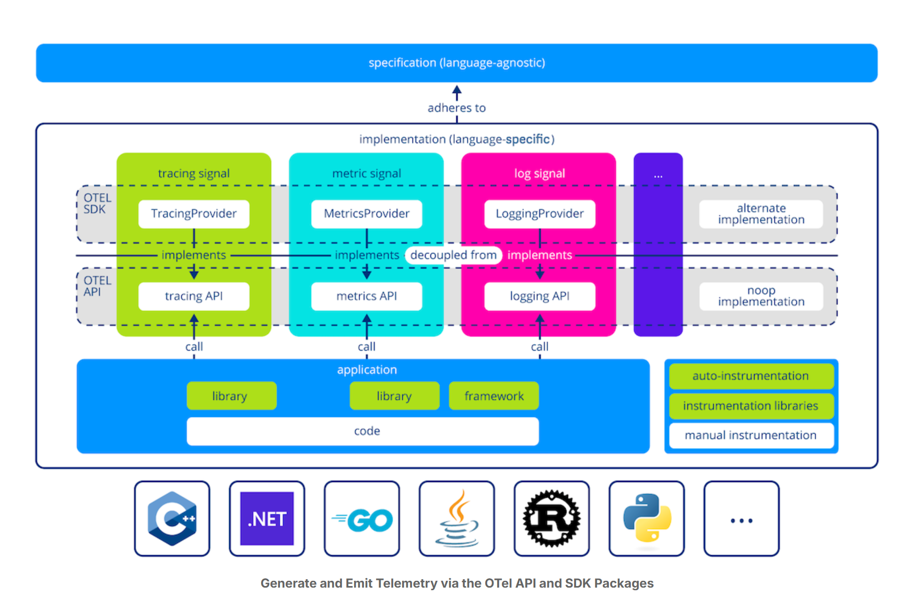
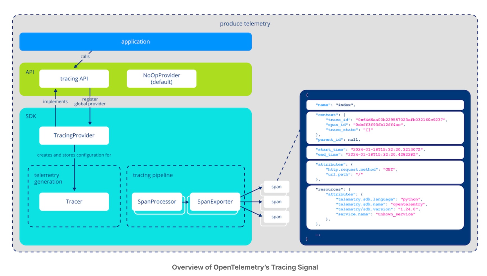
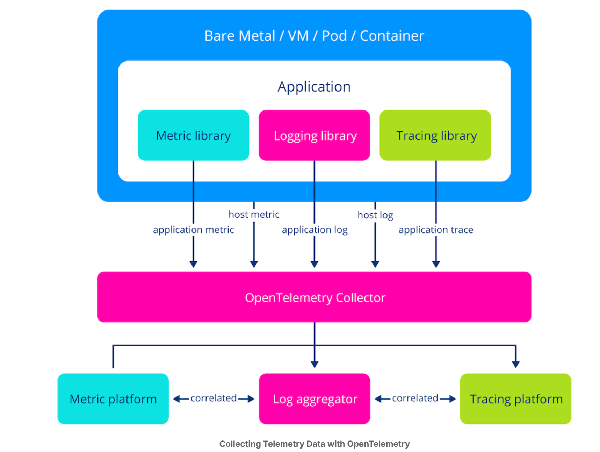
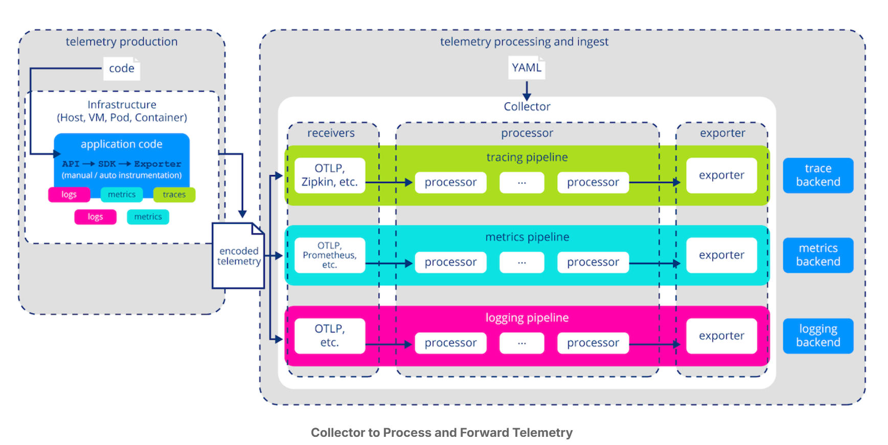
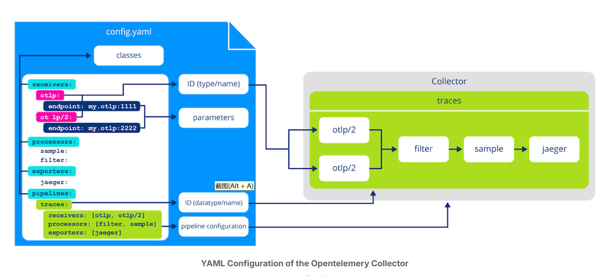

## 前言

分布式系统是一个由独立计算机或节点组成的网络，这些计算机或节点共同执行任务，就好像它们是一个单独的系统。这些系统广泛应用于云计算等应用中，在这些应用中，应用的不同部分运行在不同的服务器上，以共享资源和平衡工作量。由于分布式系统的复杂性，要随时了解每个组件内部正在发生的事情是很有挑战性的。这就是**可观察性**变得至关重要的原因。

要使分布式系统具有可观测性，我们必须对其状态进行建模，以便对其行为进行推理。这种模型由三个因素组成：

1. 首先是 **workload**。这些是系统为实现其目标而执行的操作。例如，当用户发送请求时，分布式系统通常会将其分解为由不同服务处理的较小任务。这通常也被称为事务。
2. 其次，**software abstractions**构成了分布式系统的结构。这包括负载平衡器、服务、Pod、容器等元素。
3. 最后，物理机器提供计算**资源**（如 RAM、CPU、磁盘空间、网络）来执行工作。

要真正理解一个系统，我们必须将多角度的见解结合起来，并弄清楚它们之间的关系。然而，在分析之前，我们必须首先捕捉系统行为的各个方面。这通常是通过 *logs*, *metrics* 和 *traces* 的组合来实现的

### Logs

**日志**是一种仅限附加的数据结构，用于记录系统中发生的事件。日志条目由表示事件发生时间的时间戳和描述事件细节的消息组成。然而，制定标准化的日志格式并非易事。原因之一是不同类型的软件通常会传达不同的信息。HTTP 网络服务器的日志必然与内核的日志不同。但是，即使是类似的软件，人们对于好的日志应该是什么样子也往往有不同的看法。

除内容外，日志格式也因用户而异。最初，基于文本的格式是为了满足人类的可读性。然而，随着软件系统变得越来越复杂，日志的数量很快就变得难以管理。为了解决这个问题，我们开始将事件编码为键/值对，使其具有机器可读性，这就是通常所说的结构化日志。此外，容器化应用的分布性和短暂性意味着登录单个机器并筛选日志已不再可行。因此，人们开始构建日志代理和协议，将日志转发到专用服务。这些日志系统可实现高效存储，并能在中央位置搜索和过滤日志。

### Metrics

日志能提供有关单个事件的详细信息。不过，有时我们需要系统当前状态的高级视图。这就是指标的作用所在。指标是通过对一组事件应用统计指标得出的单一数值。换句话说，指标表示的是一个总体。这一点非常有用，因为通过其紧凑的表示方法，我们可以绘制出系统随时间变化的图表。为此，业界开发了用于提取指标值的仪表装置、用于表示和传输数据的格式和协议、用于存储这些数据的专用时间序列数据库，以及用于向最终用户提供这些数据的前端。

### Traces

随着分布式系统规模的不断扩大，传统的日志系统在调试复杂问题时往往显得力不从心。原因在于，我们通常必须了解系统中的事件链。在单台机器上，堆栈跟踪允许我们将异常追溯到一行代码。而在分布式环境中，我们就没有这种能力了。取而代之的是，我们需要进行大量过滤，以查找感兴趣的日志事件。为了了解更大的上下文，我们必须识别其他相关事件，例如启动日志条目的特定请求或事务，以及在整个系统中处理该请求所涉及的服务或微服务的顺序。这通常需要大量的手工劳动（例如比较时间戳），或者需要有关应用程序的广泛领域知识。认识到这一问题后，Google 开发了[Dapper](https://research.google.com/pubs/pub36356.html?spm=5176.100239.blogcont60165.11.OXME9Z) ，推广了 *分布式跟踪*的概念。

其基本思想是在日志中添加事务上下文。这使得推断因果关系和重建系统中请求的历程成为可能。

### Three Pillars of Observability

**遥测**是从远程或分布式系统自动收集和传输数据的过程，以监控、测量和跟踪这些系统的性能或状态。遥测数据可实时洞察应用程序不同部分的执行情况。遥测为可观察性工具提供数据，帮助开发人员和系统管理员观察、排除故障和优化系统，而无需手动检查每个组件。

从表面上看，logs、metrics和traces在其生命周期和组成部分上有许多相似之处。一切都始于捕获和发射数据的仪表装置。数据必须具有由格式定义的特定结构。然后，我们需要一种机制来收集和转发 [遥测](https://en.wikipedia.org/wiki/Telemetry)。通常情况下，在将数据导入后端之前，会有某种代理来进一步丰富、处理和批处理数据。这一过程通常涉及数据库，以有效地存储、索引和搜索大量数据。最后，还要进行前端分析，以便最终用户访问数据。不过，在实践中，我们会为每种遥测类型开发专用系统，这是有充分理由的：每种遥测信号都有其独特的技术挑战。这些挑战主要是由数据的不同性质造成的。

数据模型、交换格式和传输协议的设计，在很大程度上取决于你处理的是非结构化或半结构化文本信息、时间序列中的紧凑数值，还是描述事件间因果关系的图式结构。即使是单一信号，在这些问题上也没有达成共识。

此外，我们如何使用遥测技术并从中获得洞察力也大相径庭。一个系统可能需要执行全文检索、检查单个事件、分析历史趋势、可视化请求流、诊断性能瓶颈等等。这些需求体现在存储、访问模式、查询功能等的设计和优化上。

在应对这些技术挑战时，[vertical integration](https://en.wikipedia.org/wiki/Vertical_integration) 成为一种实用的解决方案。在实践中，可观测性供应商将问题范围缩小到单一信号，并提供仪表装置来生成和分析遥测数据的工具，作为一个单一的、完全集成的解决方案。

### 可观察性方法存在的挑战

#### 孤立的遥测技术难以使用

首先，遥测数据的质量存在缺陷。为了说明这一点，让我们假设要调查问题的根本原因。问题的第一个指标通常是指标仪表板中的警报或异常。为了确认事件是否值得调查，我们必须形成一个初步假设。我们目前掌握的唯一信息就是在某个特定时间点发生了某些事情。因此，第一步是使用指标系统查找显示时间相关的异常行为的其他指标。

在对问题做出合理猜测后，我们希望深入调查问题的根本原因。为了获取更多信息，我们通常会切换到日志系统。在这里，我们编写查询并执行大量过滤，以查找与可疑指标相关的日志事件。

在发现感兴趣的日志事件后，我们往往希望了解该操作发生的大背景。遗憾的是，传统日志系统缺乏重建特定事务事件链的机制。传统日志系统往往无法捕捉操作的完整上下文，因此很难在不同服务或组件之间关联事件。它们往往无法保存关键的元数据，如trace IDs or span IDs，而这些对于将相关事件联系在一起至关重要。这种限制导致系统行为的视图支离破碎，单个操作的故事分散在多个日志中，没有清晰的叙述。此外，标准化查询语言或界面的缺乏也增加了有效搜索和分析日志的难度，因为operators必须依靠自定义脚本或手动过滤来发现模式和异常。

如果我们将视角从构建可观察性解决方案的人转换到使用该解决方案的人，就会发现一个内在的脱节。现实世界并不是由日志、度量或跟踪问题组成的。相反，我们必须在不同类型的遥测数据之间来回切换，以建立心智模型并推理系统行为。由于可观测性工具是由互不关联的数据组成的孤岛，因此要弄清这些信息之间的关系会给operators带来巨大的认知负担。

#### Lack of Instrumentation Standard Leads to Low Quality Data

造成根本原因分析困难的另一个因素是遥测数据往往缺乏一致性。这导致不同服务或组件之间的事件关联困难重重，因为没有标准化的方法来识别相关事件，例如通过trace IDs or span IDs。此外，也没有直接的方法将多个特定于解决方案的日志库集成到一个统一的系统中，导致系统行为的视图支离破碎、互不关联

#### No Built-in Instrumentation in Open Source Software

让我们从开源软件开发人员的角度来看这个问题。如今，大多数应用程序都建立在开源库、框架和独立组件之上。由于大部分工作都是在应用程序开发人员的业务逻辑之外进行的，因此从开源组件中收集遥测数据至关重要。在操作软件时，最了解软件重要性的人就是开发人员和维护人员本身。然而，目前还没有通过本机工具进行交流的好方法。

一种方法是选择可观测性解决方案的仪表装置。然而，这会给项目增加额外的依赖性，并迫使用户将其集成到自己的系统中。运行多个日志和度量系统虽然不切实际，但在技术上是可行的，而跟踪则是完全不可能的，因为它需要每个人都同意跟踪上下文传播的标准。

解决计算机科学问题的常见策略是增加一层间接性。开放源代码开发者通常会提供可观测性钩子，而不是嵌入供应商特定的仪表装置。这样，用户就可以编写适配器，将开源组件与他们的可观测性系统连接起来。虽然这种方法提供了更大的灵活性，但也有其自身的问题。例如，每当软件有新版本时，用户就必须注意并更新他们的适配器。此外，间接性也增加了开销，因为我们必须在不同的遥测格式之间进行转换。

### 什么是 OpenTelemetry（简而言之）？

OpenTelemetry (OTel) 是一个开源项目，旨在为生成、收集和导出跟踪、度量和日志等遥测数据提供标准化的工具和应用程序接口。其目的是让开发人员深入了解应用程序，帮助监控、排除故障和优化软件系统。

OpenTelemtry 的主要目标是

+ **统一**telemetry****：将跟踪、日志记录和度量结合到一个单一的框架中，实现所有数据的关联，并为遥测数据建立一个开放的标准。
+ **供应商中立性**：与处理数据的不同后端集成。
+ **跨平台**：支持多种语言（Java、Python、Go 等）和平台，使其适用于不同的开发环境。

#### OpenTelemetry 不是什么

1. OpenTelemetry 不会取代 Datadog、New Relic 或 Prometheus 等成熟的监控或可观察性平台。相反，它有助于收集和标准化遥测数据（跟踪、度量、日志），以便将其发送到这些工具进行可视化和分析。
2. OpenTelemetry 不会存储或可视化数据。它的重点是收集遥测数据并将其导出到可处理存储和展示的外部系统，如 Grafana、Jaeger 或 Prometheus。
3. OpenTelemetry 是一个用于收集和导出数据的工具包，但需要配置并与其他系统集成。它不会自动提供开箱即用的监控或警报功能。
4. 虽然 OpenTelemetry 可以帮助你收集详细的性能数据，但它并不能自动优化应用程序的性能。它是一种诊断工具，可以帮助你收集用于手动调整的洞察力。

从本质上讲，OpenTelemetry 是遥测数据的集成和标准化工具，而不是监控、日志记录或性能管理的一体化解决方案。它通过规范数据收集流程，对其他工具起到补充作用。

#### OpenTelemetry 的优势

+ Instrument once, use everywhere

  OpenTelemetry 旨在提供一套标准化的工具和库，用于收集和导出应用程序的遥测数据（例如，日志、指标、跟踪）。它的目标是让开发者只需一次性地将这些工具集成到代码中，就可以与各种不同的监控和分析系统兼容，而无需针对每个系统进行单独的修改。

  为了实现这个目标，并且考虑到它可能会成为很多软件项目的基础依赖，OpenTelemetry 非常重视 API 的稳定性。它承诺：一旦某个信号（例如，一种特定类型的日志或指标）被声明为稳定版，客户端就永远不会遇到破坏性的 API 更改。这意味着即使 OpenTelemetry 更新版本，开发者也不用担心现有的代码会因此出错，保证了长期使用的兼容性。

+ Separate telemetry generation from analysis

  OpenTelemetry 的另一个核心理念是*将产生遥测数据的机制与分析遥测数据的系统分开*。开放的、与供应商无关的仪表装置标志着*可观测性业务的根本性改变*。供应商必须通过功能丰富、实用性强的分析平台实现差异化，而不是将资源投入到构建专有仪表装置并使其不断更新。OpenTelemetry *促进了竞争*，因为用户不再受限于他们在开发过程中选择的可观测性解决方案。在转用 OpenTelemetry 之后，您可以移动平台，而不必重新测量整个系统。

+ Make software observable by default
  有了 OpenTelemetry，开源开发人员就能在其项目中添加*n**ative instrumentation，而无需引入特定于供应商的代码*，从而减轻用户的负担。我们的想法是让可观测性成为开发过程中的一等公民。通过让软件内置仪表装置，我们就不再需要精心设计的机制来捕获和集成这些仪表装置

+ mprove how we use telemetry
  最后（但绝对不是最不重要的），OpenTelemetry 试图改变我们思考和使用遥测技术的方式。OpenTelemetry 不再为日志、指标和跟踪设置三个独立的筒仓，而是采用将遥测信号联系在一起的模式。通过上下文创建信号之间的接触点，遥测的整体价值和可用性大幅提高。例如，想象一下从仪表板上显眼的统计数据直接跳转到相关日志的能力。相关的遥测数据有助于减轻人类操作复杂系统的认知负担。能够利用关联数据将标志着新一代可观察性工具的诞生

## OpenTelemetry 框架概述

接下来我们将了解：

+ 解释 OpenTelemetry 信号规范的目的，以及它如何确保不同语言和平台的一致性
+ 描述 OTel SDK 和 API 规范以及语义约定。
+ 讨论 "Vendor-Agnostic Instrumentation"的概念，重点是 OpenTelemetry 如何提供特定语言的Instrumentation，包括不同的Instrumentation级别
+ 解释 OpenTelemetry Collector 作为遥测处理器的作用，以及它如何促进遥测数据的处理和输出
+ 讨论 OTLP（开放遥测协议）、其作为传输遥测数据的有线协议的重要性及其在规范不同组件间通信方面的作用

### Signal Specification (语言无关)

在高层次上，OpenTelemetry 被组织成各种信号，主要包括**tracing, metrics and logging**记录。每个信号都是作为独立组件开发的（但也有方法将数据流相互连接）。信号是在 OpenTelemetry 的 *language-agnostic*[specification](https://opentelemetry.io/docs/specs/) 中定义的，它是项目的核心。最终用户可能不会直接接触到该规范，但它在确保 OpenTelemetry 生态系统内的一致性和互操作性方面发挥着至关重要的作用。

OpenTelemetry规范由三部分组成

1. **[术语定义](https://opentelemetry.io/docs/specs/otel/glossary/):** 这部分奠定了基础，确保所有参与者对关键术语有相同的理解，避免歧义。就像一本字典，定义了OpenTelemetry 中使用的各种专业词汇。

2. **信号规范:** 这是 OpenTelemetry 的核心，它详细规定了三种主要信号（Tracing 追踪, Metrics 指标, Logging 日志）的处理方式。 这部分又细分为 API 和 SDK 两个层面：

   - **API 规范（请参阅 [Tracing API](https://opentelemetry.io/docs/specs/otel/trace/api/)、[Metrics API](https://opentelemetry.io/docs/specs/otel/metrics/api/) 和 [OpenTelemetry Logging](https://opentelemetry.io/docs/specs/otel/logs/)):** 

     这是面向应用程序开发者的接口。它定义了开发者可以用哪些方法来创建、处理和导出遥测数据，就像一个约定。 不同的编程语言（例如 Java、Python、Go）会根据这个 API 规范实现各自的库，但它们都遵循相同的接口，确保了互操作性。 这样，即使应用使用不同的语言编写，产生的遥测数据也能被统一处理。

   - **SDK 规范 （请参阅 [Tracing SDK](https://opentelemetry.io/docs/specs/otel/trace/sdk/)、[Metrics SDK](https://opentelemetry.io/docs/specs/otel/metrics/sdk/)、[Logs SDK](https://opentelemetry.io/docs/specs/otel/logs/sdk/)）:** 

     这是面向 SDK 开发者的规范，SDK 是对 API 的具体实现。它规定了每种编程语言的 OpenTelemetry SDK 需要满足哪些要求才能与规范兼容。SDK 负责处理配置、数据处理、导出等底层细节，让开发者更方便地使用 OpenTelemetry。

3. **遥测数据相关规范:** 除了信号架构，规范还涵盖了其他方面，以确保不同来源的遥测数据具有一致性和可比性：

   - **语义约定:** 这部分定义了遥测数据中常用元数据的命名和解释规则。例如，HTTP 请求的持续时间应该如何命名，数据库查询的错误代码应该如何表示。通过遵循这些约定，可以减少对来自不同来源的数据进行规范化的工作，方便数据分析和理解。
   - **OpenTelemetry 协议 (OTLP):** 这是一种用于传输遥测数据的标准协议。它定义了数据格式和传输方式，使得不同厂商的 OpenTelemetry 实现可以互通。 你可以把它理解成一个通用的语言，让不同的系统可以互相理解彼此的遥测数据。

总而言之，OpenTelemetry 规范通过定义清晰的 API、SDK、语义约定和传输协议，实现了遥测数据的标准化，从而简化了监控和可观测性的实施，并提高了不同系统之间的数据互操作性

### 与供应商无关的特定语言工具

OTel 的设计理念是将 API 和 SDK 分开，从而实现语言无关性和灵活性。

**工作流程：**

1. **应用程序调用 OTel API:** 你的应用程序代码调用 OTel API 来记录遥测数据。
2. **API 调用 SDK:** OTel API 将调用转发给已注册的 SDK 提供器。
3. **SDK 处理数据:** SDK 提供器根据配置处理数据，例如添加上下文信息、采样、批处理等。
4. **SDK 导出数据:** SDK 将处理后的数据导出到后端系统，例如 Jaeger、Prometheus、Zipkin 等。

**API 和 SDK 分离的好处：**

- **语言无关性:** 应用程序代码只依赖于 OTel API，不依赖于具体的 SDK 实现，因此可以轻松切换不同的 SDK 或后端系统。
- **灵活性:** 用户可以根据自己的需求选择不同的 SDK 实现，例如选择特定厂商的 SDK 或开源的 SDK。
- **减少依赖:** 库开发者可以直接使用 OTel API 进行埋点，而无需引入额外的 SDK 依赖，避免了依赖冲突。
- **按需启用:** 用户可以根据需要选择是否注册 SDK 提供器，如果没有注册，则 API 调用将被忽略，不会产生额外的开销。

### Telemetry Processor (独立的组件)

到目前为止，我们已经看到 OpenTelemetry 为应用程序和库开发人员提供了与供应商无关的仪表装置工具。这本身就是一个重要的里程碑，但 OpenTelemetry 的框架远不止于此。在生成和发射遥测数据后，operators负责管理并将其摄取到相应的后端。这包括以下任务

- 从各种来源收集数据
- 进行解析和转换，以便下游处理
- 用附加元数据丰富
- 过滤无关数据，减少噪音和存储需求
- 正常化和应用转换
- 缓冲以提高弹性和性能
- 路由选择，将遥测数据子集导向不同的目的地
- 转发到后端

为构建和配置此类遥测管道，运营团队通常会部署额外的基础架构。一个流行的例子是 [fluentbit](https://fluentbit.io/) 遥测代理。同样，OpenTelemetry 提供了具有这些功能的独立组件：[OpenTelemetry Collector](https://opentelemetry.io/docs/collector/)。

### Wire Protocol

作为标准化、生成和管理包的补充，OpenTelemetry 还定义了如何在生产者、代理和后端之间传输遥测数据。

The [OpenTelemetry Protocol (OTLP)](https://opentelemetry.io/docs/specs/otel/protocol/) is an open source and vendor-neutral wire format that defines:

+ 数据如何在存储器中编码
+ 在网络上传输数据的协议

As a result, OTLP is used throughout the observability stack. Emitting telemetry in OLTP means that instrumented applications and third-party services are compatible with countless observability solutions. The Collector supports receiving telemetry from and exporting to a various formats (e.g., Prometheus Metrics, Zipkin traces, etc.). However, OTLP is generally preferred because the Collector uses it internally to represent and process telemetry. Thereby, we avoid the cost of converting between formats and increase consistency. This is because the native format closely aligns with the ideas proposed by the framework (having attributes follow semantic conventions, cross-signal correlation, etc.).

Similarly, most observability backends support OTLP right out of the box. Given the rapid adoption of OpenTelemetry, integrating with OTLP automatically gives you access to a broad audience of potential users. Moreover, an open and vendor-neutral telemetry protocol means less work for developers of observability tools. Before, you had to develop countless adapters to be able to ingest data arriving in various proprietary formats. In other words, OTLP is a significant push for interoperability between tools and services in the observability ecosystem.

OTLP offers three transport mechanisms for transmitting telemetry data: HTTP/1.1, HTTP/2, and gRPC. When using OTLP, the choice of transport mechanism depends on application requirements, considering factors such as performance, reliability, and security. OTLP data is often encoded using the Protocol Buffers (Protobuf) binary format, which is compact and efficient for network transmission and supports schema evolution, allowing for future changes to the data model without breaking compatibility. Data can also be encoded in the JSON file format, which allows for a human-readable format with the disadvantage of higher network traffic and larger file sizes.

### 小结

we explored the key components of the **OpenTelemetry Framework**, covering how it provides a unified approach to collecting and transmitting telemetry data.

We began by discussing the **Signal Specification**, which is language-agnostic and ensures consistency in how telemetry data (logs, metrics, traces) is defined and gathered across different platforms and languages.

Next, we discussed **Vendor-Agnostic Instrumentation**, emphasizing how OpenTelemetry enables telemetry collection in specific programming languages while maintaining independence from any particular vendor's observability toolset.

We then examined the role of the **OpenTelemetry Collector** as a **Telemetry Processor**, detailing how it processes, transforms, and exports telemetry data to various backends, allowing flexibility in managing observability data pipelines.

Additionally, we introduced the **OTLP (OpenTelemetry Protocol)**, which standardizes the transmission of telemetry data across the system, ensuring reliable communication between different components.

Finally, we touched on the importance of the **OTel SDK and API specification**, which defines how developers interact with OpenTelemetry, and the **Semantic Conventions**, which provide consistent labeling and structure for telemetry data, improving the clarity and usefulness of collected information.

## Hands-on Lab

请[参考]([ForcemCS/OpenTelemetry: OpenTelemetry入门](https://github.com/ForcemCS/OpenTelemetry))

## Instrumentation(仪表装置)

接下来我们将了解仪表装置

- 定义仪表装置并解释其在可观测性中的作用
- 描述现有的各种仪表装置类型，包括：自动或零代码仪表装置、仪表装置库和手动仪表装置
- 确定与每种仪表装置相关的优势和挑战
- 解释仪表装置库如何在不支持本地 OpenTelemetry 的框架与 OpenTelemetry 生态系统之间架起桥梁
- 了解自动仪表装置在将可观测性动态注入应用程序中的作用，并描述如何使用特定语言机制（如 Java 代理）实现自动仪表装置
- 认识不同编程语言和框架中自动仪表装置的局限性
- 讨论手动仪表对代码库的影响，包括实施所需的工作量以及在遗留环境中可能遇到的挑战

### What is instrumentation?

仪表化是指添加代码或使用工具从应用程序中收集遥测数据（如logs、metrics和traces）的过程。

换句话说，这意味着你在应用程序代码中添加了一些东西，从而将一个不被观测的应用程序变成了一个能从应用程序内部发射数据的应用程序。工具化应用程序就像一部外语片和一部带字幕的外语片之间的区别；工具化解释了正在发生的事情。

通过这些数据，可以深入了解应用程序在运行时的表现，帮助开发人员监控性能、诊断问题并了解整个系统的健康状况。

在可观察性方面，仪器是关键的第一步。它可以收集遥测信号，使可观察性工具能够跟踪和可视化应用程序及其组件的运行情况。通过检测应用程序，开发人员可以识别瓶颈、跟踪分布式服务中的请求并监控资源使用情况--所有这些对于实时了解系统行为都至关重要。然而，仪器通常高度依赖于所使用的编程语言和框架。这意味着仪器代码往往是专有的，是为每个应用程序的特定工具、库和架构量身定制的。因此，开发人员通常必须为他们使用的每种语言或框架实施定制的仪器，这可能会导致系统不同部分在保持一致性方面遇到挑战，尤其是在多语言（多语言）环境中。

这也意味着，你想从应用程序中提取的信息越具体，你的仪器工作就必须越具体。

### 不同的Instrumentation类型

OpenTelemetry 框架概述 "一章介绍了 OTel 的三种不同仪器类别：automatic, libraries, and manual。如果查阅文档，你还会发现**zero-code** and **code-based instrumentation**

**OpenTelemetry 类别：**

+ Automatic Instrumentation (or zero-code)

  + 无需修改代码：无需修改源代码即可自动检测应用程序。
  + 通常由 OpenTelemetry 代理或插件提供：这些代理附加到应用程序的运行时，自动收集遥测数据。
  + 是快速安装的理想选择：开箱即用，无需人工干预即可收集跟踪、指标和日志。
  + 控制粒度较小：自动仪器虽然易于使用，但其微调或定制功能可能不如手动仪器。

+ Instrumentation Libraries (潜在可能的code-based)

  + 可能只需修改极少的代码：库通常是编程语言或框架的专用库，通过将其导入代码进行集成。有些库只需极少的配置即可轻松集成，而有些库则可能需要人工干预。
  + 提供更大的灵活性：它们可让您在自动方法无法到达的地方添加仪器，或使用自定义逻辑对其进行扩展
  + 控制集成：您可以使用库更详细地检测应用程序的特定部分。

+ Manual Instrumentation (完全基于代码)

  + 需要明确更改代码：手动测量需要在源代码中直接添加 OpenTelemetry API 调用。
  + 细粒度控制：它让开发人员能够完全控制哪些内容会被记录、如何测量以及收集哪些数据。你可以准确选择开始和结束跟踪的位置、记录特定事件或捕获自定义指标。
  + 自定义：这是最灵活的方法，允许开发人员对应用程序的任何部分进行检测，无论是否有自动或基于库的选项。
  + 耗费更多精力和维护：由于开发人员需要明确管理代码中的跨度、指标和日志记录点，因此手动仪表的实施和维护需要更多时间。

  使用 OpenTelemetry 的 API 定义自定义spans, attributes, or events。例如在自定义跟踪中手动封装特定代码块。添加无法自动捕获的自定义指标，例如计算特定业务功能被调用的次数

### Overlap

有些仪表库可能会在配置后自动提供仪表功能，这就模糊了两者的界限。例如，一个库可能会在导入后自动对 HTTP 请求进行检测，也可能需要手动添加几行代码才能实现全部功能。

简而言之，两者之间的界限并不总是很明显，但自动仪器一般不需要代码且范围广泛，而仪器库则提供了更细粒度的控制和灵活性，有时只需很少的代码改动。

另外，从技术上讲，每种实现方法都会使用某种形式的库。在自动或零代码方法中，只需添加库并执行预定义的操作即可。在手动或基于代码的方法中，您将添加库，以便在代码中直接调用 API/SDK。

### 背景信息

#### Instrumentation Libraries

OpenTelemetry 的长期愿景是让第三方库或框架与本地 OpenTelemetry 仪器一起发布，提供开箱即用的可观测性。然而，并非所有项目都支持不断发展的 OpenTelemetry API。为了弥补这一差距，我们开发了仪器库。这些库有助于提高 OpenTelemetry 的采用率，而无需完全依赖库维护者。

仪器库是一个独立的、单独安装的库，旨在将 OpenTelemetry API 调用注入到缺乏本地集成的库或框架中。其方法因编程语言和特定库而异，包括封装接口、修补代码和在库特定钩子上注册回调等技术。

OpenTelemetry 维护着这些库的注册表，其中包括许多适用于不同框架和编程语言的选项。不过，许多库仍处于 alpha 或 beta 阶段。要找到合适的库，可以在注册表中搜索您的框架或语言。

#### 优势与挑战: Libraries

Instrumentation libraries 为增强缺乏 OpenTelemetry 原生支持的第三方库或框架的可观测性提供了宝贵的方法。它们简化了采用过程，但也带来了挑战：

+ **依赖性管理**：增加了复杂性，需要精心维护。
+ **社区支持**：与原生集成相比，库的支持和资源可能有限。

当原生仪器不可用、手动仪器又不切实际时，仪器库就显得尤为有用。它们通常与 OpenTelemetry 的自动仪表结合使用，后者可在不修改代码的情况下将可观测性动态注入应用程序。

#### 优势与挑战: Auto-Instrumentation

自动仪器通过使用代理或运行程序，在运行时将仪器动态注入应用程序，从而简化了可观测性设置。这是通过每种编程语言特有的机制实现的。

虽然自动仪器是一项强大的功能，但值得注意的是，并非所有语言都支持类似的机制。因此，不同编程语言的自动仪表功能可能会有所不同。

#### 优势与挑战: Manual Instrumentation

使用 OpenTelemetry API 和 SDK 进行手动测量可能需要大量人力。这一过程涉及大量代码修改和遥测框架学习，可能会让人难以承受，尤其是在传统代码库中。尽管 OpenTelemetry 的目标是 "检测一次，永不再用"，但手动检测的成本和复杂性可能仍然很高。

认识到这些挑战，OpenTelemetry 支持增量迁移策略，以简化采用过程。仪表库和自动仪表旨在提供预定义的度量、跟踪和日志，只需最少的代码改动，从而简化集成过程。

## Traces

**1. Tracing API (追踪 API):** 这是开发者与 OpenTelemetry 交互的主要接口。开发者使用这些接口在应用程序代码中添加追踪信息，例如创建 Span（跨度，代表一个操作单元）、添加属性等等。你可以把它理解成一套用于埋点的工具。

**2. SDK (软件开发工具包):** SDK 实现了 Tracing API，并提供了更多的功能，例如配置追踪管道、管理 Span 的生命周期等。它就像一个引擎，驱动着整个追踪过程。

**3. TracingProvider (追踪提供者):** 这是 SDK 的核心组件，负责创建 Tracer 对象。一个应用程序通常只有一个 TracingProvider 实例。它像一个工厂，负责生产 Tracer。

**4. Tracer (追踪器):** 开发者使用 Tracer 对象来创建 Span。每个 Span 代表应用程序中的一个操作单元，例如一个函数调用、一个数据库查询等等。Tracer 就像一个记录器，记录着每个操作的执行情况。

**5. Tracing Pipeline (追踪管道):** 这是 Span 数据的处理流程。它由 SpanProcessor 和 SpanExporter 组成。

**6. SpanProcessor (跨度处理器):** SpanProcessor 负责处理 Span 数据，例如添加标签、过滤 Span 等等。它像一个过滤器，可以对 Span 数据进行一些预处理。

**7. SpanExporter (跨度导出器):** SpanExporter 负责将 Span 数据发送到后端系统，例如 Jaeger、Zipkin 等等。它像一个发送器，将处理好的 Span 数据发送到指定的地方。

**8. NoOpProvider (空操作提供者):** 这是一个默认的 TracingProvider，它不会进行任何实际的追踪操作。当开发者没有配置 TracingProvider 时，就会使用 NoOpProvider。它就像一个占位符，防止程序崩溃。

**工作流程:**

1. 应用程序调用 Tracing API 创建 Span。
2. Tracing API 将请求传递给 TracingProvider。
3. TracingProvider 创建 Tracer 对象。
4. 应用程序使用 Tracer 对象创建 Span 并记录追踪信息。
5. Span 数据被传递到 Tracing Pipeline。
6. SpanProcessor 对 Span 数据进行处理。
7. SpanExporter 将处理后的 Span 数据发送到后端系统。

## Metrics

1. **Meter (计量器):** 可以理解为一个“工厂”或“命名空间”，用于创建和管理各种 instruments。一个 meter 通常与你的应用中的一个库或模块关联。例如，你可以为你的网络请求模块创建一个 meter，专门用于生成和管理与网络请求相关的指标。
2. **Instrument (仪器):** 是具体的测量工具，用于记录特定类型的指标。它由 meter 创建，并拥有一个唯一的名称。常见的 instrument 类型包括：
   - **Counter (计数器):** 用于累计计数，例如请求总数、错误总数等，值只会递增。
   - **Gauge (测量仪):** 用于记录瞬时值，例如当前CPU使用率、内存使用量等，值可以上升或下降。
   - **Histogram (直方图):** 用于记录数值的分布情况，例如请求延迟的分布、文件大小的分布等，将数据划分到不同的桶中进行统计。
3. **Measurement (测量值):** 是 instrument 记录的单个数据点，代表指标在特定时刻的状态。例如，一个计数器每次增加1就是一个 measurement。这些原始的 measurement 会被聚合处理成最终的数据点。

## Logs

请参考如下资源

- [OpenTelemetry logs](https://opentelemetry.io/docs/concepts/signals/logs/)
- [OpenTelemetry Logging](https://opentelemetry.io/docs/specs/otel/logs/)
- [Logs Data Model | OpenTelemetry](https://opentelemetry.io/docs/specs/otel/logs/data-model/)
- [Getting Started | OpenTelemetry](https://opentelemetry.io/docs/languages/python/getting-started/)
- [OpenTelemetry Python API and SDK](https://github.com/open-telemetry/opentelemetry-python)
- [OpenTelemetry Logging Instrumentation](https://opentelemetry-python-contrib.readthedocs.io/en/latest/instrumentation/logging/logging.html)

## OpenTelemetry Collector

接下我们将了解

- 了解 OpenTelemetry Collector 在遥测管道中的作用
- 区分基于 SDK 的遥测和基于采集器的遥测管道。
- 解释采集器管道的组成部分，包括接收器、处理器和输出器
- 描述各种采集器部署模式，以及采集器如何改进资源管理和遥测性能
- 确定使用采集器进行遥测治理、扩展和故障排除的好处
- 使用基于 YAML 的配置文件配置 OpenTelemetry 收集器
- 评估不同采集器部署拓扑结构的利弊

我们了解了 OpenTelemetry 的 SDK 如何实现产生遥测数据的仪器。我们还配置了一个基本管道，直接从 SDK 导出生成的遥测数据。[*Collector*](https://opentelemetry.io/docs/collector/) 是 OpenTelemetry 的关键组件，用于管理遥测数据的处理和转发。

现在，你可能会问自己：这些功能与 SDK 有什么不同？

使用 SDK 时，遥测管道是在应用程序代码中定义的。根据您的使用情况，这种方法完全没问题。另一方面，收集器是一个用 Go 编写的二进制文件，作为一个单独的独立进程运行。它提供了一个灵活、可配置且与供应商无关的系统，用于处理应用程序之外的遥测。它本质上是遥测源和存储数据的后端之间的中介。

### The Benefits of Collectors

部署收集器有很多优点。最重要的是，它可以更干净地分离关注点。开发人员不必关心遥测生成后会发生什么。有了采集器，操作员就可以控制遥测配置，而无需修改应用程序代码。此外，将这些关注点整合到一个中心位置可简化维护工作。在基于 SDK 的方法中，遥测数据的去向、所需格式以及处理方式等配置分散在由不同团队管理的不同代码库中。然而，遥测管道很少是针对单个应用的。如果没有收集器，调整配置并在不同应用间保持一致就会变得非常棘手。

把东西从 SDK 中移出还有其他好处。例如，SDK 的整体配置变得更加精简。此外，每次对遥测管道进行更改时，我们都不再需要重新部署应用程序。由于在调试与遥测处理相关的问题时只需监控一个位置，因此故障排除变得更加容易。将处理和转发卸载到另一个进程意味着应用程序可以将资源用于执行实际工作，而不是处理遥测。在了解更多细节之前，我们先来看看组成收集器的组件。

### Architecture of a Collector Pipeline

#### Receivers 

测信号管道由接收器、处理器和输出器组合而成。

接收器是数据从源（即应用程序）到 OpenTelemetry 收集器的传输方式。这种机制可以是拉式的，也可以是推式的。开箱即用的收集器支持 [**OTLPReceiver**](https://github.com/open-telemetry/opentelemetry-collector/tree/main/receiver/otlpreceiver) 以 OpenTelemetry 的本地格式接收跟踪、度量和日志。[**collector-contrib**](https://github.com/open-telemetry/opentelemetry-collector-contrib/tree/main/receiver) 资源库包括一系列接收器，用于摄取以各种协议编码的遥测数据。例如，有一个用于跟踪的 [**ZipkinReceiver**](https://github.com/open-telemetry/opentelemetry-collector-contrib/tree/main/receiver/zipkinreceiver) 接收器、[**StatsdReceiver**](https://github.com/open-telemetry/opentelemetry-collector-contrib/tree/main/receiver/statsdreceiver) 和 [**PrometheusReceiver**](https://github.com/open-telemetry/opentelemetry-collector-contrib/tree/main/receiver/prometheusreceiver) 等等。数据导入后，接收器会将遥测数据转换为内部表示。然后，接收器将收集到的遥测数据传递给一系列处理器。

#### Processors 

处理器提供一种机制，用于在将遥测数据发送到后端之前对其进行预处理。处理器分为两类，一些适用于所有信号，而另一些则专门针对特定类型的遥测数据。从广义上讲，处理遥测数据一般有以下几个原因：

#### Exporters

最后，链中的最后一个处理器将其输出交给输出器。输出器接收数据，将内部表示转换成所选的协议，并将其转发到一个（或多个）目的地。与接收器类似，收集器也内置了 [OTLP](https://github.com/open-telemetry/opentelemetry-collector/tree/main/exporter) 的输出器。如前所述，许多开源或商业可观测性后端都是围绕自定义数据格式构建的。尽管 OpenTelemetry 越来越流行，但您当前的后端可能还不支持（或处于早期阶段）OTLP。为了解决这个问题，[**collector-contrib**](https://github.com/open-telemetry/opentelemetry-collector-contrib/tree/main/exporter) 资源库包含了许多遥测协议的输出程序。

### 配置OpenTelemetry Collector

## 单词

Instrumentation/**ˌɪnstrəmen'teɪʃn**/： 仪表装置

