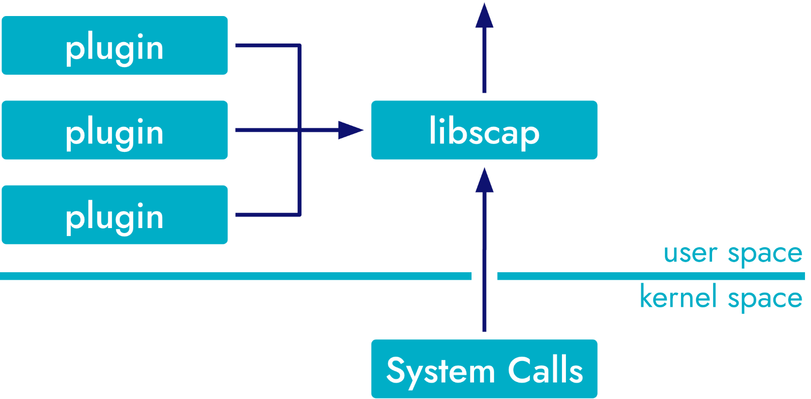

# Cloud Security

接下来我们将了解：

- 插件框架在 Falco 中的作用。
- Github、Cloudtrail 和 K8s Audit 插件如何扩展 Falco 的安全监控。
- 使用这些插件来增强云安全态势。

## Falco Plugins

确保主机级活动的安全是基础步骤，但在当今多样化和复杂的技术环境中，这还远远不够。安全考虑因素通常会扩展到云资源、API 甚至应用程序级活动。这就需要一种更加全面的监控和警报方法，这种方法不能只关注系统调用或本地主机活动。

Falco 的插件框架就是为了弥补这一不足而设计的，它是一种可扩展的机制，用于增强 Falco 在系统调用之外的监控能力。插件以动态共享库（Unix 为.so，Windows 为.dll）的形式实现，是一种添加额外数据源的方法，这些数据源可用于生成安全警报，而无需重建 Falco。它们与 Falco 捕获堆栈集成，实质上是 libscap 的替代input providers



插件包括两个主要功能。在 Falco 中设置插件需要配置 falco.yaml 文件，该文件指定了要加载和初始化的插件。

+ 事件源

  用于实现一个新的事件源，将事件馈送给 Falco。

+ 字段提取

  主要是从其他插件或核心库生成的事件中产生字段。

Falco 拥有多个功能强大的插件，可扩展其功能范围。例如，CloudTrail 插件可从 AWS CloudTrail 获取 JSON 日志，并允许 Falco 在云基础设施发生危险时发出警报。接下来，我们将介绍其中的一些插件。

在 Falco 部署中，根据您是监控系统调用还是使用插件，架构会有很大不同。对于系统调用监控，Falco 以面向主机的方式运行，因此必须将其部署到集群中的每台主机上。因此，在 Kubernetes 环境中，Falco 通常作为 DaemonSet 部署，以确保主机级覆盖。**另一方面，插件在主机外部生成数据。为防止冗余警报，建议使用单个 Falco 实例消耗这些插件生成的事件。**对于这种使用情况，建议使用具有单个副本的专用 Falco 部署架构。

## 安装插件

插件通常用 Go 或 C 语言编写，可以通过下载项目、编译和将生成的动态共享库(**是一种可以被多个程序共享使用的可执行代码文件。在 Linux 下，动态共享库的文件通常以 `.so` 结尾（Shared Object）**)移动到预期位置来安装。尽管通常会提供 Makefile，但它并不是开箱即用的解决方案。

falcoctl 是一种命令行界面 (CLI) 工具，旨在通过命令行界面管理 Falco 规则和插件。换句话说，falcoctl 可以帮助下载、安装和更新规则与插件。尽管 Falco 默认随附一些插件（如 CloudTrail），但其他插件需要安装（如 GitHub）。在这种情况下，您应该使用 falcoctl 来管理插件。

开始使用 Falcoctl 插件有四个主要步骤：

1. **Install** **falcoctl** 

   在主要场景中，Falco 安装默认也会安装 falcoctl。

2. **Configure an index **

   默认安装附带一个索引文件，其中包含官方工具。

3. **Search for Plugins **

   ```shell
   sudo falcoctl artifact search [plugin-name]
   ```

4. **Install Plugin **

   ```shell
   sudo falcoctl artifact install [plugin-name]
   ```

有关更多信息请参考此[插件](https://falco.org/blog/falcoctl-install-manage-rules-plugins/)

## 启用插件

插件配置部分通过 falco.yaml 文件进行配置，其中指定了插件调用参数，包括要加载的共享对象和插件配置。配置插件并不意味着启用插件。要启用插件，必须在 load_plugin 设置中添加插件名称。例如，下面的 yaml 配置并启用了 okta 插件的 myorg、api_token 和 24 小时的 cache_expiration。

```yaml
plugins:  
  - name: okta  
    library_path: /usr/share/falco/plugins/libokta.so  
    init_config:  
      organization: myorg  
      api_token: 00QCjA14MlV-WPXM...0HmJFx-vbGua  
      cache_expiration: 84600 #24h  
      open_params: ''  
    load_plugin: [okta]  
```

### JSON 插件

JSON（JavaScript Object Notation，JavaScript 对象符号）是一种轻量级数据交换格式，对人类和机器来说都易于读写。由于其普遍性和易用性，它已成为网络服务及其客户端之间数据交换的标准之一。

[JSON 插件](https://github.com/falcosecurity/plugins/tree/main/plugins/json)可从任何 JSON 有效负载中提取值。这是一个提取插件，因此没有事件源。它与以 JSON 表示其事件有效负载的插件（如 k8s_audit events 和 cloudtrail）结合使用。该插件没有任何配置，可通过以下方式进行配置：

```yaml
plugins:
  - name: json
    library_path: libjson.so
```

### Github 插件

GitHub 被公认为代码版本管理和协作的集中式存储库，如今已不仅仅是一个代码存储平台。通过内置的 CI/CD 管道，它现在拥有相当强大的计算能力。然而，它的重要性和功能也使其成为一个显著的攻击载体。安全从业人员必须认识到，GitHub 既是资产，也是潜在漏洞，因此必须保持警惕并采取保护措施，以保障存储库和相关工作流程的安全。

GitHub 插件可导出多个字段，用于分析 GitHub 活动。插件自带一套默认规则，可检测常见的 GitHub 相关威胁/问题，例如

+ 一个秘密被提交到存储库中。
+ 私人存储库变成了公共存储库。
+ 创建了一个新的部署密钥。

要安装网络钩子，插件需要有一个能访问受监控软件源的 [GitHub 令牌](https://github.com/settings/tokens)。该令牌至少需要完整的软件仓库范围，以便能够枚举用户的软件仓库并安装/删除网络钩子。运行插件的机器需要一个公共地址和一个开放的防火墙，允许 80 端口（HTTP）或 443 端口（https）。

插件有两个主要设置：init_config 和 open_params。

+ init_config 允许定义三个初始参数：websocketServerURL，即插件运行所在服务器的 URL（即本机的公共访问地址）；secretsDir（默认为 ~/.ghplugin）和 useHTTPS（默认为 true）。
+ open_params 是以逗号分隔的插件将监控的版本库名称列表。指定 * 作为打开参数将导致插件监控所有可用的版本库。

下面是监控软件源的示例：

```yaml
- name: github  
  library_path: libgithub.so  
  init_config: '{"websocketServerURL":"https://my-server"}'  
  open_params: 'falcosecurity/falco, falcosecurity/libs'  
```

### Cloudtrail插件

AWS CloudTrail 是记录和持续监控 AWS 环境中活动的宝贵资产。由于它能捕获 API 调用的全面记录，包括源 IP 地址和受影响的资源，因此能为安全审计和实时分析提供关键数据。

CloudTrail 插件可读取 AWS CloudTrail 日志，并为每个 CloudTrail 日志条目发出事件。该插件自带一组默认规则，可用于识别 CloudTrail 日志中有可疑得注意的事件，包括

- 不使用多因素身份验证的控制台登录
- 禁用用户多因素身份验证
- 禁用 S3 存储桶的加密功能

该插件有不同的初始化设置，可配置为从 S3 bucket、传递 SNS 新日志文件通知的 SQS 队列或本地文件系统路径读取日志文件。更多详情请查看[文档](https://github.com/falcosecurity/plugins/tree/main/plugins/cloudtrail)

下面是一个从 S3 存储桶读取 CloudTrail 日志的示例：

```yaml
- name: cloudtrail  
  library_path: libcloudtrail.so  
  init_config: ""  
  open_params: "s3://my-s3-bucket/my-cloudtrail-logs/"  
```

注意：**CloudTrail 插件依赖于 JSON 插件。请确保将其包含在 `load_plugins` 设置中。**

### Kubernetes Audit Events插件

Kubernetes 审计日志是 Kubernetes 集群中的 **API 访问日志**，记录了对 Kubernetes API 服务器的所有请求，包括**谁**（用户/服务账户）**在什么时间**执行了**什么操作**，以及**操作结果**。对于旨在监控、分析和强化 Kubernetes 集群安全态势的安全从业人员来说非常宝贵。从跟踪权限变更到检测异常行为，Kubernetes 审计日志提供了一个不可或缺的可观察性和安全工具层。

k8s_audit 插件支持消费来自 Webhook 后端的 Kubernetes 审计事件。它嵌入了一个网络服务器，该服务器通过可配置的端口监听，并接受包含一个或多个事件的 JSON 对象的 POST 请求。该插件自带一组默认规则，可检测常见的 Kubernetes 威胁/问题，例如以下问题：

- 创建具有特权、挂载敏感host paths或使用host networking的 pod。
- 授予用户过于宽泛的权限，如群集管理员。
- 创建包含敏感信息的配置映射

要启用 Kubernetes 审计日志，你需要更改 kube-apiserver 进程的参数，添加 `--audit-policy-file` 和 `--audit-webhook-config-file` 参数，并提供实现审计`policy/webhook` 配置的文件

托管的 Kubernetes 提供商通常会提供一种配置审计系统的机制。

与其他插件一样，有两个主要设置：`init_config` 和` open_params`。通过 init_config，可以定义四个初始参数：

1. **sslCertificate**
2. **maxEventSize**
3. **webhookMaxBatchSize **
4. **useAsync **

open_params 告知插件通过监听 HTTP(S) 网络服务器来打开事件流。

下面是一个使用已配置证书的示例：

```yaml
- name: k8saudit  
  library_path: libk8saudit.so  
  init_config:  
    sslCertificate: /etc/falco/falco.pem  
  open_params: "https://10.2.166.10:9765/k8s-audit"  
```

**注意：K8S审计插件依赖于 JSON 插件。请确保将其包含在 `load_plugins` 设置中。**

