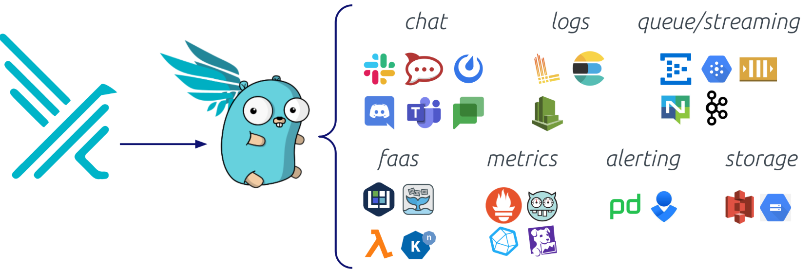

## Outputs and Falcosidekick

接下来我们将了解：

+  Falco 的输出格式选项
+ 根据需要配置相应的输出channel
+ 利用 Falcosidekick 加强对falco output的管理。

### 架构

Falco 的警报机制分为两个阶段：初始事件处理和后续通知发送。


事件触发一个规则，然后由消息处理程序进行处理，使通知格式化。为了保持效率，格式化后的通知会被推送到一个非阻塞并发队列中，使**main processing pipeline**能够不间断地继续运行。

一个独立的输出工作线程会从队列中弹出这些通知，并通过配置的输出通道将它们分发出去。这些通道实现了将警报发送到各自目的地的逻辑，包括文件系统和web endpoints。

+ （可以理解为一个“快递员”）不断从这个队列里取出通知，然后决定怎么发送：
  - 如果你配置了 `file` 输出，写入本地日志文件。
  - 配置了 `webhook`，就会 POST 到你配置的某个 HTTP 接口。
  - 配置了 `stdout`，就打印出来（比如 `kubectl logs` 里可以看到）。

虽然队列能有效缓冲临时的 I/O 延迟，但长期或无限期的块需要人工干预。在这种情况下，Falco 会将问题记录到 stderr。这些错误通常表明存在配置错误或资源限制。

+ 如果 webhook 目标接口很慢，甚至挂了，Falco 的输出线程可能会越来越慢。但因为是异步队列，主流程不会被阻塞，短期没问题。

  但是如果 webhook 永远都不通，队列一直塞不出去——最终队列可能满了。这时 Falco 会把这个问题写到 `stderr`（标准错误输出），提示你：

  ```
  Falco: output queue full, dropping event
  ```

### Format

Falco 通过配置文件（falco.yaml）中的两个主要设置提供可配置的通知格式。首先，time_format_iso_8601 选项管理时间戳格式。如果设置为 false（默认），Falco 会遵循/etc/localtime 设置来表示日期和时间。如果为 "true"，则使用 ISO 8601 标准。该设置会影响所有 Falco 日志输出。

第二个方面是 JSON 输出格式，由 json_output 控制。默认情况下，该选项设置为 false，这意味着 Falco 会输出包含时间戳、严重性和消息字段的纯文本通知。启用为 true 时，通知会以 JSON 格式的字符串封装。通过 json_include_output_property 和 json_include_tags_property，可以实现额外的粒度。启用（默认）后，这些选项将分别在 JSON 对象中包含纯文本消息和特定于规则的标记。

### Output Channels

**容器环境特别说明：**当你把 **Falco 运行在容器中**（包括 Kubernetes 中的 Pod），它的日志输出如果是写到标准输出（`stdout`）或者标准错误（`stderr`），那么这些日志不会被 Falco 自己管理，而是会交给容器运行时来处理。

默认情况下，Falco 只激活六个内置输出通道中的两个：stdout 和 syslog。您可以根据需要启用其他通道，所有通道都可以通过 falco.yaml 配置文件进行配置。在该文件中，每个输出通道都有一个启用选项，用于打开或关闭该通道。此外，还可能存在其他选项，用于对单个通道进行专门配置。除了特定通道的设置外，还存在像 json_output 这样的全局选项，可影响多个或所有通道。启用 json_output 后，无论输出通道如何，警报都会强制格式化为 JSON 格式

下面，我们将详细介绍六个不同的输出通道：

#### stdout_output

默认启用的 stdout_output 是 Falco 最直接的输出通道。启用后，Falco 会为每个警报打印一行到标准输出。该输出通道的唯一可用选项是启用。

#### syslog_output

syslog_output 默认也是启用的，它允许 Falco 为每个警报发送系统日志信息。与标准输出一样，该输出通道的唯一可用选项是启用。启用后，Falco 会向 syslog 发送信息，并带上两个重要属性：

**Facility（日志类别）是 `LOG_USER2`**
 这个表示“用户级别的应用程序日志”。在 syslog 的世界里，日志被分为不同的 facility，比如：

- `LOG_AUTH`：认证日志
- `LOG_DAEMON`：系统守护进程
- `LOG_USER`、`LOG_USER2`：用户应用程序
- `LOG_USER2` 是一个预留的值（Falco 用它来分类自己发的日志）。

**Severity Level（日志级别）由规则定义的优先级决定**
 比如你在 Falco 规则中写了：

```
priority: Critical
```

那就对应 syslog 的 `crit` 级别。

#### file_output 

如果启用文件输出，Falco 会将每个警报写入文件。该输出通道的默认配置为

```
file_output:  
  enabled: false  
  keep_alive: false  
  filename: ./events.txt  
```

文件名选项允许您指定 Falco 将写入的目标文件。如果文件不存在，Falco 会创建该文件；如果文件已经存在，Falco 不会尝试截断或旋转该文件。

如果禁用 keep_alive（默认设置），Falco 将打开文件进行附加，写入信息，然后为每个警报关闭文件。如果 keep_alive 设置为 "true"，Falco 只会在第一次警报前打开文件一次，并在随后的所有警报中保持打开状态。

**说明：**无论是否启用**keep_alive**，Falco都会在收到**SIGUSR1**信号时关闭并重新打开文件。如果您想使用程序来轮换输出文件（例如logrotate），此功能非常方便。

Falco 的 file output 打开了，配置如下：

```
file_output:
  enabled: true
  keep_alive: true
  filename: /var/log/falco/events.log
```

 logrotate 配置文件 `/etc/logrotate.d/falco`：

```
conf复制编辑/var/log/falco/events.log {
    daily
    rotate 7
    compress
    missingok
    notifempty
    postrotate
        kill -SIGUSR1 $(pidof falco)
    endscript
}
```

```
[ Falco ]
   |
   |-- logs to ---> /var/log/falco/events.log
   |
[ logrotate ]
   |
   |-- renames events.log -> events.log.1
   |-- creates new events.log
   |-- sends SIGUSR1 to Falco
             |
             |-- Falco closes & reopens file
             |-- continues writing to new file

```

#### program_output 

程序输出与文件输出非常相似，但在这种情况下，Falco 会将每个警报的内容写入您在配置文件中指定的程序的标准输入。该输出通道的默认配置为

```
program_output:  
  enabled: false  
  keep_alive: false  
  program: >  
    jq '{text: .output}' | curl -d @- -X POST https://hooks.slack.com/services...  
```

如果 keep_alive 为false，Falco 会为每个警报重新启动程序，并将警报写入标准输入。如果 keep_alive 为 true，Falco 会启动程序一次，，然后不断往它的 stdin 写数据（适合那种能够持续处理输入的程序，比如你自写的 Python 脚本或 Node.js 服务。）

程序字段可让您指定警报的接收程序。Falco 使用 shell 运行该程序，允许使用命令管道进行预处理。该字段的默认值显示了一个将警报发布到 Slack webhook 的好例子。不过，建议为此使用 Falcosidekick

#### http_output

当您需要通过 HTTP(S) 连接发送警报时，最佳选择是使用 HTTP 输出。其默认配置简单明了：

```
http_output:  http_output：
  enabled: false
  url: ht‌tp://some.url  url: http://some.url
```

启用后，您唯一需要指定的配置就是端点的 URL。Falco 会为每个警报向指定的 URL 发出 HTTP POST 请求。支持未加密 HTTP 和安全 HTTPS 端点。

#### grpc_output

gRPC 输出是最复杂的输出通道。与其他输出通道相比，它可以对警报转发和接收信息的全面粒度进行更多控制。该输出通道通过 Falco 的 gRCP API 向连接的外部程序发送警报。其默认配置为

```
grpc_output:  grpc_output：
  enabled: false
```

该输出通道的完整配置非常复杂。请查阅 [gRPC API 文档](https://falco.org/docs/grpc/#configuration)或者[Falco book](https://www.oreilly.com/library/view/practical-cloud-native/9781098118563/)

### Falcosidekick

[Falcosidekick 项目](https://github.com/falcosecurity/falcosidekick/)提供了将 Falco 与您的生态系统连接起来的完整解决方案。它工作在 Falco 的输出之上，允许您将其通知转发到许多其他目的地。Falcosidekick 可在通知中添加自定义字段，或按优先级过滤事件（以每个目的地为基础）。特别是，[支持的输出](https://github.com/falcosecurity/falcosidekick/#outputs)包括以下平台和应用程序：

- Communication and collaboration
- Metrics and observability
- Alerting
- Logging and storage
- Function as a Service (FaaS) and serverless
- Message queues and streaming



#### Using Falcosidekick

要使用 Falcosidekick，请更新 Falco 的设置以启用 JSON 格式

Falcosidekick 启动后会监听一个 HTTP 端口（默认是 `2801`）。Falco 需要配置为把告警以 JSON 格式 **通过 HTTP POST** 发给这个端口

```
json_output: true  
json_include_output_property: true  
http_output:  
  enabled: true  
  url: http://falcosidekick.default.svc.cluster.local:2801
  #设置 HTTP 请求的 User-Agent 字段，一般可选，但有些服务端可能用于日志或安全控制。
  user_agent: "falcosecurity/falco"  
  insecure: true  
```

#### Falcosidekick 配置

配置是通过 yaml 文件和 env vars 完成的。两者均可使用，但 env vars 优先于文件值。每个 Falcosidekick 输出都有自己的配置设置。有关配置的详细信息，请查阅[文档](https://github.com/falcosecurity/falcosidekick/#yaml-file)。下面的示例使用正确的 Falco 配置将 Falco 和 Falcosidekick 部署在一起

```shell
helm install falco -n falco falcosecurity/falco \
  --set falcosidekick.enabled=true \
  # 添加一个 自定义字段 到每一条 Falco 告警中，字段名是 environment，值是 auto-test
  --set falcosidekick.config.customfields="environment:auto-test" \
  --set falcosidekick.config.slack.webhookurl="https://hooks.slack.com/..." \
  #设置最低告警级别为 critical 才发送到 Slack，只有 critical、error, emergency 等级的才发
  --set falcosidekick.config.slack.minimumpriority=critical  
```

#### Falcosidekick-ui

Falcosidekick 还允许您使用一个辅助项目 [Falcosidekick-ui](https://github.com/falcosecurity/falcosidekick-ui)，在一个舒适的网络用户界面上可视化 Falco 事件。网页用户界面会显示检测到的事件的统计数据，并以汇总形式和时间轴显示数值。您还可以筛选自己感兴趣的事件，快速获得所有事件的详细信息。

与 Falcosidekick 一样，你可以直接在主机、容器或 Kubernetes 上运行 Falcosidekick-ui。最简单的方法是在 Kubernetes 上与 Falcosidekick 一起运行。完整的命令如下

```
helm install falco -n falco falcosecurity/falco \
  --set falcosidekick.enabled=true \
--set falcosidekick.enabled=true\
  --set falcosidekick.webui.enabled=true
```

注意：Falcosidekick-ui 事件通过 Redisearch 模块（> v2）存储在 Redis 服务器中。如果使用 Helm 部署，会自动配置 Redis。否则（主机或容器），您需要提供 Redis。
