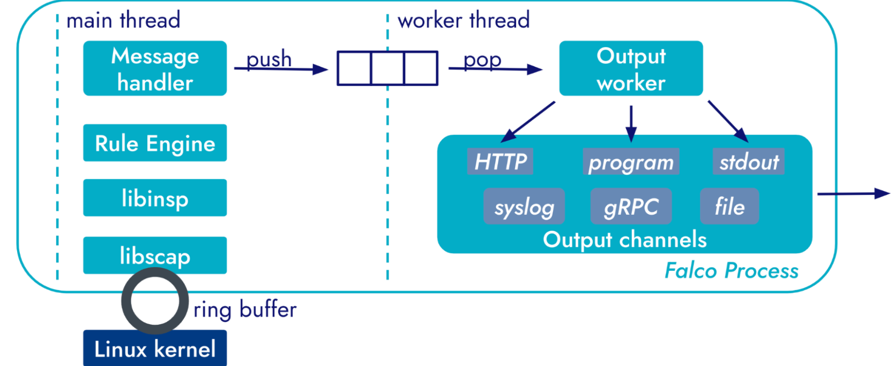

## Outputs and Falcosidekick

接下来我们将了解：

+  Falco 的输出格式选项
+ 根据需要配置相应的输出channel
+ 利用 Falcosidekick 加强对falco output的管理。

### 架构

Falco 的警报机制分为两个阶段：初始事件处理和后续通知发送。



事件触发一个规则，然后由消息处理程序进行处理，使通知格式化。为了保持效率，格式化后的通知会被推送到一个非阻塞并发队列中，使**main processing pipeline**能够不间断地继续运行。

一个独立的输出工作线程会从队列中弹出这些通知，并通过配置的输出通道将它们分发出去。这些通道实现了将警报发送到各自目的地的逻辑，包括文件系统和web endpoints。

+ （可以理解为一个“快递员”）不断从这个队列里取出通知，然后决定怎么发送：
  - 如果你配置了 `file` 输出，写入本地日志文件。
  - 配置了 `webhook`，就会 POST 到你配置的某个 HTTP 接口。
  - 配置了 `stdout`，就打印出来（比如 `kubectl logs` 里可以看到）。

虽然队列能有效缓冲临时的 I/O 延迟，但长期或无限期的块需要人工干预。在这种情况下，Falco 会将问题记录到 stderr。这些错误通常表明存在配置错误或资源限制。

+ 如果 webhook 目标接口很慢，甚至挂了，Falco 的输出线程可能会越来越慢。但因为是异步队列，主流程不会被阻塞，短期没问题。

  但是如果 webhook 永远都不通，队列一直塞不出去——最终队列可能满了。这时 Falco 会把这个问题写到 `stderr`（标准错误输出），提示你：

  ```
  Falco: output queue full, dropping event
  ```

### Format

Falco 通过配置文件（falco.yaml）中的两个主要设置提供可配置的通知格式。首先，time_format_iso_8601 选项管理时间戳格式。如果设置为 false（默认），Falco 会遵循/etc/localtime 设置来表示日期和时间。如果为 "true"，则使用 ISO 8601 标准。该设置会影响所有 Falco 日志输出。

第二个方面是 JSON 输出格式，由 json_output 控制。默认情况下，该选项设置为 false，这意味着 Falco 会输出包含时间戳、严重性和消息字段的纯文本通知。启用为 true 时，通知会以 JSON 格式的字符串封装。通过 json_include_output_property 和 json_include_tags_property，可以实现额外的粒度。启用（默认）后，这些选项将分别在 JSON 对象中包含纯文本消息和特定于规则的标记。

### Output Channels

默认情况下，Falco 只激活六个内置输出通道中的两个：stdout 和 syslog。您可以根据需要启用其他通道，所有通道都可以通过 falco.yaml 配置文件进行配置。在该文件中，每个输出通道都有一个启用选项，用于打开或关闭该通道。此外，还可能存在其他选项，用于对单个通道进行专门配置。除了特定通道的设置外，还存在像 json_output 这样的全局选项，可影响多个或所有通道。启用 json_output 后，无论输出通道如何，警报都会强制格式化为 JSON 格式

下面，我们将详细介绍六个不同的输出通道：

#### stdout_output

默认启用的 stdout_output 是 Falco 最直接的输出通道。启用后，Falco 会为每个警报打印一行到标准输出。该输出通道的唯一可用选项是启用。

#### syslog_output

syslog_output 默认也是启用的，它允许 Falco 为每个警报发送系统日志信息。与标准输出一样，该输出通道的唯一可用选项是启用。启用后，Falco 会向 syslog 发送信息，并带上两个重要属性：

**Facility（日志类别）是 `LOG_USER2`**
 这个表示“用户级别的应用程序日志”。在 syslog 的世界里，日志被分为不同的 facility，比如：

- `LOG_AUTH`：认证日志
- `LOG_DAEMON`：系统守护进程
- `LOG_USER`、`LOG_USER2`：用户应用程序
- `LOG_USER2` 是一个预留的值（Falco 用它来分类自己发的日志）。

**Severity Level（日志级别）由规则定义的优先级决定**
 比如你在 Falco 规则中写了：

```
priority: Critical
```

那就对应 syslog 的 `crit` 级别。

#### file_output 

如果启用文件输出，Falco 会将每个警报写入文件。该输出通道的默认配置为

```
file_output:  
  enabled: false  
  keep_alive: false  
  filename: ./events.txt  
```

文件名选项允许您指定 Falco 将写入的目标文件。如果文件不存在，Falco 会创建该文件；如果文件已经存在，Falco 不会尝试截断或旋转该文件。

如果禁用 keep_alive（默认设置），Falco 将打开文件进行附加，写入信息，然后为每个警报关闭文件。如果 keep_alive 设置为 "true"，Falco 只会在第一次警报前打开文件一次，并在随后的所有警报中保持打开状态。

**说明：**无论是否启用**keep_alive**，Falco都会在收到**SIGUSR1**信号时关闭并重新打开文件。如果您想使用程序来轮换输出文件（例如logrotate），此功能非常方便。

Falco 的 file output 打开了，配置如下：

```
file_output:
  enabled: true
  keep_alive: true
  filename: /var/log/falco/events.log
```

 logrotate 配置文件 `/etc/logrotate.d/falco`：

```
conf复制编辑/var/log/falco/events.log {
    daily
    rotate 7
    compress
    missingok
    notifempty
    postrotate
        kill -SIGUSR1 $(pidof falco)
    endscript
}
```

```
[ Falco ]
   |
   |-- logs to ---> /var/log/falco/events.log
   |
[ logrotate ]
   |
   |-- renames events.log -> events.log.1
   |-- creates new events.log
   |-- sends SIGUSR1 to Falco
             |
             |-- Falco closes & reopens file
             |-- continues writing to new file

```

#### program_output 

#### http_output

#### grpc_output