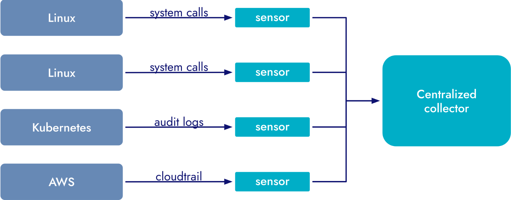
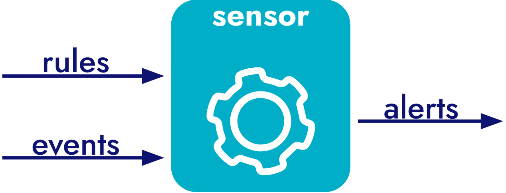

# 简介

**Falco 的设计原则**

+ 运行时专用

  Falco 可在服务和应用程序运行时实时检测威胁。一旦检测到不需要的行为，它就会立即向您发出警报。它被设计为流式引擎，可快速处理数据，独立评估每个事件，并在尽可能接近数据源的情况下评估规则。这一原理可确保 Falco 在检测到不需要的行为时立即发出警报，从而对潜在威胁做出及时响应。

+ 适合生产

  Falco 可在任何环境下部署，包括对稳定性和低开销要求极高的生产环境。这一原则影响了 Falco 的数据收集架构，确保了性能、稳定性和对应用程序的最小影响。

+ 无入侵

  Falco 无需用户重新编译应用程序、安装库或使用监控钩子重建容器，即可观察应用程序行为。这一原则在现代容器化环境中尤为重要，因为在这种环境中，对每个组件进行更改都是不切实际的。这一原则确保 Falco 可以监控每个进程和容器，无论其来源或寿命如何，从而使其成为一个全面的监控解决方案。

+ Run at the Edge

  Falco 采用分布式多传感器架构设计。其传感器轻巧、高效、便携，可在各种环境中运行。这一原则确保 Falco 可以部署在物理主机、虚拟机或容器中，为各种部署方案提供灵活性和适应性。

+ 避免移动和存储大量数据

  Falco 的设计宗旨是尽可能靠近终端，就地进行检测，只将警报发送到中央采集器。根据这一原理设计的解决方案操作简单、成本效益高，并且具有良好的横向扩展能力。

+ Falco 旨在支持最大型的基础设施。它保持有限的状态，避免集中存储，并利用边缘计算。它的数据收集堆栈不使用sidecars, library linking或进程检测等技术。这一原则确保了 Falco 即使在活动频繁的大型主机上也能有效扩展，使其成为适用于大规模基础设施的解决方案。

+ 真实

  Falco 使用系统调用作为数据源，而系统调用很难禁用或规避，这使得 Falco 难以规避。如果试图规避，攻击者会留下 Falco 可以检测到的痕迹。这一原则确保了 Falco 能够提供可靠、真实的监控，增强了其作为安全工具的有效性

+ 强大的默认设置，丰富的可扩展性

  Falco 的设计目的是在安装后立即提供价值，将定制需求降至最低。不过，在需要定制时，Falco 可灵活创建新规则、开发和部署新数据源，并与您所需的通知和事件收集工具集成。这一原则确保 Falco 既方便用户使用，又能适应高级需求。

+ 简单

  简洁是 Falco 设计的基础。其规则语法简洁、易读、易学。扩展 Falco 以对新的数据源发出警报，或将其与新的云服务或容器类型集成，都是一个简单明了的过程。这一原则确保了 Falco 在提供强大而灵活的功能的同时，仍然易于访问和使用。

**Falco 的使能**

+ 我们可以用 Falco 做什么

  Falco 擅长在运行时实时检测威胁、入侵和数据盗窃。它能很好地与传统基础架构配合使用，并在支持容器、Kubernetes 和云基础架构方面表现出色。它能确保工作负载（进程、容器、服务）和基础设施（主机、虚拟机、网络、云基础设施和服务）的安全。它设计轻巧、高效、可扩展，可用于开发和生产。它可以检测多种类型的威胁，但如果您需要更多，也可以对其进行定制。它还拥有一个支持它并不断加强它的繁荣社区。

+ 不能与 Falco 一起做的事

  + 没有一种工具可以解决您的所有问题。了解 Falco 不能做什么与知道在哪里使用它同样重要。与任何工具一样，也需要权衡利弊。首先，Falco 并非通用策略语言：它不具备完整编程语言的表现力，也无法在不同引擎之间执行关联。相反，它的规则引擎旨在高频率地在基础设施的许多地方应用相对无状态的规则。如果您正在寻找一种功能强大的集中式策略语言，可以看看开放策略代理（[OPA](https://www.openpolicyagent.org/docs/latest/policy-language/)）。

  + 其次，Falco 的设计并不是将收集到的数据存储在一个集中的存储库中，以便对其进行分析。规则验证在端点执行，只有警报才会发送到集中位置。如果您的重点是高级分析和大数据查询，建议使用市场上众多日志收集工具中的一种。
  + 最后，出于效率考虑，Falco 不检查网络有效载荷。因此，它不是实施第 7 层（L7）安全策略的合适工具。传统的基于网络的入侵检测系统（IDS）或 L7 防火墙是此类使用案例的更好选择。

## 高级架构

在最高级别上，Falco 非常简单：将其视为一个传感器。您可以在分布式基础设施上安装多个传感器。每个传感器收集数据（来自本地机器或某些 API 的事件），针对这些事件运行一系列规则，并在发生不良事件时通知您。

不良行为由一系列规则定义。这些规则可以是由社区创建和维护的默认规则集，也可以是根据您的需要创建的自定义规则集。

生成的警报会被发送到集中收集器，如通用安全信息和事件管理 (SIEM) 工具或 Falcosidekick等专用工具。

### Sensors 

传感器由一个引擎组成，引擎有两个输入端：数据源和一组规则。传感器将规则应用于来自数据源的每个事件。当规则与事件相匹配时，就会产生输出。

### Data Sources 

Falco 传感器旨在从各种来源收集输入数据。其中，系统调用最为关键。系统调用为 Falco 提供了对主机上所有活动的广泛可见性。系统调用包含多种操作，包括

+ 打开或关闭文件
+ 建立或接收网络连接
+ 从磁盘或网络读写数据
+  执行命令
+ 使用管道或其他类型的进程间通信与其他进程通信

通过窃听系统调用，Falco 可以检测到各种潜在的安全威胁和违规行为。Falco 可以通过系统调用识别的活动包括

+ 权限升级
+ 访问敏感数据
+ 意外的网络连接或套接字突变
+ 执行不需要的程序
+ 数据外泄

除了系统调用外，**Falco 还可以利用其他数据源**

+ K8S审计日志

  Falco 的 K8s Audit 插件通过监控 Kubernetes 审计事件来增强安全性。它能提供集群活动的高度可见性，并能检测恶意行为。以下是它能检测到的一些示例：

  - 创建特权 pod
  - 创建敏感Pod
  - 一个不受信任的节点成功加入群集

+ CloudTrail

  Falco 的 CloudTrail 插件通过监控 AWS CloudTrail 日志来增强安全性。它可以配置为从 S3 存储桶、SQS 队列或本地文件系统路径获取日志文件。以下是它可以检测的一些示例：

  - 当用户在没有多因素身份验证的情况下登录时
  - 修改云服务配置时
  - 当有人访问对象存储中的一个或多个敏感文件时

+ Github

  Falco 的 GitHub 插件通过监控仓库中的活动来增强安全性。它可在一个或多个版本库上安装 webhook，以解析消息并检测潜在威胁。以下是它能检测到的一些示例：

  - 一个秘密被提交到存储库
  - 私人存储库变成公共存储库
  - 创建了一个新的部署密钥

+ Okta

  Falco 的 Okta 插件通过监控来自 Okta 的日志事件来增强安全性。以下是它可以检测到的一些示例：

  - 已在 Okta 中为用户分配了管理权限
  - 已创建新的 Okta API 令牌
  - 在最后 5 分钟内尝试了太多次失败的 MFA

### Data Enrichment

丰富的数据源使 Falco 成为强大的运行时安全工具。此外，来自不同供应商的元数据也丰富了其检测功能。

当 Falco 检测到问题时，您通常需要更多信息来了解问题的原因和范围。

- 是哪个程序做的？
- 是在容器里发生的吗？
- 如果是，容器和镜像的名称是什么？
- 发生这种情况的service/namespace是什么？
- 是在生产中还是在开发中？
- 这个更改是 root 做的吗？

Falco 的数据丰富引擎通过建立环境状态（包括运行中的进程和线程、它们打开的文件、它们运行的容器和 Kubernetes 对象等）来帮助回答所有这些问题。Falco 的规则和输出可访问所有这些状态。

### Rules 

规则告诉 Falco 引擎如何处理来自数据源的数据。它们允许用户以简洁易读的格式定义策略。Falco 预装了一套全面的规则，涵盖主机、容器、Kubernetes 和云安全，您还可以轻松创建自己的规则来定制它

### Output Channels

每次触发一条规则，相应的引擎就会发出输出通知。在最简单的配置中，引擎会将通知写入标准输出（可想而知，这通常不是很有用）。幸运的是，Falco 提供了复杂的方法来路由输出并将其引导到一系列地方，包括日志收集工具、S3 等云存储服务以及 Slack 和电子邮件等通信工具。它的生态系统包括一个名为 Falcosidekick 的奇妙项目，专门用于将 Falco 与世界连接起来，让收集输出毫不费力。
