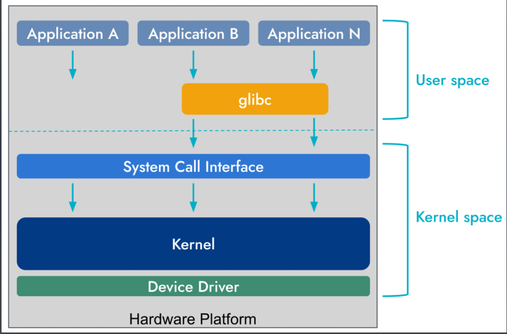
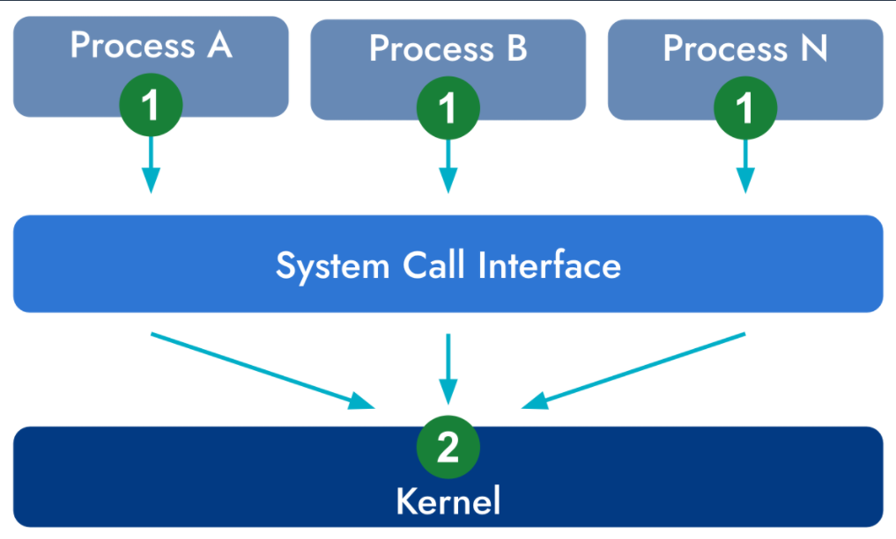
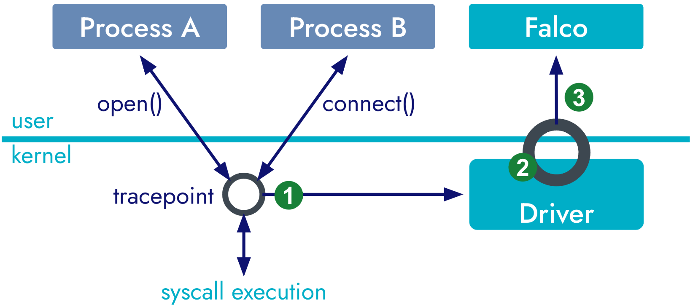
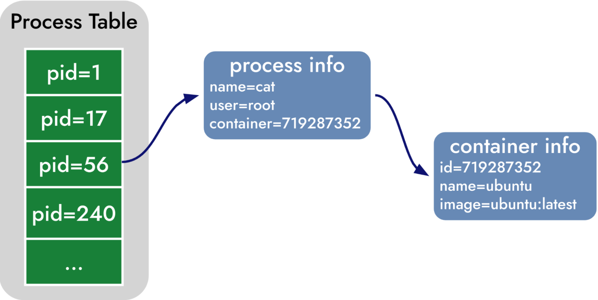

# Host Security

接下来我们将了解

- 什么是系统调用及其在操作系统中的作用。
- Falco **Data Enrichment**的概念及其优势。
- 高效收集**system calls**的最佳实践。
- 不同**drivers**的利弊。

## 系统调用

系统调用是用户空间程序与内核之间的桥梁，为应用程序提供了请求文件操作、网络通信和进程管理等服务的 API。这些调用允许程序与底层操作系统交互，而无需关注硬件级操作。调用系统调用时，CPU 会从用户模式转换到内核模式，从而可以执行特权操作。例如，通过系统调用执行 read() 和 write() 等操作，就可以进行文件 I/O 操作。



专为 Linux 环境定制的 Falco 通过监控系统调用，充分利用了内核到用户空间的接口。这种监控提供了对系统中发生的活动的细粒度观察，使 Falco 成为安全可观察性的强大工具。由于系统调用被所有应用程序用于文件操作和网络活动等各种任务，因此对系统调用的监控使 Falco 能够敏锐地察觉系统行为。系统调用 API 在不同 Linux 发行版中的稳定特性增强了 Falco 安全规则的可靠性和适用性。

### strace 

用于观察系统调用的第一个工具是 strace。它在 Unix 兼容系统上几乎普遍可用。它附着在一个进程上，跟踪该进程进行的系统调用。你可以在两种模式下运行它：一种是在运行命令前加上前缀，另一种是使用进程 ID (pid) 。在这两种情况下，`strace` 的输出是一系列类似函数调用的行（function-like lines），这些行表示进程执行的系统调用（system calls），并且包含参数列表（argument lists）和返回值（return values）。

```shell
root@VM-4-11-ubuntu:~# strace echo hello world
#execve(...)：看起来就像 execve() 这个函数被调用，参数是 "/usr/bin/echo"（要执行的程序路径）和 ["echo", "hello world"]（命令的参数列表）。
execve("/usr/bin/echo", ["echo", "hello", "world"], 0x7ffc61cbea50 /* 27 vars */) = 0
.....
write(1, "hello world\n", 12hello world
)           = 12

close(1)                                = 0
close(2)                                = 0
exit_group(0)                           = ?
```

+ 对于写入系统调用，它将 hello world 字符串输出到标准输出（文件描述符 1）。它返回的值是 12，即成功写入的字节数。请注意，在 write 系统调用返回之前，hello world 字符串已被打印到标准输出中，而 strace 会将其返回值打印到屏幕上。
+ 不过，strace 使用 ptrace 来拦截系统调用，这会大大降低被观察进程的运行速度。由于性能下降，strace 不适合用于生产，一般也不适合用于全系统监控。

### The sysdig开放源码工具

sysdig 比 strace 更为复杂，并包含一些高级功能。虽然这可能会使它更难使用，但好消息是，sysdig 与 Falco 的数据模型、输出格式和过滤语法相同，因此您可以在 sysdig 中使用很多关于 Falco 的知识，反之亦然。与 strace 不同，sysdig 会捕获系统上运行的所有进程的系统调用。

sysdig 接受与 Falco 相同的过滤语法（顺便说一句，这也使它成为测试和排查 Falco 规则的绝佳工具）。下面是一个例子，我们限制 sysdig 捕捉名为 "cat "的进程的系统调用：

```shell
sysdig proc.name=cat & cat /etc/hosts
47190 14:40:39.913809700 12 cat (377163.377163) < execve res=0 exe=cat args=/etc/hosts. tid=377163(cat) pid=377163(cat) ptid=5860(zsh) cwd= fdlimit=1024 pgft_maj=0 pgft_min=60 vm_size=424 vm_rss=4 vm_swap=0 comm=cat
cgroups=cpuset=/user.slice.cpu=/user.slice.cpuacct=/.io=/user.slice.memory= /user.slic... env=SYSTEMD_EXEC_PID=3558.GJS_DEBUG_TOPICS=JS ERROR;JS LOG.SESSION_MANAGER=local/... tty=34817 pgid=377163(cat) loginuid=1000 
#进入系统调用
flags=0 47194 14:40:39.913846153 12 cat (377163.377163) > brk
addr=0
47196 14:40:39.913846951 12 cat (377163.377163) < brk res=55956998C000 vm_size=424 vm_rss=4 vm_swap=0
#结束系统调用
47205 14:40:39.913880404 12 cat (377163.377163) > arch_prctl
47206 14:40:39.913880871 12 cat (377163.377163) < arch_prctl
47207 14:40:39.913896493 12 cat (377163.377163) > access mode=4(R_OK)
47208 14:40:39.913900922 12 cat (377163.377163) < access res=-2(ENOENT) name=/etc/ld.so.preload
47209 14:40:39.913903872 12 cat (377163.377163) > openat dirfd=-100(AT_FDCWD) name=/etc/ld.so.cache flags=4097(O_RDONLY|O_CLOEXEC) mode=0
47210 14:40:39.913914652 12 cat (377163.377163) < openat fd=3(<f>/etc/ld.so.cache) dirfd=-100(AT_FDCWD) name=/etc/ld.so.cache flags=4097(O_RDONLY|O_CLOEXEC) mode=0 dev=803
```

| **字段**                   | **示例值**                | **解释**                                       |
| -------------------------- | ------------------------- | ---------------------------------------------- |
| **增量事件号**             | `47190`                   | 这是 `sysdig` 记录的第 `47190` 个事件          |
| **事件时间戳**             | `14:40:39.913809700`      | 事件发生的时间                                 |
| **CPU ID**                 | `12`                      | 事件发生的 CPU 编号                            |
| **进程名**                 | `cat`                     | 触发事件的进程名                               |
| **进程 ID 和 线程 ID**     | `(377163.377163)`         | `PID=377163`，`TID=377163`（单线程进程时相同） |
| **事件方向**               | `<`                       | `<` 表示系统调用 **返回**（完成）              |
| **事件类型（系统调用名）** | `execve`                  | 这里 `cat` 进程执行 `execve` 运行 `/etc/hosts` |
| **系统调用返回值**         | `res=0`                   | `execve` 成功执行，返回 `0`                    |
| **进程信息**               | `exe=cat args=/etc/hosts` | 执行的二进制文件是 `cat`，参数是 `/etc/hosts`  |

## 捕捉系统调用

有两个地方可以捕获系统调用：运行中的进程或操作系统内核。



**用户空间：**

在运行中的进程中捕获系统调用通常需要用某种工具来修改进程或其某些库。事实上，Linux 中的大多数程序都使用 C 标准库（也称为 glibc）来执行系统调用，这就使得对它进行检测变得相当有吸引力。

**通常要监视一个正在运行的进程的系统调用**，可以通过修改该进程本身（在代码中添加一些额外的代码或钩子（hook）来观察和记录系统调用的行为。）或它使用的库（library）来实现。

+ 当一个 C 程序运行 `printf("Hello")` 时，它实际上调用的是 **glibc**，然后 **glibc** 再去执行 `write()` 这个系统调用。

  **如果我们修改 glibc**，在 `write()` 之前插入额外的代码，我们就可以在不修改程序本身的情况下**捕获和记录系统调用**。

**内核空间：**

要捕获过渡到操作系统后的系统调用执行，需要在操作系统内核本身运行一些代码。由于在内核中运行代码需要提升权限，因此这往往更加微妙，风险也更大。在内核中运行的任何程序都有可能控制机器、进程、用户和硬件。因此，在内核中运行的任何程序如果出现漏洞，都可能导致重大安全风险、数据损坏，在某些情况下甚至会导致机器崩溃。

这也是为什么许多安全工具都选择在用户空间，在进程内部的用户层捕获系统调用的原因。而 Falco 的做法恰恰相反：它完全站在内核工具一侧。下面，我们将讨论这一选择背后的原因。

+  准确性

  **User-level instrumentation**技术（如在 glibc 层工作的技术）是有限的，因为它们依赖于程序动态加载和使用 instrumentation库。例如，在容器中非常常见的静态链接 C 程序会在编译时导入 glibc 函数。此外，攻击者还可以通过编写简单的 CPU 指令序列来绕过检测。另一方面，内核级捕获更加强大，因为它在所有库和抽象层之下运行，攻击者很难规避。

+ 性能

  由于每次系统调用都需要进行大量上下文切换，ptrace 等用户级捕获技术会带来显著的性能开销，因此不适合生产环境。内核级捕获无需进行上下文切换，可直接从内核高效收集时间戳等上下文信息，是性能最高、最适合生产环境的工具技术。

+ 可扩展性

  进程级捕捉需要对每个进程 "做一些事情"。虽然 "做 "的内容可能不同，但它仍然会带来与被观察进程数量成正比的开销。内核级仪器则不然。如果在正确的位置插入内核仪器，那么无论有多少进程在运行，都可以使用一个单一的**instrumentation point**。这不仅能确保最高效率，还能确保不会遗漏任何内容，因为任何进程都无法逃脱内核级捕获。

+ 稳定与安全

  我们提到过，内核级仪器更微妙，因为一个错误就可能导致严重的问题。您可能会问："选择像 Falco 这样基于内核仪器的工具，而不是基于用户级仪器的产品，我会不会承担额外的风险？

  其实不然。首先，内核级工具受益于文档齐全、稳定的**stable hooking interfaces**，而基于 glibc 的捕获等方法则不那么干净，本质上风险更大。它们不能让机器崩溃，但绝对能让被检测进程崩溃，而且结果通常很糟糕。除此之外，像 eBPF这样的技术大大降低了在内核中运行代码的风险，使得即使是规避风险的用户也可以使用内核级工具。

+ 容器与云原生

  内核级捕获可提供对所有系统调用的全面可视性，无论它们是来自容器内部还是外部。它无需使用sidecar或受监控容器内的任何东西。

### Kernel-level Instrumentation

正如前面所讨论的，内核级工具比用户级工具在运行时安全性方面更具优势。但是，实现它的最佳机制是什么呢？在现有的各种方法中，有两种与 Falco 这样的工具相关：内核模块和 eBPF 探测器。

+ 内核模块

  + 可加载内核模块是可以在运行时加载到内核中的代码片段。从历史上看，模块在 Linux（以及许多其他操作系统）中被大量使用，使内核可扩展、高效且更小

  + 内核模块可扩展内核的功能，而无需重启系统。它们通常用于实现设备驱动程序、网络协议和文件系统。内核模块针对其运行的特定内核进行编译。换句话说，不可能在一台机器上编译一个模块，然后在另一台机器上使用，除非它们的内核完全相同

  + Linux 支持内核模块已经有很长一段时间了，因此即使是很老的 Linux 版本，它们也能正常运行。它们对内核的访问权限也很广，这意味着对它们的操作限制很少。这使它们成为收集运行时安全工具（如 Falco）所需详细信息的最佳选择。由于内核模块是用 C 语言编写的，因此效率也很高，在对性能要求很高的情况下是一个不错的选择。

  + 内核模块以最高权限运行，使系统在稳定性和安全性方面面临相当大的风险。设计不当或恶意的内核模块会无意或有意破坏操作系统的完整性，导致系统崩溃或安全漏洞。有些公司不允许使用第三方内核模块。相比之下，**eBPF (Extended Berkeley Packet Filter)** 为程序与内核的交互提供了一种更安全、更可控的机制。

+ eBPF

  + eBPF 是（BPF）的 "下一代 "产品。BPF 设计于 1992 年，用于 BSD 操作系统的网络数据包过滤，Wireshark 等工具至今仍在使用它。BPF 的创新之处在于能够在操作系统内核中执行任意代码。eBPF 最初是为高效的网络数据包过滤而设计的，现在已发展成为一种通用、高效的运行时，可促进多种类型的系统级跟踪和操作。传统的内核模块在部署和维护方面可能存在风险，而 eBPF 则不同，它提供了一种更安全、更灵活的机制来扩展内核功能。

  + eBPF 程序以受限的 C 语言子集编写，并使用 bpf 系统调用加载到内核中。这些程序被 byte-compiled into BPF bytecode，然后由Just-In-Time（JIT）编译器进行验证，以确保其符合安全约束。验证过程可防止风险操作，如永不终止的循环、未经授权的内存访问或敏感信息泄露。最后，您可以在多个 Linux 内核上运行相同的程序，而无需对内核进行特定的调整，从而提高了代码的可重用性。

  + eBPF 的多功能性使其适用于从网络监控和安全到性能分析和可观测性的广泛应用。XDP（eXpress Data Path）等工具利用 eBPF 进行高性能网络处理，绕过了传统的网络堆栈，从而提高了效率。同样，BPFtrace 等项目也利用 eBPF 进行复杂的系统跟踪。它允许开发人员和系统管理员创建用于数据包过滤、系统调用跟踪，甚至修改内核数据结构的自定义逻辑，所有这些都不需要修改内核代码。

+ 为什么是 eBPF 而不是内核模块？

  + 虽然传统的内核模块能够扩展内核功能，但在系统稳定性和安全性方面却有很大的弊端。内核模块在内核不受限制的环境中运行，有可能发生无意或恶意行为，从而危及系统。相比之下，eBPF 在严格控制的沙盒中运行，并经过严格验证，是一种更安全的替代方案。沙箱环境和验证过程使 eBPF 成为系统级操作的现代和可取的解决方案，可以更有把握地进行开发、部署和调试。

### Falco Drivers 

Falco 提供三种不同的驱动程序实现方式，分别实现我们上边讨论的两种方法：内核模块、经典 eBPF 探针和现代 eBPF 探针。这三种实现具有相同的功能，在使用 Falco 时可以互换。因此，我们可以描述它们是如何工作的，而不需要关注特定的一种。Falco 驱动程序捕获系统调用的方法包括三个主要步骤，如图所示：



1. 内核中有一个称为跟踪点（tracepoint）的设施，用于拦截系统调用的执行。Falco 驱动程序为系统调用安装了两个跟踪点：一个是系统调用进入内核的跟踪点，另一个是系统调用退出内核并将控制权交还给调用进程的跟踪点。
2. 在被跟踪点拦截时，驱动程序会将系统调用参数 "打包 "到共享内存缓冲区中。在这一阶段，系统调用也会被打上时间戳，并从操作系统收集额外的上下文（例如，线程 ID 或某些套接字系统调用的连接详情）。这一阶段需要超级高效，因为在跟踪点拦截返回之前，系统调用无法执行。
3. 共享缓冲区现在包含系统调用数据，Falco 可以通过 libscap 直接访问这些数据。在这一阶段不会复制数据，从而在优化缓存一致性的同时最大限度地降低 CPU 使用率。

#### eBPF vs. Modern eBPF

现代 eBPF 是 eBPF 探针的全新实现。与经典的 eBPF 相比，现代 eBPF 具有多种优势，如性能更好、可定制性强等。然而，它的主要优势在于已嵌入 Falco，这意味着你无需下载或构建任何东西；只要你的内核足够新，Falco 就会自动注入它。

#### 你应该使用哪种驱动程序？

如果你不确定应该使用哪种驱动程序，这里有一些简单的指导原则：

- 如果内核版本支持 modern-ebpf（一般情况下，>=5.8），则使用**modern-ebpf**
- 如果内核版本不支持 modern-ebpf，且大于 4.12，则使用 **eBPF probe**
- 如果内核版本早于 4.12，则使用**kernel module**
  + 如果需要处理 I/O 密集型工作负载，并且希望尽可能降低仪器开销，则应使用内核模块。内核模块的开销低于 eBPF 探针，在产生大量系统调用的机器上，它对运行进程的性能影响较小。由于内核模块的性能取决于进程的系统调用次数，因此很难估计内核模块的性能会好多少，但对于每秒都会产生大量系统调用的磁盘或网络密集型工作负载来说，差别会很明显。

### Data Enrichment for Syscalls

捕获系统调用可提供原始数据，这些数据可能非常丰富，但除非搭配正确的上下文，否则对运行时安全并无多大帮助。例如，知道进程 312 读取了文件描述符 3 并不意味着什么。哪个进程是 312？哪个文件是 3？该进程是容器的一部分吗？该容器是 Kubernetes 集群的一部分吗？这就是为什么 Falco 要先提取原始数据，然后用上下文信息加以丰富的原因。

通常，我们将这些信息称为事件元数据。从 proc.id=312 和 fd.num=3 等基本信息开始，丰富过程会添加多层元数据，如表示进程名称的 proc.name=cat、表示文件描述符详细信息的 fd.name=/etc/hosts、表示容器上下文的 container.id=2381923312 和 container.image=ubuntu:latest 以及表示 Kubernetes 信息的 k8s.pod.name=my-pod 和 k8s.ns.name=my-namespace 等。这样就形成了信息量更大的多维事件数据结构，有助于加深理解和更有效地做出决策。

```
proc.id=312 proc.name=cat fd.name=/etc/hosts  
container.id=23819293312 container.image=ubuntu:latest  
k8s.pod.name=my-pod k8s.ns.name=my-namespace  
```

获取元数据是一项复杂的任务，而有效获取元数据则更为复杂。丰富过程通常包括对原始事件数据进行查找，以获取额外的上下文元数据。这些查找必须符合特定的标准，才能在运行时进行操作。首先，它们必须不会阻塞监控进程，确保正常运行不受影响。其次，查询必须是高性能的，这意味着应尽量减少延迟。要实现低延迟，通常需要本地缓存或数据库能够快速访问必要的元数据，从而减少与远程获取或计算成本高昂的计算相关的开销。

在 Falco 中，满足这些查询要求的技术方法包括使用本地状态表。这些表有两个主要阶段：构建阶段和维护阶段。在 Falco 启动时的构建阶段，初始状态表会填充相关的元数据。随后，在维护阶段，通过监听可能改变状态信息的相关系统事件（如进程创建或终止），这些表会保持更新。

Falco 主要收集三类不同的系统调用元数据：

- Operating System
- Container 
- Kubernetes

#### Operating System Metadata

启动时，Falco 会扫描 Linux procfs 和其他操作系统级资源，以初始化状态表，将文件描述符和进程 ID 等低级标识符映射为更多人类可读信息。初始化后，libsinsp 会检查在内核空间运行的 Falco 驱动程序捕获的系统调用流。任何改变状态的系统调用（如 open()）都会触发这些表的更新。这种方法最大限度地减少了系统噪声和性能影响，同时允许 Falco 实时更新其元数据表，而无需进一步调用系统进行更新。

####  Container Metadata

Falco 与各种容器运行时（包括 Docker、Podman 以及 containerd 和 CRI-O 等 CRI 兼容运行时）建立接口，以收集容器元数据。初始化时，Falco 会查询容器运行时，建立所有运行容器的内部缓存，并更新其状态表，将进程和线程 ID 与各自的容器 ID 关联起来。容器元数据的后续更新通过 Falco 驱动程序捕获的系统调用流来处理。检测到新进程或线程时，libsinsp 要么从其内部缓存中检索容器 ID，要么查询容器运行时以更新其元数据。你会发现可用的容器元数据都集中在[field class container](https://falco.org/docs/reference/rules/supported-fields/#field-class-container),中，这些元数据可用于条件和输出格式化。

 

#### Kubernetes Metadata

Falco 收集 Kubernetes 元数据时，首先要与 Kubernetes API 服务器建立连接，以建立集群的本地状态。与用于操作系统和容器的本地机制不同，Falco 必须远程调用 API 服务器来收集 Kubernetes 元数据。初始状态建立后，Falco 会使用 Kubernetes 观察 API 定期更新本地状态。当 Kubernetes 元数据可用时，你会发现它被分组在  [k8s field class](https://falco.org/docs/reference/rules/supported-fields/#field-class-k8s).

使用**DaemonSet 部署 Falco**的架构

采用分块数据检索，并可选择只请求特定节点的数据。此外，Falco 还能直接从容器注释中获取 Kubernetes 元数据子集，而无需连接到 Kubernetes API 服务器。之所以能做到这一点，是因为 kubelet 提供了 Pod 的 ID、名称、命名空间和标签等关键元数据。该模式始终处于启用状态，既是一种优化，也是一种功能，即使未启用完整的 Kubernetes 支持，也能收集到足够的元数据。只有在需要额外数据时，Falco 才会返回到 Kubernetes API 服务器进行查询。
