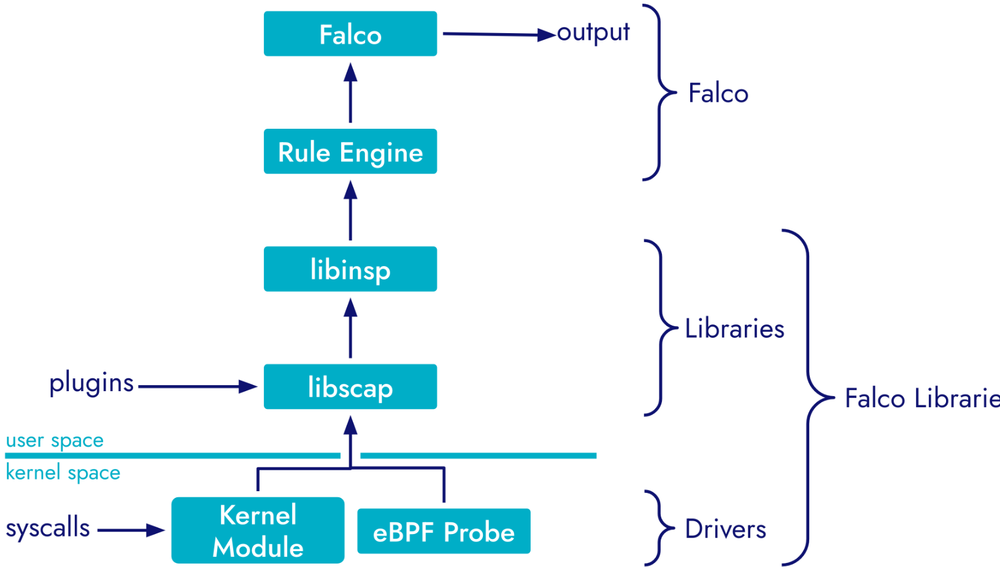

## 架构

Falco 采用流式引擎架构，其基本设计理念是输入→处理→输出。


在这种模式下，Falco 不断从一个或多个来源接收事件（输入），通过丰富和检查一组规则来处理输入的事件（处理），然后输出符合规则的事件（输出）。这种流式架构允许 Falco 实时运行，提供即时威胁检测和响应能力。

更详细的架构如下：

 

### Input 

Falco 可以从多种来源采集数据，大致分为两大类：主机和云。libscap 库包含控制内核模块和 eBPF 探测器的逻辑，包括加载它们、启动和停止捕获以及读取它们生成的数据。它还包含加载、管理和运行插件的逻辑。


属于主机类别的系统调用输入来自操作系统内核，可提供进程、容器、虚拟机和主机活动的可见性。

这种可视性对于监控可疑或未经授权的活动（如文件访问、网络连接和权限升级）至关重要。

云类别包括各种其他输入，如 Kubernetes 审计日志、AWS CloudTrail 和其他基于云的活动日志。这些都通过插件进行管理，插件是可扩展的模块，可增强 Falco 的核心功能。通过这些插件，Falco 不仅能监控其运行的主机，还能监控更广泛的云环境，从而提供全面的安全态势

### Processing Events（事件处理）

Falco 的事件处理基本上可分为两个核心任务：通过规则引擎进行丰富和过滤。

+ Enrichment （丰富）

  libscap 和 libsinsp 提供开箱即用的系统调用增强功能。需要考虑两种类型的增强：

  + **Kubernetes/Containers Metadata**: 在多容器环境中，原始系统调用无法提供上下文，例如哪个容器或 Kubernetes pod 发起了系统调用。添加这种元数据可以发出更有针对性、更有意义的警报，明确可疑活动是来自主机还是特定容器、pod 或命名空间。
  + **System Metadata**:原始形式的系统调用过于细化，而且只针对特定机器（例如，"进程 561 打开文件描述符 4 进行写入"，丰富后变为：Process "nginx" (pid=561, user=www-data) wrote to "/var/www/html/index.html"）。丰富系统元数据可将机器数据转化为人类可理解和可操作的信息。

+ Filtering (Rule Engine) 

  规则引擎是与 Falco 交互的用户界面。它可以处理各种任务，包括

  - 加载和解析 Falco 规则文件。
  - 对规则进行本地定制，如根据本地文件追加或覆盖规则。
  - 通过 libsinsp 对每条规则的条件和输出进行编译。
  - 触发规则时发出相应的输出。

得益于 libscap 和 libsinsp 等底层库，规则引擎的操作简单而强大，这使得它与 Falco 架构的其他部分相对分离

### Output

Falco 提供一系列输出选项，以满足不同的操作要求。支持的通道包括 stdout、syslog、https 和 grpc。虽然 https 和 grpc 为自定义设置提供了更大的灵活性，但它们并不能提供即插即用的体验。

为了增强和扩展 Falco 的输出功能，该生态系统包括一个名为 Falcosidekick 的项目。该实用程序充当中间输出处理器，支持大量附加输出目标，包括但不限于 Slack、PagerDuty、Elasticsearch 等。这使得 Falco 能够与各种监控工具和事件响应平台无缝集成

## 运行Falco

Falco 是一种多功能安全监控工具，可部署在多种环境中，每种环境都有其独特的优势和注意事项。无论是在裸机 Linux 主机上运行、在虚拟机中运行，还是作为 Kubernetes 等容器编排系统的一部分运行，Falco 的核心功能都保持一致。其主要优势之一是能够在不同类型的工作负载中利用共享的 Linux 内核。这在容器化设置中尤其有用，因为内核驱动程序可以在主机上安装一次，但仍能监控所有容器中的活动。因此，在容器化环境中运行 Falco 与直接在主机操作系统上运行 Falco 的功能完全相同，从而为不同的部署架构提供了统一的体验。

启动并运行 Falco 的基本步骤一般包括下载相应的软件包或二进制文件，安装系统调用事件捕获所需的内核驱动程序，最后启动 Falco 服务。根据部署 Falco 的特定环境，这些步骤会略有不同。接下来，我们将深入探讨在 Linux 主机和 Kubernetes 集群中安装和运行 Falco 的细节。

### Linux Host

在 Linux 主机上部署 Falco 需要执行一系列任务，以确保其按预期运行：

- 安装必要的内核头文件

  内核头文件对 Falco 的运行至关重要，因为在没有预编译版本的情况下，内核头文件用于编译 Falco 驱动程序。您可以使用以下命令验证并安装内核头文件：

  ```
  # Verify  # 验证
  apt search linux-headers-$(uname -r)
  
  # Install  # 安装
  apt-get -y install linux-headers-$(uname -r)
  ```

- Setting up the package repository

- Running Falco 奔跑的法尔科

- 测试其运行完整性

  默认情况下，Falco 日志会直接发送到系统日志，您可以对其进行监控，以确保规则加载和运行状态正确无误。

  ```
  grep falco /var/log/syslog
  ```

  安装和初始化完成后，最好对 Falco 进行测试，以确保它能按照规则有效监控系统调用和活动。运行一个潜在的危险命令并检查日志以确认 Falco 的拦截。

  ```
  # 触发 Falco 规则
  find /root -name "id_rsa"
  
  # 检查检测
  grep falco /var/log/syslog | grep "find /root -name id_rsa"
  ```

更多内容请[参考](https://falco.org/docs/getting-started/falco-linux-quickstart/)

### Kubernetes

请参考官方[文档](https://falco.org/docs/getting-started/falco-kubernetes-quickstart/)