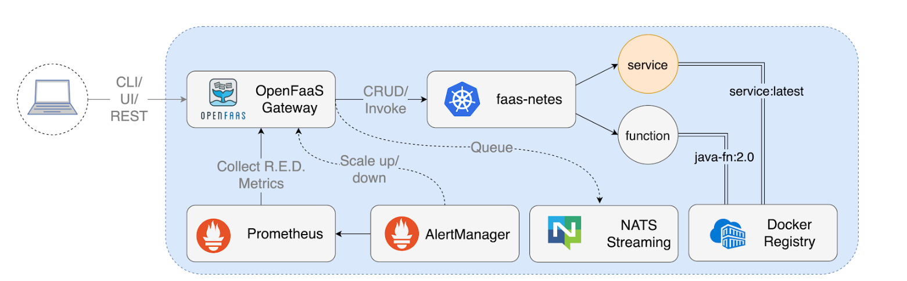

## 概述

### 1. 核心架构：各个组件在干什么？

- **OpenFaaS Gateway (网关):** 它是整个系统的**大门**。无论你是想运行函数、查看状态还是删除函数，所有的请求都必须先经过它。它负责分发指令。
- **faas-netes:** 它是网关与 **Kubernetes (K8s)** 之间的**翻译官**。网关说“我要运行这个函数”，faas-netes 就去指挥 K8s 调度资源。
- **Prometheus & AlertManager (监控与报警):** 它们是系统的**眼睛**。Prometheus 收集函数的运行数据（比如现在有多少请求），如果请求太多，AlertManager 就会通知网关：“太忙了，赶紧多开几个副本（Scale up）！”。
- **NATS Streaming (队列):** 它是**缓冲区**。如果你有一个任务需要处理很长时间，不要求立即返回结果，请求就会先排在 NATS 队列里慢慢处理（异步调用）。
- **Docker Registry (镜像仓库):** 这是**仓库**。在 OpenFaaS 中，**每一个函数本质上都是一个 Docker 镜像**。你需要把代码打包成镜像存放在这里，系统才能运行它。

------

### 2. 核心功能：你能用它做什么？

网关提供的 **REST API** 能力：

- **增删改查 (CRUD):** 就像管理文件一样管理你的函数。
- **自动扩缩容 (Scaling):** 根据流量大小，自动增加或减少函数的运行数量。
- **函数调用 (Invoke):** 触发函数执行。
- **异步处理 (Queue-up):** 把任务丢进队列，不用等结果返回，系统处理完了会告诉你。
- **日志与状态:** 查看函数运行得好不好，有没有报错。

------

### 3. 一个关键点：函数 = 容器

**"Each function is a Docker image"**。 这意味着：

1. 你可以用任何语言（Go, Python, Java 等）写函数。
2. 你需要给函数起名字和版本号（Tag），比如 `java-fn:2.0`。
3. **微服务与函数共存：** 传统的微服务（Service）和短小的函数（Function）可以在同一个架构下跑，互不冲突。

------

### 4. 你怎么操作它？

1. **CLI (faas-cli):** 命令行工具（程序员最爱，效率高）。
2. **UI (控制台):** 网页界面（直观，点点鼠标就能运行）。
3. **REST API:** 编写代码来调用。比如你在你的 Go 项目里发一个 HTTP 请求给 Gateway，让它去运行某个函数。

## Events, Triggers, and Invocations

### 1. 基础方式：HTTP 调起

OpenFaaS 的所有通信本质上都是 **HTTP/REST**。

- **最简单的触发：** 就像你直接在浏览器输入网址或用 `curl` 发送请求。你点一下，函数就跑一下。
- **局限性：** 这种方式是“同步”的。你必须等着函数运行完给你返回结果。

### 2. 核心概念：触发器 (Triggers)

触发器就是**“自动触发函数的开关”**。你不需要手动去点，而是当某个事件发生时，系统自动帮你调用函数。

**connector-sdk** 是一个工具包。你可以把它理解为一个**“适配器”**。

> **打个比方：** > 你的函数只听得懂“普通话”（HTTP 请求）。但外面的世界有说“英语”的（Kafka）、说“法语”的（MQTT）。**connector-sdk** 就是一个翻译官，把这些外语转成函数能听懂的 HTTP 指令。

------

### 3. 常见的触发器示例（你可以用它们做什么？）

| **触发器类型**              | **生活化场景模拟**         | **实际应用例子**                                           |
| --------------------------- | -------------------------- | ---------------------------------------------------------- |
| **cron (定时)**             | 定好的闹钟                 | 每天凌晨 2 点自动备份数据库。                              |
| **Apache Kafka / RabbitMQ** | 快递公司的分拣流水线       | 电商下单后，自动触发“发送扣款短信”的函数。                 |
| **Minio (S3 存储)**         | 只要有人往信箱投信，灯就亮 | 用户上传一张照片到云盘，自动触发“生成缩略图”的函数。       |
| **MQTT (物联网)**           | 感应器报警                 | 某个温度传感器超过 40 度，自动触发“给管理员发邮件”的函数。 |
| **AWS SQS / NATS**          | 任务队列                   | 处理大量的后台任务，一个接一个地排队执行。                 |

这段文字的核心是在讨论 **“函数是如何被叫起床干活的”**。

在 OpenFaaS 中，函数平时是“躺平”的（甚至可以缩减到 0 个副本以节省资源）。这段话解释了通过什么手段来**触发（Trigger）**这些函数运行。

我们可以把 OpenFaaS 的触发机制比作一个**“多功能闹钟”**：

------

### 1. 基础方式：HTTP 调起

OpenFaaS 的所有通信本质上都是 **HTTP/REST**。

- **最简单的触发：** 就像你直接在浏览器输入网址或用 `curl` 发送请求。你点一下，函数就跑一下。
- **局限性：** 这种方式是“同步”的。你必须等着函数运行完给你返回结果。

### 2. 核心概念：触发器 (Triggers)

触发器就是**“自动触发函数的开关”**。你不需要手动去点，而是当某个事件发生时，系统自动帮你调用函数。

文中提到的 **connector-sdk** 是一个工具包。你可以把它理解为一个**“适配器”**。

> **打个比方：** > 你的函数只听得懂“普通话”（HTTP 请求）。但外面的世界有说“英语”的（Kafka）、说“法语”的（MQTT）。**connector-sdk** 就是一个翻译官，把这些外语转成函数能听懂的 HTTP 指令。

------

### 3. 常见的触发器示例（你可以用它们做什么？）

文中列举了一堆技术名词，我们来看看它们在实际场景中怎么用：

| **触发器类型**              | **生活化场景模拟**         | **实际应用例子**                                           |
| --------------------------- | -------------------------- | ---------------------------------------------------------- |
| **cron (定时)**             | 定好的闹钟                 | 每天凌晨 2 点自动备份数据库。                              |
| **Apache Kafka / RabbitMQ** | 快递公司的分拣流水线       | 电商下单后，自动触发“发送扣款短信”的函数。                 |
| **Minio (S3 存储)**         | 只要有人往信箱投信，灯就亮 | 用户上传一张照片到云盘，自动触发“生成缩略图”的函数。       |
| **MQTT (物联网)**           | 感应器报警                 | 某个温度传感器超过 40 度，自动触发“给管理员发邮件”的函数。 |
| **AWS SQS / NATS**          | 任务队列                   | 处理大量的后台任务，一个接一个地排队执行。                 |

------

### 4. 异步机制 (Asynchronous)

- **同步：** 你给函数发请求，然后在那**死等**它处理完（比如处理 10 秒，你就等 10 秒）。
- **异步：** 你把请求扔给 OpenFaaS，它回你一句“收到了，稍后处理”，然后你可以立刻去干别的事。OpenFaaS 会在后台慢慢跑，跑完了再把结果存起来或发给你。